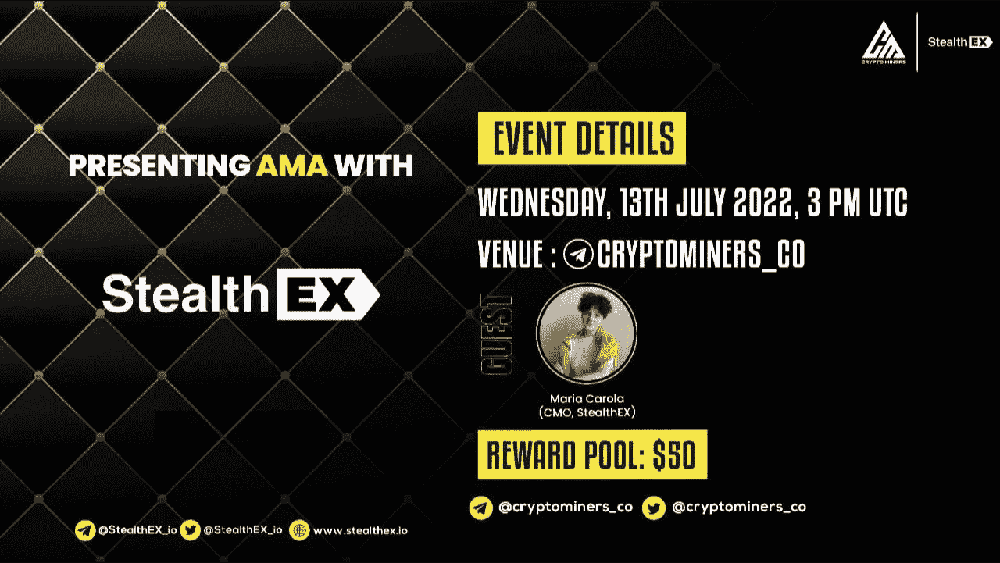

# 独家 AMA 回顾:加密矿工 x 偷窃 x

> 原文：<https://medium.com/coinmonks/recap-of-exclusive-ama-crypto-miners-x-stealthex-fd8a60af0750?source=collection_archive---------47----------------------->

2022 年 7 月 13 日，我们在[电报](https://t.co/MQMzkhp3Mw)中[窃取了 X](https://stealthex.io/) &名密码矿工的 AMA 会话，这里是一个回顾。只需要花一点时间通读。

**Q1: Ramsy，加密矿工:你能给我们简单解释一下 StealthEX 吗？在这个领域创建这样一个平台时，你有什么想法？**

**玛利亚·卡罗拉，CMO·StealthEX:**StealthEX 是一个即时交易平台，旨在实现简单的加密货币互换。您不必注册或创建帐户来与我们交换。我们自 2018 年以来一直存在，并有相当长的时间来发展。StealthEX 现在有超过 450 个加密资产可用于交换，一个与菲亚特购买加密的选项，一个用于其他项目的开放 API 和一个推荐程序。我们的团队总是在想办法给项目带来更多的功能，所以更多酷的东西会随之而来。稍后我会讲到。

StealthEX 的创建有一个非常简单的想法——加密货币互换应该简单且保密。在 StealthEX 创建的时候，许多加密服务转向了保管模式，这是团队不同意的。我们相信自助存储(因此你是唯一持有你的资产的人，不涉及交换钱包或其他服务)，以及易于管理的加密货币的使用。

Q2:你的主要特点和优势是什么，让你有别于其他项目？

StealthEX 有一些让我们区别于其他交易所的特点。我们来看看主要品种。

如果你把我们比作币安这样的监管交易所，StealthEX 给予你更多的自由和保证。你不必考虑司法管辖区，通过强制性 KYC，或创建一个帐户。此外，由于我们从几家供应商处获得流动性，因此有更多硬币可供选择。然而，最主要的一点是，你不必相信任何人为你保管你的钱，你的资金不会发生任何事情。所有的掉期交易都是钱包对钱包的，因此它们不会脱离被占用用户的自我监管。

第二层—比较 StealthEX 和 dex。当我开始在 crypto 工作时，dex 并不流行。现在，有数百种服务利用智能合约来执行交换。P2P 交易和流动性池的整个系统很酷，但也有一些缺点——例如，适当的维护。StealthEX 使用了一种更古老的自动互换技术，在这个过程中没有智能合约，这使得系统更具抵抗力和可靠性。此外，使用德克斯只是更复杂的 UX 方式。

最后但同样重要的是，将 StealthEX 与我们的直接竞争对手(其他即时交换服务)进行比较。有几件事要提一下。

1.  我们拥有比大多数同类服务更多的可用资产(包括非常罕见的资产)。
2.  KYC 是一个非常罕见的事情。
3.  界面本身相当简单。
4.  这项服务运行迅速，所有的交换几乎都是在瞬间完成的。
5.  我们的支持热线运作良好。

到目前为止，你的团队的经验和背景对你的项目的成功有效吗？

我们来自不同的背景——有些人以前从事过 crypto 工作，有些人来自其他领域。我相信拥有这种多样性是好的——它有助于带来更多不同的观点+人们可以从不同的方面做出贡献。

我可以代表我自己说——我在同声翻译方面的背景并不能直接帮助我做好 CMO 的工作，但它确实有助于压力管理和沟通。两者在加密中都很有用:)

**问题 4:你能概述一下 StealthEX 是如何被使用的吗？还有，StealthX 给选择你平台的用户提供了什么激励？**

StealthEX 超级简单。您只需进入我们的主页，选择您想要兑换的货币和金额，输入地址，然后开始存款。差不多吧，剩下的都是我们做的。

如果你说的激励是指直接利益，那么用户可以选择我们的推荐链接与他们的朋友和观众分享——这样他们就可以积累加密利润。如果这只是一个关于人们为什么选择我们平台的问题，那么答案将是——因为我们从 2018 年开始就一直在不停地工作，为您带来一款可靠、简单、值得信赖的产品。

**Q5:开发这个项目花了多长时间？你对未来有什么计划？我们能从 StealthEX 中期待什么——你能分享你的路线图吗？**

MVP 建立得相当快，但是一般的开发总是在进行中。我们在增加新的功能，重新设计旧的东西，在界面中引入新的东西等等。

现在，你可以期待一些个人内阁的酷变化，为 API 合作伙伴制定灵活费用的能力，一个全新的交换小工具内置到网站中，以及新合作伙伴带来的菲亚特购买选项中的许多附加功能。很多很酷的东西在路上！

# 现场提问

**Q1:在你们的平台上有多少资产上市，交换和互换的速度有多快？没有注册可以吗？**

现在，我们在平台上持有超过 450 种资产，并且几乎每周都会推出新的硬币和代币。交换需要 5 到 30 分钟，具体取决于网络条件(可能会过载，交换会变慢)

是的，所有的交换都是免注册的，而且永远都是！

**Q2:我看到 StealthEX 宣布了一项联盟计划。你能告诉我们它是如何工作的吗？我如何申请这个项目？我们怎样才能在这个联盟项目上赚到钱呢？**

你可以在这里`[https://partners.stealthex.io/login](https://partners.stealthex.io/login)`报名

你只需要创建一个帐户，并开始使用你的会员工具。

这里有推荐链接、API 集成和即将推出的小工具，你可以用它们来赚取利润。

所有的交易所都给你带来[利润](https://stealthex.io/affiliate-program/)。你也可以在这里查看所有细节:`[https://stealthex.io/affiliate-program/](https://stealthex.io/affiliate-program/)`

**Q3:什么是 StealthEX，启动这个项目的原因是什么？与你开始使用 StealthEX 时相比，你对它的未来使用情况有多乐观？**

我已经回答了第一部分的第一个问题，但是第二个问题很好。

我相信对免托管服务的需求将会一直存在。首先，现在对不为你持有资产的服务有更大的需求。这种需求主要是由于托管服务中可能发生的令人讨厌的事情(最近看到一些交易所和贷款服务)

> 交易新手？尝试[加密交易机器人](/coinmonks/crypto-trading-bot-c2ffce8acb2a)或[复制交易](/coinmonks/top-10-crypto-copy-trading-platforms-for-beginners-d0c37c7d698c)

**Q4:你有多少名团队成员？他们在区块链领域有足够的经验吗？他们有从事加密和非加密项目的经验吗？**

我们现在有 30 名团队成员，他们有着不同的经验。我相信区块链知识并不是公司所有领域都需要的，但 dev 和管理的所有关键人员显然都有:)

举例来说，我已经在密码部门工作了 5 年。

**问题 5:我们可以看到哪些即将到来的新闻？**

哦，我们有这么多！

我认为最好的事情是订阅我们的时事通讯——我们总是把已经列出的新资产和发展里程碑放在那里

此外，它在 Twitter 上，非常方便没有管理:`[https://www.getrevue.co/profile/stealthex_io?via=twitter-profile](https://www.getrevue.co/profile/stealthex_io?via=twitter-profile)`

**问题 6:月亮什么时候出现？**

Soon

**Q7:我想知道你们交易所的所有掉期是否都是非托管的？**

谢谢提问！全部都是，绝对！

**Q8:stealth ex 有一个很棒的功能，它允许我们通过 VISA 和 MASTERCARD 用 fiat 购买加密货币。我们可以购买哪些上市货币？用菲亚特买的话费用高吗？**

谢谢提问！

可以在这里找到可供购买的货币:`[https://stealthex.io/?amount=100&from=usd&to=eth](https://stealthex.io/?amount=100&from=usd&to=eth)`

好事情——你可以开始用小额购买，特别是对那些刚刚起步的人来说。此外，你可以不买 KYC，总共 900 美元。

费用是有的，当然，但肯定不比其他提供商高:)

我们还计划扩大法定货币和加密货币的清单。

我们如何才能相信你的项目，相信你不是一个骗局项目？如今有如此多的骗局发生。

对于非托管交易所来说，地毯式搜索没有太大意义，因为我们根本不持有用户在平台上的资金。很明确的说，没什么好拉的:)

此外，我们已经存在多年，一直致力于信任因素。谢谢你的提问！

**Q10:StealthEX 作为加密货币交易平台提供了哪些属性？它最引人注目的地方是什么？你将如何创建一流的可持续交易所？您目前有面向公众的赠品或空投吗？**

如果你不介意，我会回答最后一部分。我们尽量经常为我们的社区举办不同的赠品！

请继续关注我们的 [Twitter](https://twitter.com/StealthEX_io) ，你一定能很快参与其中！

`[https://twitter.com/StealthEX_io](https://twitter.com/StealthEX_io)`

许多项目都有用户界面/ UX 的问题，这个项目会让新用户望而却步。您计划如何改善与新用户和加密空间之外的用户的交互？

我们非常重视设计和 UX，并一直在改进界面。我认为这是非常重要的，这样每个人在偶然发现一个服务时都能明白他们在做什么。

StealthEX 自诩为初学者友好的平台，这是一个巨大的优先权。谢谢提问！

感谢各位的光临，我们希望你们在 AMA 过得愉快！

记住，如果你需要兑换你的硬币[stealth x](https://stealthex.io/)就在这里，只需遵循以下简单的步骤:

1.  选择兑换的货币对和金额。比如 [BTC](https://stealthex.io/coin/bitcoin) 到 [ETH](https://stealthex.io/coin/ethereum) 。
2.  按下“开始交换”按钮。
3.  提供硬币将被转移到的收件人地址。
4.  移动你的加密货币进行交易。
5.  收到您的加密硬币！

*如果您对 StealthEX exchange 服务还有其他问题，您可以前往我们的* [*常见问题部分*](https://stealthex.io/faq) *，在那里找到所有必要的信息。*

*关注我们上* [*中*](https://stealthex-io.medium.com/) *，* [*推特*](https://twitter.com/Stealthex_io) *，* [*电报*](https://t.me/StealthEX) *，*[*YouTube*](https://www.youtube.com/channel/UCeES_XBesX76ge7xf1meuSw)*，以及*[*Reddit*](https://www.reddit.com/user/Stealthex_io)*获取*

如果您在兑换硬币方面有任何问题，我们随时准备为您提供支持。我们的团队尽最大努力保护所有成员并回答他们的问题。对于所有请求，请通过 support@stealthex.io 向我们发送消息

*非常欢迎您访问*[*StealthEX exchange*](https://stealthex.io/)*，看看它有多快多方便。*

> 加入 Coinmonks [电报频道](https://t.me/coincodecap)和 [Youtube 频道](https://www.youtube.com/c/coinmonks/videos)了解加密交易和投资

# 另外，阅读

*   [CBET 回顾](https://coincodecap.com/cbet-casino-review) | [库币 vs 比特币基地](https://coincodecap.com/kucoin-vs-coinbase) | [拜比特 vs 比特币基地](https://coincodecap.com/bybit-vs-coinbase)
*   [折叠 App 回顾](https://coincodecap.com/fold-app-review) | [本地比特币回顾](/coinmonks/localbitcoins-review-6cc001c6ed56) | [Bybit vs 币安](https://coincodecap.com/bybit-binance-moonxbt)
*   [加密保证金交易交易所](/coinmonks/crypto-margin-trading-exchanges-428b1f7ad108) | [赚取比特币](/coinmonks/earn-bitcoin-6e8bd3c592d9) | [Mudrex 投资](https://coincodecap.com/mudrex-invest-review-the-best-way-to-invest-in-crypto)
*   [WazirX vs coin dcx vs bit bns](/coinmonks/wazirx-vs-coindcx-vs-bitbns-149f4f19a2f1)|[block fi vs coin loan vs Nexo](/coinmonks/blockfi-vs-coinloan-vs-nexo-cb624635230d)
*   [比斯勒评论](https://coincodecap.com/bitsler-review)|[WazirX vs coin switch vs coin dcx](https://coincodecap.com/wazirx-vs-coinswitch-vs-coindcx)