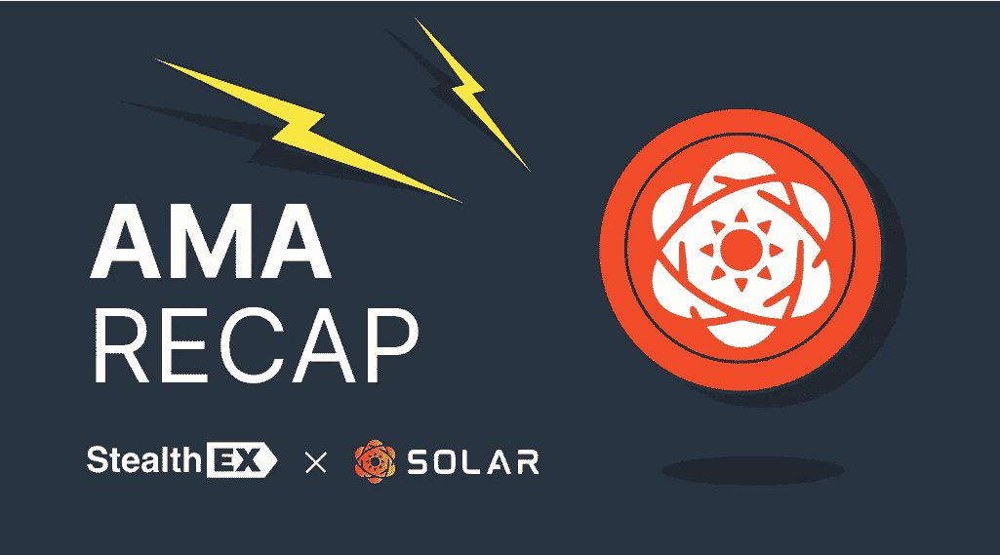
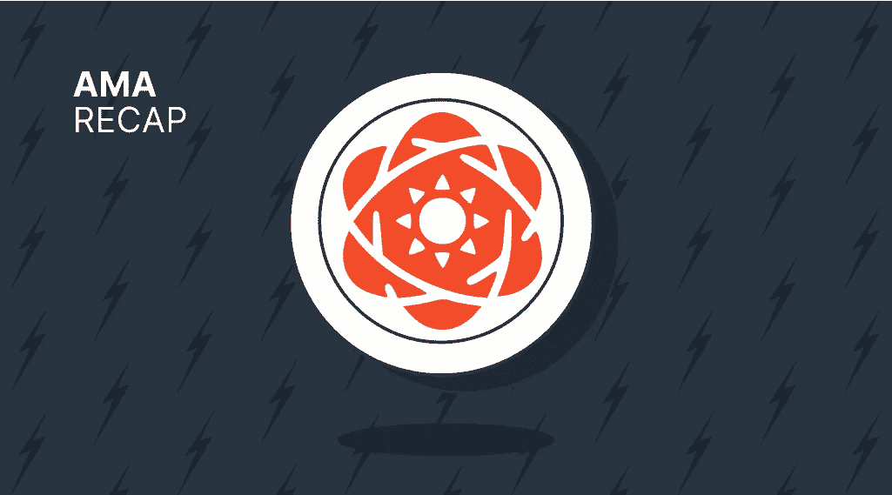

# 独家 AMA 回顾:StealthEX 回答了来自 Solar Crypto 的问题——你想知道的一切！

> 原文：<https://medium.com/coinmonks/recap-of-exclusive-ama-stealthex-answers-questions-from-solar-crypto-everything-you-wanted-to-d72a70b134e6?source=collection_archive---------12----------------------->

X 团队被邀请参加[太阳能 TG](https://t.me/Solar)AMA——如果你错过了，这里是回顾！

太阳能高级品牌大使 Elaine 与 StealthEX 首席执行官 Maria Carola 聊天。

# AMA 回顾:太阳能 x 窃取 x

**依莲:**玛利亚，你能自我介绍一下吗，或许能告诉我们一些关于 StealthEx 及其各种功能的信息？

玛丽亚:大家好。我叫玛丽亚，是 StealthEX 的首席执行官。

StealthEX 是一种即时加密货币交易所——一种允许用户利用主要集中交易所和 dex 的流动性而不必信任它们的服务。集中交易所需要在平台上创建一个热钱包，并在那里持有你的资金，此外，在许多地区往往受到限制。StealthEX 是一种用于加密货币交换的 VPN，允许每个人以无托管的方式在全球范围内无限制地交换 600 多项资产。

支持的资产当然包括太阳能！

伊莱恩:玛丽亚，你担任 StealthEX 的首席执行官多久了，你以前有没有参与过其他加密项目？

**玛丽亚:**实际上不会很久——我最近刚从首席营销官的职位上下来。当然也在 StealthEX 上。

不过，我从事加密产品的总体经验相当丰富——这是我全职从事加密工作的第六年或第七年，碰巧我从事的服务都是钱包和交易所。

伊莲:那么，当一名首席执行官需要做些什么呢？？当然除了做 AMAs！

玛丽亚:啊，好主意。老实说，我不再经常做 AMAs 了。尽管如此，我还是非常喜欢它！

在我的日常生活中，我负责 StealthEX 的开发和管理，因此我将 80%的时间花在内部和合作电话上，为我们即将计划和实施的所有功能和改进编制路线图。此外，我为这些特性写所有的描述，所以这是相当多的日常工作 tbh

**Elaine:** 我很有兴趣了解一下 StealthEX 的背景是谁发起的，是什么想法催生了 StealthEX？

玛丽亚:哦，是的，当然！StealthEX 实际上已经上市很长时间了——我们最近庆祝了我们的第四个生日。

虽然我不是创始成员之一，但我在 2 年前加入了这个团队，但我完全支持这个团队的总体想法。背后的想法非常简单——我们中没有人真的想处理集中和托管服务。我们相信无监护权的方法，并认为人们应该注意它，特别是因为我们已经看到了一些原因，最近所有的交易所都在下跌。

伊莲:你认为这部剧对密码世界有什么影响？？

**玛利亚:**好吧，让我们从人们损失了大量金钱这个事实开始——这绝对是一件糟糕的事情，不应该发生，我为所有受到影响的人感到非常抱歉。然而，这是一个很好的时间来回想加密实际上应该是什么——一个去中心化的实体。在所有的戏剧中，回到真正的根源和想法是很好的。

**依莲:**所以就在这一点上展开。你觉得无保管钱包和兑换有什么重要的？

玛丽亚:最重要的是你(作为用户)负责。我们不持有你的钱，我们不能访问你的账户或任何类似的东西(因为本质上没有)，你可以自由选择你想用你的资金做什么

毕竟是你的钥匙=你的硬币。

伊莱恩:【StealthEX 是如何进化的？今天的 StealthEX 和它刚出现的时候相比怎么样？

玛丽亚:StealthEX 变了很多。当我们开始时，它只是一个大约有 150 种资产的加密到加密的交换。现在，我们有法定购买，固定和浮动汇率，以及超过 670 种加密货币，这是最近才推出的移动应用程序。此外，我们还为合作伙伴提供了一套产品——其他服务可以集成我们的 API、网站所有者的小部件、推荐链接等等。

唯一没变的是主旨。

伊莲:你有特定的目标市场吗，或者 StealthEX 适合所有人吗？我的意思是谁是你典型的 StealthEX 用户？

玛丽亚:StealthEX 几乎适合所有人。我们有 fiat on-ramping，这对那些想加入并开始使用加密货币的人很有用。我们列出了数百种资产，因此几乎任何社区成员都可以找到他们的硬币(包括一些罕见的硬币、隐私硬币等等)。

对于那些有智能手机的人来说，一个应用程序很方便。只有一件事是，我们还没有发布该应用程序的 iOS 版本，但这也在路上了

伊莱恩:那么，如果 StealthEx 适合所有人，你如何瞄准非技术人员，也许是加密新手？

玛丽亚:老实说，使用 StealthEX 并不需要很专业——只要对如何创建一个加密钱包有基本的了解就足够了。

还没有加密的人可能会犹豫，所以我们已经降低了交换和购买金额到我们能做到的最低限度+对于低于 900 美元每用户的菲亚特加密购买没有 KYC。

试图摆脱所有令人恐惧的时刻。

伊莱恩:那么，在这种情况下，你认为 StealthEX 与竞争对手相比有哪些主要优势？

**玛利亚:**我认为主要的优势之一就是服务非常简单。

我们尽量不把事情弄得太复杂，让界面尽可能的干净。当然，下一件事是，如果与其他即时交易服务相比，我们持有大多数资产——没有人真正拥有超过 600 英镑的资产。

低下限和无上限是另一个伟大的事情，帮助所有类型的用户-那些只想用少量测试的人，或者那些交换数千的人。

**依莲:**那么，有了这些伟大的功能，StealthEx 还有什么可以开发的吗？！(解释或更正刚说过的话)我是说

StealthEXs launchpad 上有什么新产品或新服务吗？还是这是最高机密？如果你告诉我们这个频道会不会爆炸！

玛丽亚:啊哈哈哈，老实说，是有的。我们现在的路线图非常广泛。我们正在计划更多的菲亚特采购合作伙伴，这样我们将提供更多的货币。

我们的合作伙伴套件将得到扩展和改进(一些新的加盟工具即将推出)。我们也在计划销售功能。

伊莲:我最后的问题不是真正的问题。玛丽亚，这是你给我们一个机会，让我们听听你对一些事情的看法。

随着 2022 年即将结束，哪些事件或趋势对你来说最为突出？你个人认为 2023 年会给加密生态系统带来什么？这是我的最后一个问题

玛丽亚:啊，这是一个有趣的问题。

我们在 2022 年的大部分时间里都处于低迷状态，老实说，对加密领域来说，这是艰难的一年。我们已经看到许多优秀的公司倒闭，但也有许多我们不会真的错过。我相信 2022 年应该是我们所有人的一个教训，对于在 crypto 工作的人来说——我们应该随时准备过冬。对于刚刚进入 crypto 的人来说，要始终保持谨慎和专注。

至于 2023 年，我只希望世界会稳定下来(我知道这是一个很大的要求)，然后 crypto 也会稳定下来。此外，正如我以前说过的，新的一年可以是一个思考自我保管和保护您的资金的好起点。

依莲:是的，2022 年肯定是起伏不定的一年。我担心这些事件给 crypto 带来的负面影响。贪婪和无能的程度有时令人震惊。我对 2023 年充满希望。让我们继续建立联系和交流吧！！！

玛丽亚:绝对没错！那些做好事的人应该团结在一起！

伊莲:在我们结束之前，你还有什么要补充的吗？

**玛利亚:**当然可以！首先，我要感谢今天加入的每一个人，加上@Elainecara 和@CNghtn 组织的一切。这是一种乐趣！

另外，我很高兴能和大家一起参加《T4 大盗》！如果您需要交换太阳能或 669 其他资产，我们的平台随时欢迎您！

# 如何在 StealthEX 上购买 SXP 币？

以下是购买 ONT 的几个步骤:

1.  选择兑换的货币对和金额。例如， [BTC](https://stealthex.io/coin/bitcoin/) 到 [SXP](https://stealthex.io/coin/solar/) 。
2.  按下“开始交换”。
3.  提供硬币将被转移到的收件人地址。
4.  存款。
5.  接受兑换的 SXP 硬币。

*如果您对 StealthEX exchange 服务还有其他问题，您可以前往我们的* [*常见问题解答部分*](https://stealthex.io/faq) *，在那里找到所有必要的信息。*

*关注我们上* [*中*](https://stealthex-io.medium.com/) *，* [*推特*](https://twitter.com/Stealthex_io) *，* [*电报*](https://t.me/StealthEX) *，*[*YouTube*](https://www.youtube.com/channel/UCeES_XBesX76ge7xf1meuSw)*，*[publish 0x](https://www.publish0x.com/stealthex)*获取*

如果您在兑换硬币方面有任何问题，我们随时准备为您提供支持。我们的团队尽最大努力保护所有成员并回答他们的问题。对于所有请求，请通过 support@stealthex.io 向我们发送消息

非常欢迎您访问[*stealthexchange*](https://stealthex.io/)*看看它有多快多方便。*

> 交易新手？试试[加密交易机器人](/coinmonks/crypto-trading-bot-c2ffce8acb2a)或者[复制交易](/coinmonks/top-10-crypto-copy-trading-platforms-for-beginners-d0c37c7d698c)