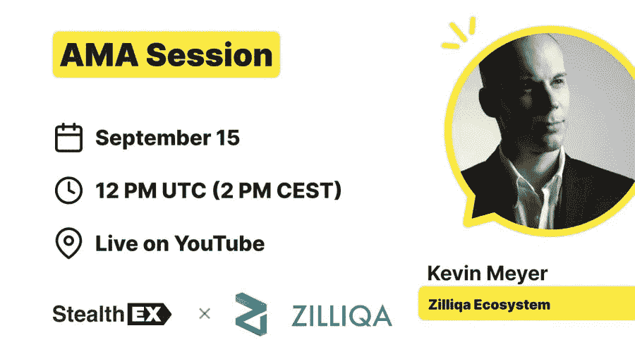

# 独家 AMA 回顾:Zilliqa x StealthEX

> 原文：<https://medium.com/coinmonks/recap-of-exclusive-ama-zilliqa-x-stealthex-9ed3f59e13e6?source=collection_archive---------43----------------------->

2022 年 9 月 15 日，我们与来自 Zilliqa 生态系统的 Kevin Meyer 进行了 AMA 会议，以下是会议摘要。

Zilliqa 是你通往区块链世界的门户，让你更容易创建用户友好的 dApps。

如果你错过了我们在 YouTube 上的 AMA 直播，你可以随时观看下面的视频:

在 [Medium](https://stealthex-io.medium.com/) 、 [Twitter](https://twitter.com/Stealthex_io) 、 [Telegram](https://t.me/StealthEX) 、 [YouTube](https://www.youtube.com/channel/UCeES_XBesX76ge7xf1meuSw) 和 [Reddit](https://www.reddit.com/user/Stealthex_io) 上关注我们，获取 [StealthEX.io](https://stealthex.io/) 更新和关于密码世界的最新消息。

## 如何购买 ZIL 硬币？

欢迎在 [StealthEX](https://stealthex.io/) 购买 ZIL 密码。

只需遵循这些简单的步骤:

1.  选择兑换的货币对和金额。例如， [BTC](https://stealthex.io/coin/bitcoin/) 到 [ZIL](https://stealthex.io/coin/zilliqa/) 的硬币。
2.  按下“交换”按钮。
3.  提供硬币将被转移到的收件人地址。
4.  移动你的加密货币进行交易。
5.  收到您的加密硬币！

如果您在兑换硬币方面有任何问题，我们随时准备为您提供支持。我们的团队尽最大努力保护所有成员并回答他们的问题。对于所有请求消息我们通过 [*支持@stealthex.io*](mailto:support@stealthex.io) *。*

*如果您对 StealthEX exchange 服务还有其他问题，您可以前往我们的* [*常见问题部分*](https://stealthex.io/faq) *，在那里找到所有必要的信息。*

**非常欢迎您访问**[**StealthEX exchange**](https://stealthex.io/)**，看看它有多快多方便。**

> 交易新手？试试[加密交易机器人](/coinmonks/crypto-trading-bot-c2ffce8acb2a)或[复制交易](/coinmonks/top-10-crypto-copy-trading-platforms-for-beginners-d0c37c7d698c)