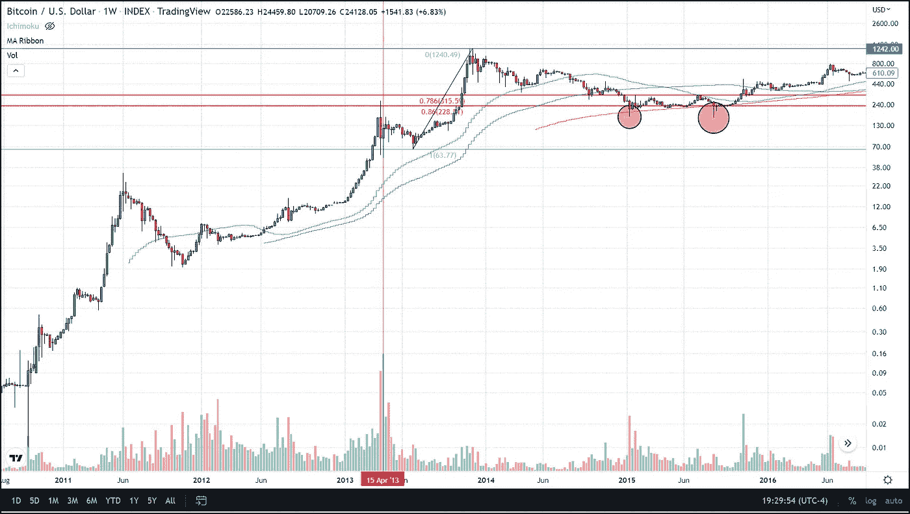
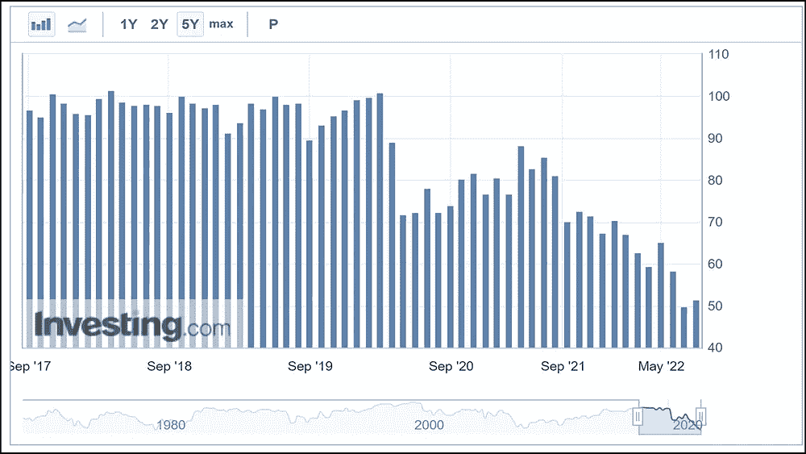
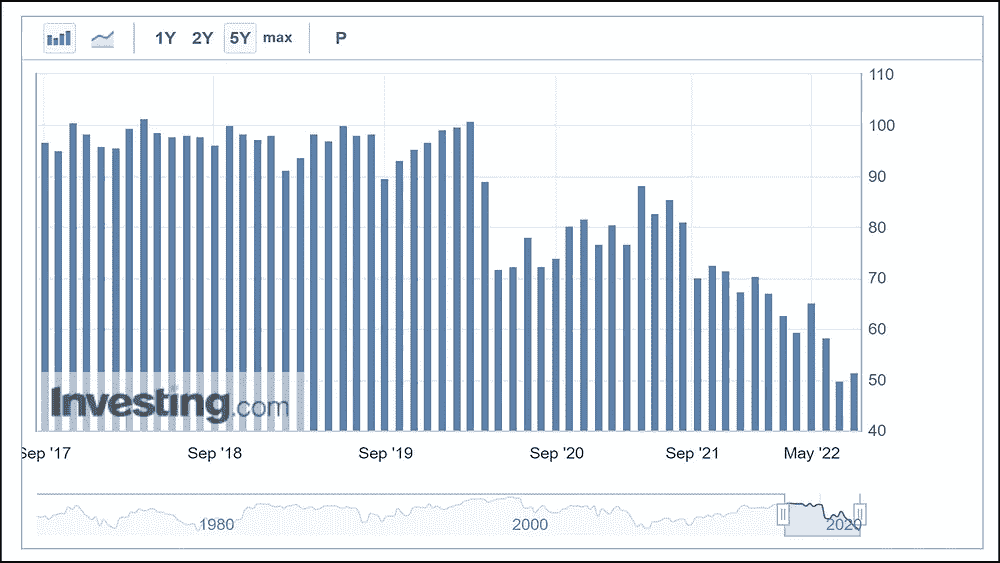
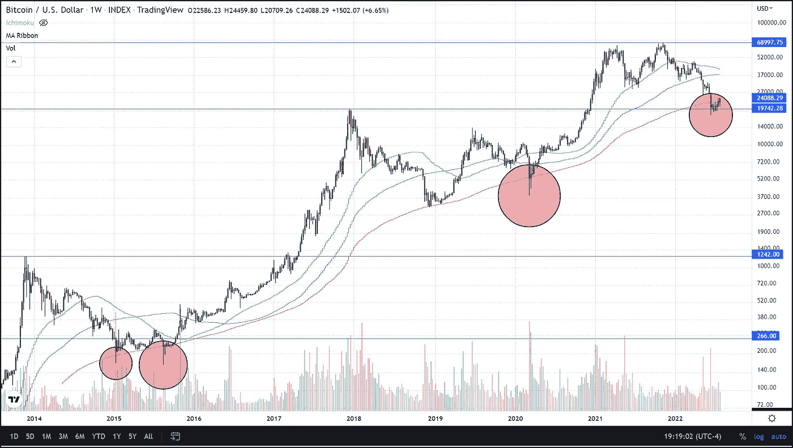
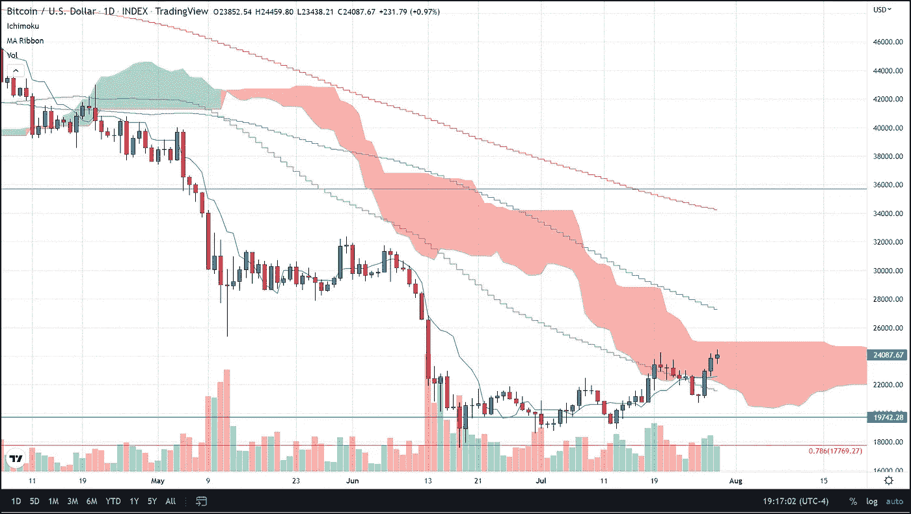

# 最近的行动表明，BTC 已经触及暂时的底部

> 原文：<https://medium.com/coinmonks/recent-action-points-to-a-temporary-bottom-in-btc-has-been-hit-852f71428497?source=collection_archive---------59----------------------->

在过去的几周里，我们一直在犹豫是否将 6 月 18 日达到的 17585 美元的低点视为比特币的价格底部。然而，我们的结论是，BTC 触底的所有标准都已满足。本周已经达到了足够的基准，让我们有信心说 BTC 几乎肯定已经见底，6 月 18 日的低点可能是一段时间内我们将看到的最低价格。

首先，我想回顾一下哪些技术指标已经暗示了底部，然后介绍一下本周发生的事情，让我们相信 6 月份的低点将仍然是最低价，我们可能在一段时间内不会看到更低的低点。

6 月 18 日触及的主要基准在我 2 月份发表的文章“*比特币的三个牢不可破的真相”*”*中引用过，这些里程碑式的波动传递的第三个特征是，在这些历史性的上涨之后，价格至少会回调 78%*我们所说的的 78%回撤价格为 17，770 美元。尽管这一水平仅在日内触及，但它与唯一的另一个抛物线周期相匹配，该周期也仅回撤至 78%回撤位置，并且仅短暂触及该位置。我指的是 2013 年 4 月 15 日的那一周，这是继 2013 年 4 月从略高于 2 美元涨到 267 美元的高点之后的一周。

然而，2013 年的这次反弹被我们称为比特币历史上的第二次抛物线反弹，也是唯一一次在 78%回撤水平的底部被突破。

出于这个原因，以及其他原因，我们认为 6 月份的低点将是一段时间的低点，而不是永远的低点。换句话说，最有可能的情况是比特币继续上涨，或者至少在突破该价格点之前的几个月到一年内保持在 17770 美元以上。这与我们 6 月 28 日的预测不谋而合，当时我们预测 BTC 的底部约为 14，000 美元，将在 2023 年 9 月至 12 月之间的某个时候触及。从现在到那时，比特币可能会触及 30，000 美元，在该价格和 78%回撤(17，770 美元)之间进行大量横向交易。

那么，是什么改变了我们本周的想法，让我们认为更低的低点在一段时间内不会出现，与此同时，我们可以预计这种短期反弹将继续下去？首先，尽管通胀压力持续上升，但美国股市最近出现反弹，我们的读者肯定知道比特币与股票的密切相关性，以及密歇根大学消费者信心指数今天报告的消费者信心正在上升的事实，该指数显示消费者信心自 5 月份以来首次上升，数字超出预期。该调查的预测值为 51.1，但实际数字为 51.5。这是自 2021 年 10 月以来的首次上涨，表明市场情绪与今天 PCE 报告揭示的现实有些脱节，这是又一次飙升，超过了《华尔街日报》和其他金融分析师的预测。尽管消费者信心指数有所上升，但仍处于过去五年来的最低水平。

本周三我们拿出了 50 天移动平均线。但到目前为止，BTC 已经走出熊市的最有说服力的迹象是这几周回到 200 周均线上方。比特币在历史上只在这个均线以下交易过四次，包括最近的一次，那次是在我们触及 78%回撤线的那周。所有这些事件都持续了长达一周的时间，直到最近跌破 200 周的均线，持续了大约六周。这使得本周收盘在这一重要指标之上，是在技术基准之下度过的最长时间。本周收盘在 200 周均线上方超过 1000 美元，这是一个强烈的信号，表明熊市即使没有结束，也至少已经暂停。

我们还移动到 50 日均线上方，并深入到市云云的分析中。我们上一次在云中是在 4 月 21 日，当时定价在 40，000 美元以上。目前，BTC 距离云端仅 1000 美元之遥，这加强了未来更高价格的理由。

此外，自 6 月 18 日触及低点以来，交易量一直保持高位，这意味着离开 BTC 市场的交易员已经重新进入，因为他们也将过去一个半月视为一个良好的进入点。

任何对我们致力于比特币交易的免费服务感兴趣的人，只需点击这个[链接](https://www.thegoldforecast.com/bitcoin)。

> 交易新手？试试[密码交易机器人](/coinmonks/crypto-trading-bot-c2ffce8acb2a)或者[复制交易](/coinmonks/top-10-crypto-copy-trading-platforms-for-beginners-d0c37c7d698c)