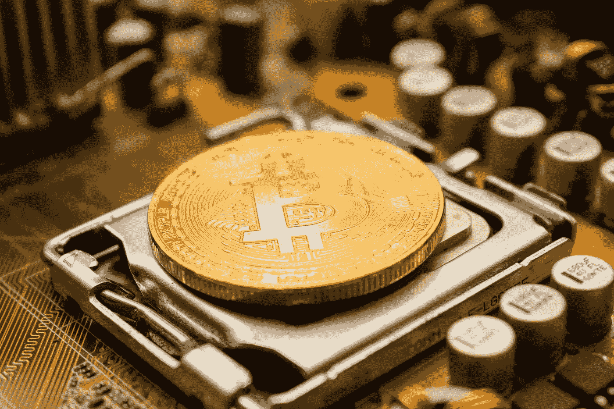

# 最近的加密热潮 99%是噪音

> 原文：<https://medium.com/coinmonks/recent-crypto-boom-was-99-noise-48b811aa025d?source=collection_archive---------43----------------------->

马克·库班说，尽管正在抛售，加密技术仍有一些潜在价值。“99%是噪音，但那里有真正的价值，”他告诉《乔恩·斯图尔特的问题》。库班补充说，萨姆·班克曼-弗里德因欺诈指控被捕将迫使 crypto“齐心协力”。亿万富翁投资者马克·库班仍然相信密码领域有一些价值，但他表示，这一资产类别在 2021 年的飞速增长…