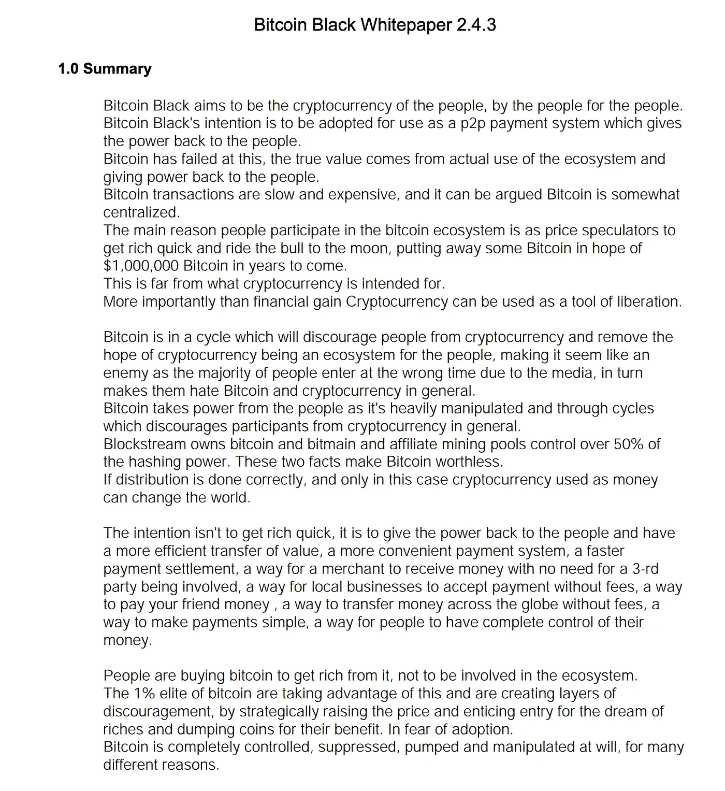

# 当你自己研究加密货币项目和替代货币时，要小心危险信号

> 原文：<https://medium.com/coinmonks/red-flags-to-watch-out-for-while-doing-your-own-research-on-cryptocurrency-projects-and-altcoins-9b2b76df7c1e?source=collection_archive---------9----------------------->

如果你现在投资正确的替代货币，那么你可以期待在下一轮牛市中获得巨大回报。这是有风险的，需要你做一些研究，因为如果你投资错了，你也会损失很多钱。

**仅仅因为你最喜欢的漫画女孩在推特上发推文就投资一个替代硬币是个坏主意，而不是#DYOR！**

**在你做研究的时候，这里有一些值得警惕的危险信号。当你了解他们时，发现他们是相对容易的。这真的不是量子物理，任何人都可以做到。**

如果你看到这些危险信号中的任何一个，那么你可以把整个加密项目扔进下一个垃圾 pin。

# 一份写得很差的白皮书或者根本没有

在做自己的研究时，首先要做的事情之一是查看该项目的白皮书。如果你根本找不到任何白皮书，那么你已经完成了你的 DYOR，你可以继续下一个项目。

一个项目必须有一份白皮书。如果一个项目根本没有任何白皮书，那么你可以肯定它绝对是垃圾。一个项目没有白皮书只有两个原因。这个项目背后的人要么完全是个迷，要么整个项目就是一个廉价制造的骗局。没有白皮书就是一面大红旗，对你大喊:“别靠近！”

还有一些情况是，你找到一份白皮书，但它写得很差。如果是这样的话，网站本身在大多数情况下看起来也很便宜。让我给你举一个写得不好的白皮书的例子。这里有一张白皮书的截图，来自一个最古老的诈骗项目“比特币黑”。

Screenshot Bitcoin Black Whitepaper — Scam Project.

你可以在他们所谓的白皮书中读到的第一句话是这样的:

> “比特币黑旨在成为民有、民治、民享的加密货币。比特币黑的意图是被用作 p2p 支付系统，把权力还给人民。”

白皮书的其余部分继续这样胡说八道，老实说，你应该认识到这是胡说八道。如果你没有意识到这是写得很差的垃圾，那么投资加密货币不适合你。继续读下去，也能发现很多东西是简单的复制粘贴。整篇文章都是关于一般性的定义，比如“什么是基础？”如果我想知道基金会的定义，我可以查字典，但这不属于白皮书。

如果你在该项目的白皮书中读到这样的东西，那么带上你辛苦赚来的比特币，跑得越远越好。这是一面巨大的红旗！

# 社交媒体表现不佳

接下来，你要检查的是社交媒体的存在。如果这个项目完全没有社交媒体的存在，那么这就是一个巨大的危险信号。

如果你发现这个项目活跃在社交媒体平台上，那么你可以开始评估项目的内容和社区。

很少或没有活动是项目遇到困难的标志。同样的道理也适用于当社区充满了每当你有一个合法的问题就攻击你的巨魔的时候。

最后，当你看到一切都只是关于项目的价格、致富和空投时，你也应该考虑这是一个危险信号。

# 没有用例

您潜在投资的加密项目和相应的替代币应该有一个或多个具体的用例，例如，需要支付区块链上的交易费用或用于政府目的。

以下是比特币黑色白皮书中描述其使用案例的摘录。

> “区块链最明显的使用案例是所谓的货币。P2P 电子现金:一个完全去中心化的点对点支付系统，把权力还给人民。不需要第三方参与。商家可以直接从消费者那里接受付款，不收取任何费用，也不需要很长的处理时间。这是一种简单、免费的跨境和跨国转移资金的方式，无需任何公司的许可，也是一种企业在本地运营的方式。”

Lmao，说实话？这是真的写在比特币黑色白皮书，包括错别字。抛开错别字不谈，这只是对比特币和区块链技术的一个大概描述。这根本不是一个用例。令牌的使用案例必须超越发送和接收数字资产的标准区块链技术。

如果你想知道真实的用例是什么，我推荐阅读我之前的一篇关于币安币的文章，标题是“ [**无数的用例正在让币安币成为最多元化的资产本身**](https://www.publish0x.com/cryptonators-investments/numerous-use-cases-are-making-binance-coin-the-most-diversif-xppgygo?a=5xe7xNOa7r&tid=Medium) ”

迷因令牌的另一个例子是各种各样的狗和猫。要知道一个迷因币没有用例的事实。你能继续期待的唯一奇迹是，某个疯狂的亿万富翁突然开始在 Twitter 上抛出硬币。

嗯，如果发生这种情况，你会很高兴，但我不会指望它。大多数迷因币在出现后就消失了。此外，请记住，能够通过推文提高价格的人也可以通过推文降低价格。这不是你能控制的，如果你想利用这种市场操纵，那么你也会自焚。

如果你想保持安全，寻找真实的用例，而不是有趣的迷因。

# 错误的令牌指标

如果到目前为止你还没有发现任何危险信号，那么你可以通过分析记号组学来继续你自己的研究。我知道你们大多数人不太了解分析记号组学，但没关系。你可以保持简单，集中在一些关键点上。

首先，如果项目在实际产品准备好之前很久就已经发布了自己的令牌，那么我也认为这是一个危险信号。

另一个危险信号是糟糕的令牌分发。总代币供应的大部分被分配给团队和/或在发布后的头几个月有大量的代币解锁。

Photo by [Clint Patterson](https://unsplash.com/@cbpsc1?utm_source=medium&utm_medium=referral) on [Unsplash](https://unsplash.com?utm_source=medium&utm_medium=referral)

# 匿名团队

我经常读到匿名团队也是一个危险信号，但我认为情况并非总是如此。我不认为一个匿名团队一定是一个危险信号，但它至少应该引起你的怀疑。

一个团队应该被公众所知的主要原因是你可以有人对任何不当行为负责。嗯，在很多情况下，你会发现这也不能给你任何保证。这是我们今年从像 FTX 和月球这样的可信项目的失败中吸取的教训之一。山姆·班克曼·弗里德和道·权都是诈骗犯，你知道他们的身份，但最终，你还是一无所获。

另一方面，没有人真正关心中本聪的匿名性。我们仍然不知道谁发明了比特币，这完全没问题。

这就是为什么我认为一个匿名团队应该引起你的怀疑，但你不应该认为这是一个大红旗。

超市的伙计们正在做自己的研究，寻找熊市期间的最佳投资机会。愚蠢的家伙不会 DYOR 和猿到下一个泵和倾倒在下一个牛市的顶峰。别做那种人，做个聪明人。答应我。在投资之前，一定要做好自己的研究，不要投资你不了解的东西。最终，你要对自己的投资决定负责，而不是其他人。

留意这些危险信号是你自己研究的重要部分，如果你发现了其中的任何一个，那么你就知道是时候继续前进了。

在这个意义上，我想再次指出，我可能在我的个人资料照片中看起来很聪明，但我不是你的财务顾问。然而，我希望阅读我的文章对你有所帮助和娱乐。

如果这是你喜欢读的那种东西，一定要在 Medium 上关注我。

如果你愿意，也可以在 [Twitter](https://twitter.com/cryptonator_s) 和 [Publish0x](https://www.publish0x.com/@Cryptonators-Airdrop-Hunt?a=5xe7xNOa7r&tid=Medium) 关注我。

> 交易新手？试试[加密交易机器人](/coinmonks/crypto-trading-bot-c2ffce8acb2a)或者[复制交易](/coinmonks/top-10-crypto-copy-trading-platforms-for-beginners-d0c37c7d698c)