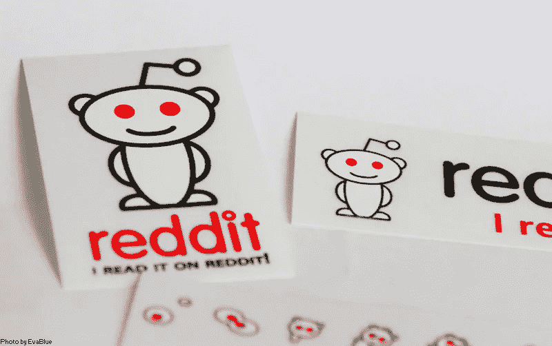

# Reddit 做得很好

> 原文：<https://medium.com/coinmonks/reddit-does-nfts-right-89652b03ad52?source=collection_archive---------3----------------------->

[reddit sticker — 2 | Thanks to the @jedberg! :) (CC) Eva Blu… | Flickr](https://www.flickr.com/photos/evablue/5282805005) ([CC BY 2.0](https://creativecommons.org/licenses/by/2.0/))

所以不久前我写了一篇关于 Twitter 和 NFTs 的文章。

基本上，他们为你提供了一种显示六边形头像的方法。我不喜欢这样。我一点也不喜欢。