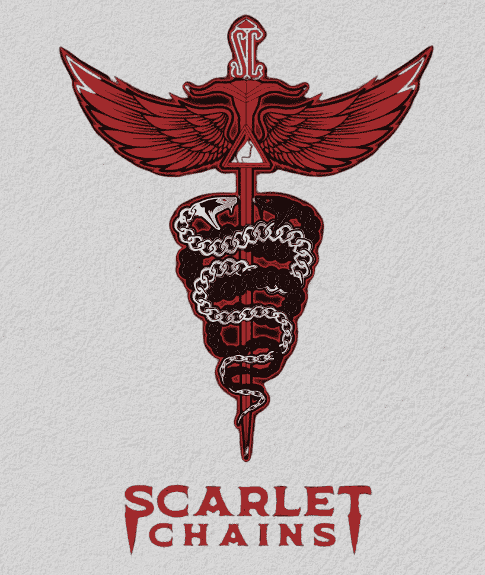

# 红灯节点区到猩红链

> 原文：<https://medium.com/coinmonks/redlight-node-district-to-scarlet-chains-dc113f83faff?source=collection_archive---------3----------------------->

Scarlet Chains Platinum

**起源故事**

《猩红链》是红光节点区的救赎故事，由红光财经在雪崩网络上为您带来。它始于加密货币讨论/促销电报。一些人在雪崩网络上有了以前失败的 NaaS/DaaS 项目的经验后，决定创建 Naas/DaaS 节点农场。我第一次被介绍到 RND 是通过一个[隐姓埋名的 AMA](https://www.youtube.com/watch?v=s9kY_o9Dq_w&t=3654s) 。

RND 于 1 月 30 日推出，RND 的代币是$玩伴，发行价是$0.30。在 24 小时内，价格飙升至 17 美元，并在 2 月 10 日达到 30 美元的历史新高。

该项目的启动非常成功，RND 实施了一种税收制度，即使在 5%的报酬率下，也能尽可能长时间地维持高价，并且在当时拥有 AVAX 上最高销量的 NFT，NFT VIP 俱乐部(290 AVAX)。3 层节点(大厦、地区和城市)为您的投资提供了游戏化，不和谐的博弈论聊天也忙于与其他同行讨论他们获得最大钱包或获得投资回报的最佳方法。

**节点情绪**

在项目的后期阶段，单词 **Node** 或 **NaaS** 在加密货币/DeFi 社区中受到了污染。在不同的区块链上出现了节点项目的过度饱和，这些项目只会持续几天。在大多数情况下，这些节点项目提供了很高的每日百分比，个人利用这一高每日百分比，通过结>声称>持续销售。自那以后，Node 领域的大牌纷纷倒下，玷污了 Node/NaaS 的名声，投资者也对 Node 项目失去了信心。

同样，不幸的是，真正的红灯节点区，社区节点情绪是不可避免的，这反映在他们的象征性价格$玩伴。他们节点的奖励支付已经停止了许多周，但在整个项目中为$ PLAYMATES 令牌提供了不同的奖励。最值得注意的是 BIP(区块链激励计划)。

**现在去哪里？**

如果你关注了来自 RND 团队的所有公告和新闻，你就会知道无眼镜区块链已经开发了很多年。这辆区块链被称为**红灯链**，新改进的**红字链**就是在此基础上打造的。

该团队从 RND 的错误中吸取了教训，开发了一个新的节点农场 **Scarlet Chains** 。RND 的投资者可以通过不同的层级节点迁移到不同的 Scarlet 链中。

**救赎故事**

[*猩红锁链白皮书*](https://redlight.finance/wp-content/uploads/2022/07/Whitepaper-Scarlet-Chains.pdf)

Scarlet Chains logo

**新时代。**

值得注意的是，通过阅读白皮书，Scarlet Chains 开始改善他们之前项目的最薄弱之处，他们强调的关键词是**稳定性**和**可持续性**。

**猩红链会持续吗？**

猩红链为获得此**可持续**和**稳定**头衔而提供的关键特性:

**$SCAR 价格** $SCAR 套装价格将从 20 美元开始，$SCAR 的价格将维持在 18-22 美元的范围内。如果达到某些指标(未向公众披露)，SCAR 的价格将升至 25 美元。

**降低每日百分比奖励率**
SCR — 0.2 美元每日伤痕
SCP — 0.85 美元每日伤痕
SCB — 1.8 美元每日伤痕

**链需奖励生成**
SCR—1x SCR
SCP—3x SCR
SCB—2x SCP+3x SCR

**税收**
0%购买税
15%销售税
15%索赔税
5%延期税
10%转让税

**代币分配** 代币循环供应— 10 万
奖励池—7.5 万
迁移— 1 万
流动资金—5000
团队钱包— 1 万
*迁移剩余的代币将进入奖励池。*

黑暗维持费根据你的链的等级来支付。将奖励组合成一条链并使用翻转功能可以降低维持费%。
**SCR & SCP 保养费(14 天)** 15% — 0 复利或展期
10% — 1 复利或展期
5% — 2 复利或展期
**SCB 保养费(28 天)** 10% — 0 复利或展期
5% — 1 复利或展期
2% — 2 复利或展期
*如果费用以美元支付。*

**流动资金流入** 为了维持 SCAR 币的价格，来自链上和链下项目的流动资金将注入 SCAR 链项目以维持价格。已经提到的流动性流入提供者有:

*   硝基网络
*   曙光信托
*   永恒的收获
*   2 其他计划项目

**更多 NFT？**

回到 RND 时代，VIP NFT 是 NFT 曾经拥有的最高等级，所有节点的奖励率增加 25%。然而，在猩红链中，有 4 倍不同的 NFT 链接可以提高你的链%奖励率。
**红光链接**——SCR 产生的奖励增加+15%，SCP & SCB
**翡翠链接**——SCR 产生的奖励增加+3%，SCP & SCB
**红宝石链接**——SCR 产生的奖励增加+7%&SCP，SCB
钻石链接—SCR 产生的奖励增加 10%&SCP，SCB 7%

**等等，还要更多 NFT？**

除了可以提高锁链奖励率的 NFT 链之外，还可以通过**牺牲锁链库(黄昏)铸造 3 个锁链增强器。**

**满月**——SCR、SCP、SCB 产生的奖励增加+5%
——免疫猩红盗
——索偿税减少 5%
**黎明慰藉**——SCR、SCP、SCB 产生的奖励增加+5%
——黑暗维持费用减少 5%
——索偿税减少 5%

每个钱包限带 1 份满月或黎明慰问品。

猩红之夜——SCR、SCP 和 SCB 产生的奖励增加+3%
——当用户进入猩红链金库时，能够“窃取”NFT(黄昏)

**游戏化**

所以你可能已经注意到在猩红之夜下，当用户输入 SCR，SCP 和/或 SCB 进入猩红链金库(黄昏)时，有一个“窃取”NFT 的能力。该团队为这些链提供了游戏化的方面。3 链可以提供一个更高的回报链的潜力，链接，甚至你可能会拉满月或黎明的安慰 NFT。

提供的链然后为你的奖赏被燃烧。你准备好烧钱了吗？

*在铸币之时，用户将只有机会在黄昏金库中让他们的转世猩红链资产在猩红之夜被盗(这在黎明金库中不会发生)。*

Redlight Finance logo

**最终想法**

我从一开始就用很少的资金参与了 RND 项目，一开始只建造了 4 栋大厦。随着时间的推移，我看到了团队计划在短时间内交付的巨大潜力，并知道我必须投入更多。几个月来，我投入了更多的资金，并按照博弈论聊天中的策略复利。税收实施了，地区和城市出现了大甩卖，奖励池最终干涸了。

RND 最终成为了他们暗示即将向公众发布的没有汽油的区块链的前身！每一个 AMA 和每一个公告都为这个项目留下了线索，我很高兴成为整个过程的一部分。

迁移到没有汽油的区块链，迁移到 Scarlet Chains 预计在 8 月底。RND 的资产将迁移到 Scarlet Chain，这又是一个关于你想转换哪些资产的博弈。我仍然看好 Scarlet Chains 和 Redlight Finance 团队即将发布的内容。

毫无疑问，一旦迁移，许多人会抓住投资回报的机会，我自己就是其中之一，因为我已经在应许之地复合了这么久。团队已经考虑到了这一点，并且能够完成这些“销售”。

我已经准备好了我的 RND 资产的迁移，我的 BIP 和 ICO 分级配置基金也准备好了。

另一边见。 **56！**

**红光金融社交**

中— [无气区块链和猩红链](/@RedlightFinance/gasless-blockchain-and-scarlet-chains-258d9b387674)
推特—[https://twitter.com/redlight](https://twitter.com/redlight)
网站—[https://redlight.finance/](https://redlight.finance/)
不和—[https://discord.com/invite/redlightfinance](https://discord.com/invite/redlightfinance)
insta gram—[https://instagram.com/redlight.finance](https://instagram.com/redlight.finance?utm_medium=copy_link)/

> 交易新手？试试[加密交易机器人](/coinmonks/crypto-trading-bot-c2ffce8acb2a)或者[复制交易](/coinmonks/top-10-crypto-copy-trading-platforms-for-beginners-d0c37c7d698c)