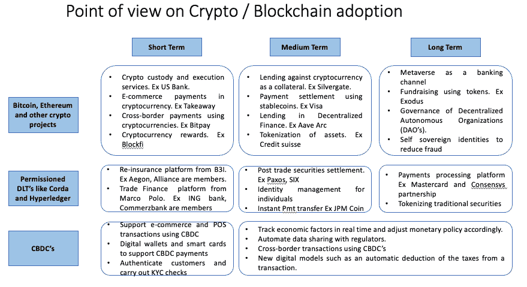

# 关于采用加密/区块链的思考

> 原文：<https://medium.com/coinmonks/reflection-on-crypto-blockchain-adoption-ad658dfaf011?source=collection_archive---------15----------------------->

今年年初的某个时候，我发表了一篇关于加密/区块链采用的短期/中期/长期观点的幻灯片。自那以来已经过去了 9 个多月，市场周期已经转向熊市。在这篇博客中，我反思了在过去的几个月中，我对这些用例的观点是如何改变的。

**加密监管** —感觉这仍然是采用周期中最强的用例。更重要的是，它是提供额外服务的先决条件，如支付、交易、deFi、赌注等。Celsius、BlockFi 和 Voyager 等本土加密公司对客户资产的处理不善，削弱了客户的信心。零售和机构现在会寻找像银行这样的可信实体来托管他们的数字资产(假设自我托管对他们来说不是一个选项)。

贝莱德现在与比特币基地合作提供加密托管服务。花旗银行、法国巴黎银行、Statestreet 等银行已经宣布了推出托管服务的计划。Fireblocks 和 Metaco 等托管技术提供商已成为这一领域的领导者。加密资产市场(MiCA)监管现在明确了加密保管的监管。

**资产的标记化** —试图将这个用例移到“短期”采用的列中。令牌化的运营效率是推动采用的主要力量。瑞士和德国等国家的监管清晰，有助于符号化项目的开展。英国资产管理行业正在推动股票/基金的令牌化。

**使用 Stablecoins 进行支付结算** —最近 Terra 生态系统的稳定硬币 UST 的内爆将导致对 Stablecoins 的大量监管。监管的不明确性至少在短期内会抑制合法用例的增长。银行存款的负利率影响了欧元稳定货币的增长。随着利率的上升，我们将会看到一些欧元稳定货币的采用。

**出借加密货币和 DeFi**——terra 生态系统中 UST 的内爆和 3AC 的破产对加密生态系统中的许多大机构产生了连锁反应。客户将不再接受传统金融机构在 Crypto 中不透明的借贷行为。我认为客户会要求加密资产的链上审计能力。尽管市场动荡，但 Uniswap、AAVE、Compound 等老牌 DeFi 公司并未表现出疲软迹象。国库中有足够储蓄的协议将能够利用熊市来构建更适合市场的产品。

**元宇宙**——我相信，尽管大肆宣传，元宇宙作为一个银行渠道仍需要很长时间。自观点发布以来，JP 摩根在分散地推出了 Onyx lounge，汇丰在沙盒中购买了虚拟房地产。处于试验阶段的银行，以确定合适的使用案例。

**CBDC 的**——隐私问题给 CBDC 带来沉重负担。批评家质疑 CBDC 的必要性..理应如此。例如，Digital Euro 在第一版中优先考虑了 P2P、POS 和电子商务支付的用例。从政策的角度来看，这些用例排名很高，但从用户需求的角度来看，排名并不高。现有的支付方式目前很好地服务于市场。Web-3 和可编程性的用例还没有被优先化。鉴于最近智能合约受到的攻击，央行支持 CBDC 的这些发展似乎不太可能。

我还想提到一个与财务无关的用例。感觉它是未来事物的先驱——星巴克宣布了发行 NFT 的 Web-3 计划，作为他们忠诚计划的一部分。这些 NFT 将在 Web-3 平台上获得优势和身临其境的体验。这是过去几个月宣布的许多其他 Web-3 计划之一——Meta、Disney、Reddit、NFL 等。

错过了任何一点…让我知道..:)

> 交易新手？试试[密码交易机器人](/coinmonks/crypto-trading-bot-c2ffce8acb2a)或[复制交易](/coinmonks/top-10-crypto-copy-trading-platforms-for-beginners-d0c37c7d698c)