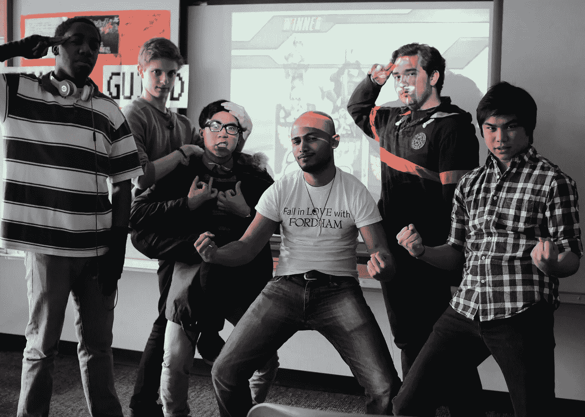
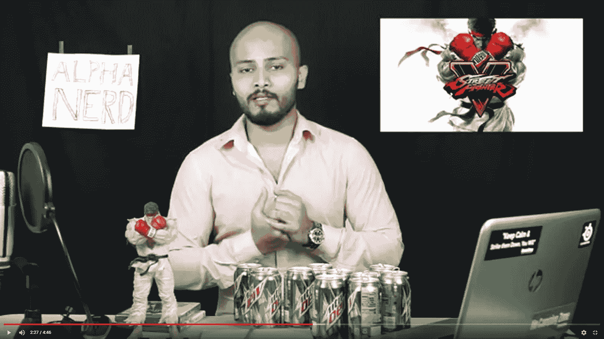
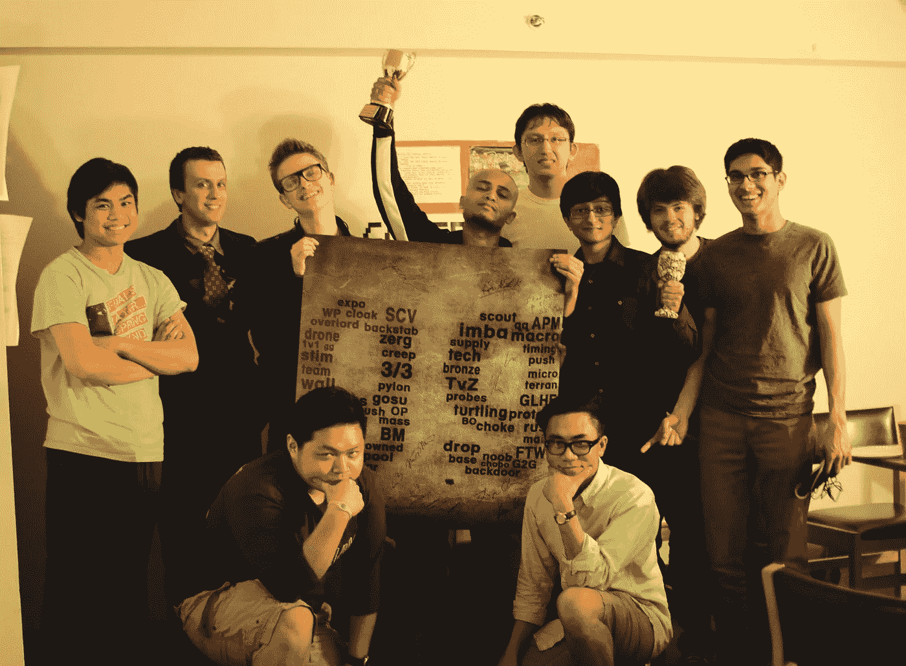

# 关于成为终身游戏玩家的思考

> 原文：<https://medium.com/coinmonks/reflections-on-being-a-lifelong-gamer-fe93820cb38b?source=collection_archive---------15----------------------->

当我开始在 Gala Games 的第一天时，我开始思考我与视频游戏的漫长历史。

我清楚记得的第一台游戏机是任天堂 64。我最近搬到美国，我的邻居邀请我去看看超级粉碎兄弟。当我看着马里奥和皮卡丘在 Hyrule Castle 上一决雌雄时，我可以说这个游戏很特别。我请求妈妈给我买一台 N64，这是一个很大的要求，因为我们仍在经历移民斗争。

由于是由孟加拉虎妈妈养大的，我购买的所有游戏都与学习成绩挂钩。

磁石中学— Gamecube
磁石高中— Xbox
奖学金上大学— Xbox 360

在大学期间，我对魔兽世界的沉迷变得更加严重，因为我可以自由地做我想做的事情。我没有为我的医学预科班学习，也没有去参加大学聚会，而是带领我的行会经历了冰冠城堡的突袭。在福特汉姆的日子里，我找到了我的游戏伙伴和书呆子部落。因为我们每天晚上都会玩《醉拳》,所以我有了创办一个游戏俱乐部的想法……我们称之为 GG --玩家协会。

正当电子竞技运动起飞，我们开始举办比赛的时候，玩家协会成立了。我的宿舍被改造成了一个电子竞技竞技场，队伍在两间卧室里比赛，观众在公共休息室观看直播。我们的星际争霸赛设有 1000 美元的奖金池，并为顶级玩家提供奖杯和现金奖励。我上大学是为了成为一名医生，但组织和领导玩家公会是我最大的成就。

毫不奇怪，我没能成为一名医生。

大学毕业后，我努力想清楚自己的未来，兼职做 SAT 家教和自由摄影师。我还在 YouTube 上开了一个游戏频道，名为 Alpha Nerd，在那里我评论视频游戏。Youtube 频道把我带到了创作者行业和影响者营销的世界。我在 creator partnerships 的一家影响力机构工作，专长是游戏和书呆子文化。

在创造者经济中呆了 5 年后，我开始寻找新的挑战。正是在这个时候，我了解了 NFTs 和 Web 3。我在《魔兽世界》和《英雄联盟》中积累数字资产的时间让我看到了 NFTs 彻底改变游戏行业的潜力。我辞去了在创造者经济中的长期职业，发现自己在一家 Web 3 游戏创业公司工作。我卖掉了 3 个 NFT 系列，并在这个领域建立了自己的地位。

当我开始我在 Gala Games 的第一天工作时，我为能够进入一个处于 Web 3 游戏前沿的组织而感到自豪。当我还是个孩子的时候接触到我的第一个游戏时，我知道我被吸引住了，我从来没有想过我会有机会在这个行业建立职业生涯。

作为一名终身游戏玩家，我期待着书写我旅程的下一个篇章。

这是来自玩家公会的星际争霸 2 锦标赛的图片。

还是我大学最美好的回忆。

感谢您的阅读。

看看我在推特上未经过滤的想法:

[https://twitter.com/wasifmrahman](https://twitter.com/wasifmrahman)

在 LinkedIn 上关注我的职业生涯:

【https://www.linkedin.com/in/wasifmrahman/ 号

我对媒体的另一个想法是:

 [## 瓦西夫·拉赫曼-中等

### 阅读瓦西夫·M·拉赫曼在媒介上的作品。拉面鉴赏家 Gala Games 的 Web 3 营销高级经理。每…

medium.com](/@wasifmrahman) 

> 加入 Coinmonks [电报频道](https://t.me/coincodecap)和 [Youtube 频道](https://www.youtube.com/c/coinmonks/videos)了解加密交易和投资

# 另外，阅读

*   [最佳比特币保证金交易](/coinmonks/bitcoin-margin-trading-exchange-bcbfcbf7b8e3) | [比特币保证金交易](https://coincodecap.com/bityard-margin-trading)
*   [加密保证金交易交易所](/coinmonks/crypto-margin-trading-exchanges-428b1f7ad108) | [赚取比特币](/coinmonks/earn-bitcoin-6e8bd3c592d9)
*   [WazirX vs CoinDCX vs bit bns](/coinmonks/wazirx-vs-coindcx-vs-bitbns-149f4f19a2f1)|[block fi vs coin loan vs Nexo](/coinmonks/blockfi-vs-coinloan-vs-nexo-cb624635230d)
*   [BlockFi 信用卡](https://coincodecap.com/blockfi-credit-card) | [如何在币安购买比特币](https://coincodecap.com/buy-bitcoin-binance)
*   [火币交易 Bot](https://coincodecap.com/huobi-trading-bot) | [如何购买 ADA](https://coincodecap.com/buy-ada-cardano) | [Geco？一次回顾](https://coincodecap.com/geco-one-review)