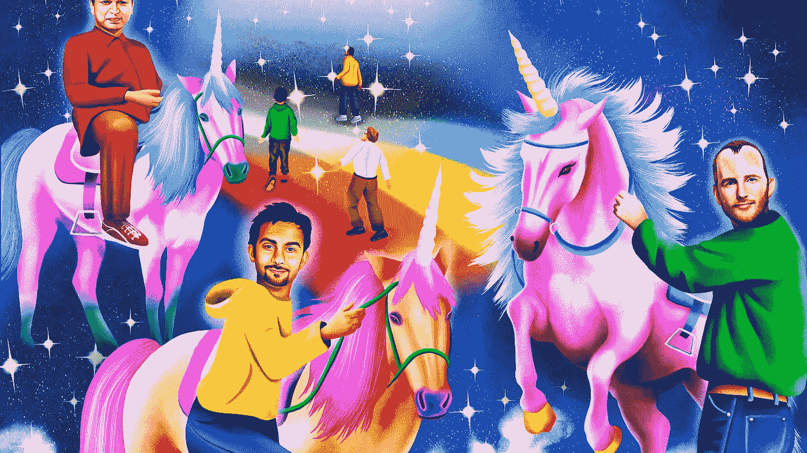
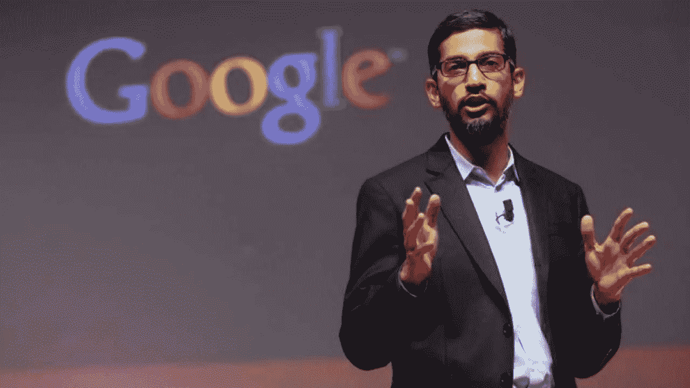
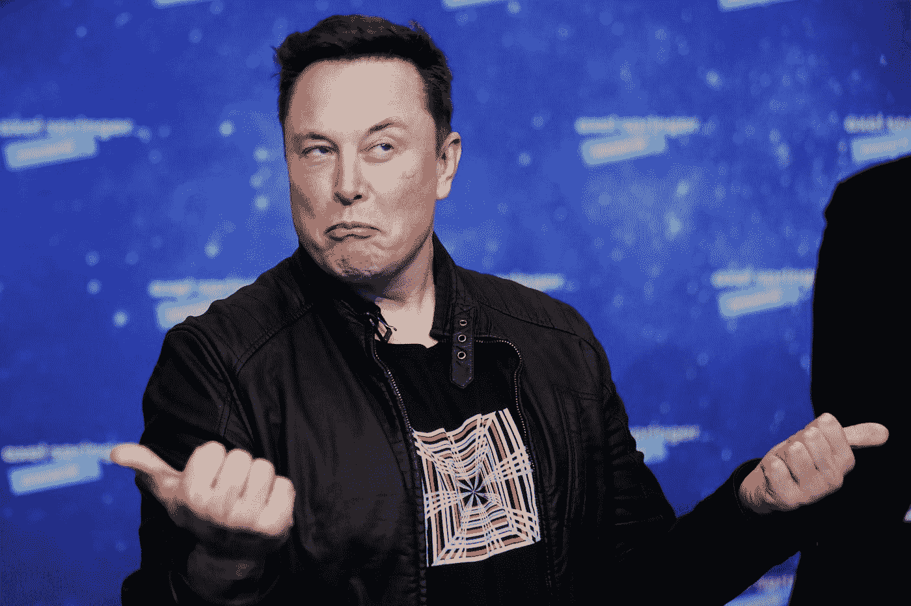
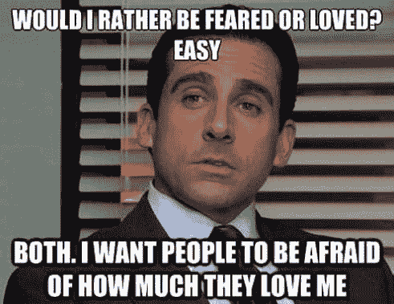

# 不管怎样，每个人都有一个糟糕的老板。

> 原文：<https://medium.com/coinmonks/regardless-everyone-has-a-bad-boss-5ed152eacee?source=collection_archive---------26----------------------->

Bad bosses are almost a norm in big companies, but why?

在看到这么多争议和问题后，你不得不怀疑硅谷和科技界是否真的存在可怕老板的系统性问题。

我只能说:当老板不容易。

你不可能一直取悦所有人。

你做的每一件事都被监视、审查和质疑。

你会允许谣言、闲言碎语之类的东西在你下面酝酿吗？

还是赶紧堵住，冒着后患无穷的风险？

唤醒员工是好事还是坏事？

我们在哪里划定尊重和“毫无疑问地追随老板”的界限？

在你的个人生活中做了有问题的事情是否意味着你在职业生活中更糟糕？

Google’s Sundar Pichai, is one of the most respected and well-loved CEO in Silicon Valley.

让我们看一些例子:

埃隆马斯克，特斯拉，SpaceX 和 the Boring Company 的 Galaxial 超载。

在一系列矛盾和不祥的指示后，他的员工开始质疑他的规则。

他要求所有员工返回工作岗位，每周至少在办公室工作 40 小时。

这笔收入将在下一季度解雇特斯拉 10%的股份。

他督促他的员工努力工作。

几乎和他工作一样辛苦，有 9 个孩子，不同的妻子。

最近的一个案例涉及 Neuralink 公司一名高管的双胞胎。

这真的是硅谷首席执行官的理想性格和履历吗？

接下来是收购 Twitter 的整个过程。

Elon actually fired a Twitter engineer instantly for talking back to him on Twitter. Ironic.

员工们都在挠头，想知道埃隆对 Twitter 的迷恋是什么，以及他为什么要冒这么大的风险，并从运营自己的公司中分心。

CoinBase 首席执行官布莱恩·阿姆斯特朗(Brian Armstrong)在 Twitter 上公开指责员工后陷入了困境，他写了一封公开信，diss 首席运营官、首席产品官和首席人事官。

Twitter 前首席执行官兼 Block 首席执行官杰克·多西在处理员工问题上也有自己的争议，尤其是在 Twitter 上与许多其他人进行了激烈的争论。

Alex Mashinsky，Celsius 的首席执行官，告诉员工一切都很好，直到 Celsius 崩溃。

Meta 的首席执行官马克·扎克伯格表面上对员工在现场问答中询问额外假期感到恼火。

不用说，这些额外的休息日很快就被完全取消了。

Jack Dorsey, cofounder of Twitter, had been known to be controversial and respected in different instances.

嗯，是不是说他们都是坏老板？

做一个“坏”老板意味着什么？

以他们的水平，当老板可不容易。

他们做出的每一个决定都会带来可怕的后果，而且并非所有的后果都是显而易见的。

他们因为错误的动作而受到惩罚，当错误出现时，他们很容易成为目标。

我只能说，做一个像他们这样的大老板并不容易。

除非你有战争经验和冷静的头脑，否则要小心接近它。

那么，为什么硅谷似乎有那么多可怕的老板呢？

Of course we all love Michael Scott from The Office.

这些老板通常都是年轻的创业者，他们很早就创办了自己的公司，很快就走上了巨大成功的道路。

他们从未上过正规的高管学校，也没上过如何在 VUCA 世界中管理拥有数十万员工的数十亿美元公司的课程。

他们不得不边走边学，用现有的东西凑合着用。

有时这意味着犯错误和承担责任。

没有人是完美的，我们应该从宏观的角度来看待它，只从长远的角度来评价老板。

当有疑问时，缩小。

-

你喜欢你的老板吗？

-

#创业#商业# startupx #成长#成功#社交媒体#文化#创业#战略# eth #比特币# elonmusk #老板#硅谷#zoomout

> 交易新手？试试[加密交易机器人](/coinmonks/crypto-trading-bot-c2ffce8acb2a)或者[复制交易](/coinmonks/top-10-crypto-copy-trading-platforms-for-beginners-d0c37c7d698c)