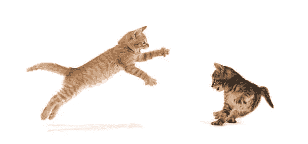

# 监管隐密体:猫战正如火如荼地进行着

> 原文：<https://medium.com/coinmonks/regulating-the-cryptoverse-the-cat-fight-is-in-full-swing-5462cc9008ca?source=collection_archive---------46----------------------->

Unsplash

美国证券交易委员会(SEC)认为加密货币是证券，这意味着它们必须受 SEC 证券指南的监管。

商品期货交易委员会(CFTC)认为加密货币是一种商品，这意味着它们必须受到 CFTC 准则的监管。