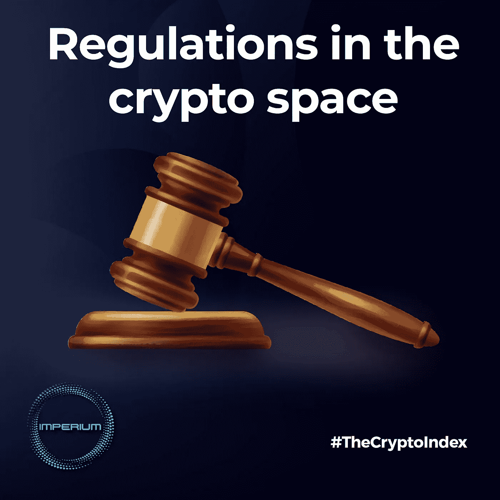

# 加密领域的法规

> 原文：<https://medium.com/coinmonks/regulations-in-the-crypto-space-6dae3d29dbc5?source=collection_archive---------16----------------------->

加密监管并不是什么新闻，因为近年来它一直在稳步发展。2022 年，在多个项目遭到无数次黑客攻击、利用和破产之后，最终导致 FTX 崩溃，导致数十亿美元的损失，监管的必要性现在比以往任何时候都更加明显。

监管的主要目标是支持金融稳定、透明度、保护用户和投资者，并确保为各种市场参与者制定一套统一的规则。

这一努力的先锋是美国和欧盟，它们提出了不同的政策和监管框架。

# 欧盟

欧盟委员会于 2020 年 9 月首次提出了加密资产市场(MiCA)监管提案，作为其数字金融战略的一部分。

其目的是澄清整个欧盟的加密货币监管状况，因为一些成员国已经有了不同的加密资产国家立法，但在欧盟层面上没有具体的监管框架。

其最终文本将于 2022 年 1 2 月在欧洲议会通过，并于 2023 年在 Q1 生效。此后，该规则将分几个阶段实施，从 Q1 2024 开始实施。

MiCA 旨在为现有法律未涵盖的加密资产建立健全的法律框架，以确保金融稳定，保护消费者和投资者，同时支持市场创新和公平竞争。

这将适用于大多数加密货币，分为四类:加密资产、公用令牌、资产参考令牌和电子货币令牌(e-money)。尽管 DeFi 项目和 NFT 目前不在 MiCA 的监管范围内。

就所提供的服务而言，MiCA 将涵盖从事加密货币托管、管理、交易、交换和营销甚至就此提供咨询的公司。

一些服务被排除在外，如贷款、某些保险产品和养老金产品。

它计划监督的许多领域包括防止洗钱、消费者保护、公司问责制和环境影响、制定一般要求、行为规则和适用于所有加密服务提供商和加密资产发行商的新许可制度。

此外，该法案将把资金转移法规(TFR)扩展到欧盟的所有 VASPs(虚拟资产服务提供商)，并将强制要求收集加密货币转移的发送者和接收者的信息。

稳定的硬币是规则中特别重要的一部分。管理稳定硬币发行者的 MiCA 系统与稳定硬币的支持方式有关。

由单一法定货币(也称为电子货币代币)支持的发行者需要是授权的银行或电子货币公司。

由任何其他资产(称为资产参考代币)支持的稳定货币发行人，如一篮子货币或商品，必须是银行或有权发行资产参考代币的发行人。

此外，MiCA 要求 stablecoin 发行者保持最低流动性，以防止类似 TerraUSD 的崩溃。

大额信用卡将受到严格的审慎监管，如果被用作支付手段，将受到限制，每天的交易上限为 2 亿€。

# 美国

从 2017 年的 ICO 热潮开始，美国证券交易委员会(SEC)对数字代币做出了表态，表明其认为加密货币是证券。因此，它开始对 ICO 发行人全面适用证券法。

随着从分散金融(DeFi)到不可替代代币(NFT)等新型代币的推出，SEC 也扩大了对这些资产类型的执法行动。

一般来说，就这些代币作为投资出售而言，它们受证券法的约束。这适用于任何“投资合同”，豪威标准将“投资合同”定义为“对普通企业的资金投资，并合理期望从他人的努力中获得利润。”

加密货币交易所被视为证券交易所，属于《银行保密法》(BSA)的监管范围，这意味着加密货币交易所服务提供商必须在金融犯罪执法网络(FinCEN)注册，实施 AML/CFT(反洗钱/打击资助恐怖主义)计划，保留适当的记录，并向国内税收署(IRS)等当局提交报告。

在税收方面，美国国税局表示，“虚拟货币”被视为财产。就像任何其他财产一样，接收、购买或出售它都会产生税务后果。比如你以一个价格买入 crypto，以更高的价格卖出，就要缴纳资本利得税。

稳定币也是美国监管机构的一个重点，因为 Terra 算法稳定币的崩溃引发了人们对这种代币监管的担忧。

2022 年 2 月 15 日，推出了“稳定币创新和保护法”草案，将“合格”稳定币描述为由受保存款机构和某些非银行实体发行的稳定币，并提议引入稳定币保险基金。

# 为什么加密监管对市场有利？

## 安全

监管将使加密货币市场成为用户更安全的环境，制裁骗局、欺诈和市场操纵。

## 信心

通过为加密资产建立健全的法律框架来确保法律确定性，将增强现有和未来投资者的信心，这个市场迄今为止一直被描述为金融“狂野西部”。

## 稳定性

直接而言，这些措施将通过纳入应对潜在风险的保障措施来调节市场的稳定性，但也通过鼓励更多长期投资进入市场来间接调节市场的稳定性。

最后，必须指出，决策者应与商业和技术界密切合作，以设计最佳和定制的监管框架，确保创新和保护。

同样重要的是，监管者要意识到某些监管模式可能产生的潜在经济影响，并合作促进一套全球协调的标准，以避免监管套利。

> 交易新手？试试[加密交易机器人](/coinmonks/crypto-trading-bot-c2ffce8acb2a)或者[复制交易](/coinmonks/top-10-crypto-copy-trading-platforms-for-beginners-d0c37c7d698c)