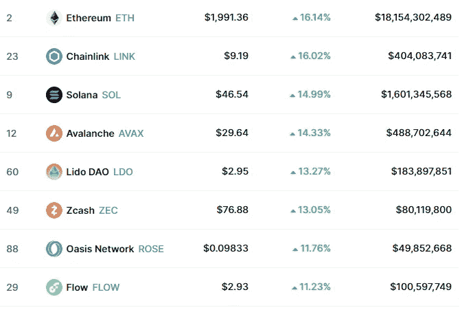
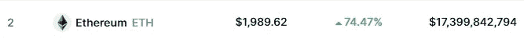
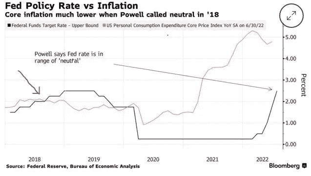
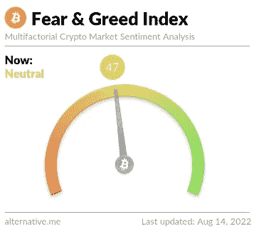
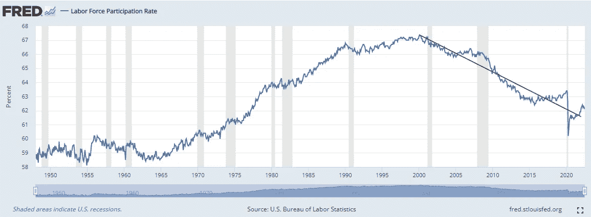
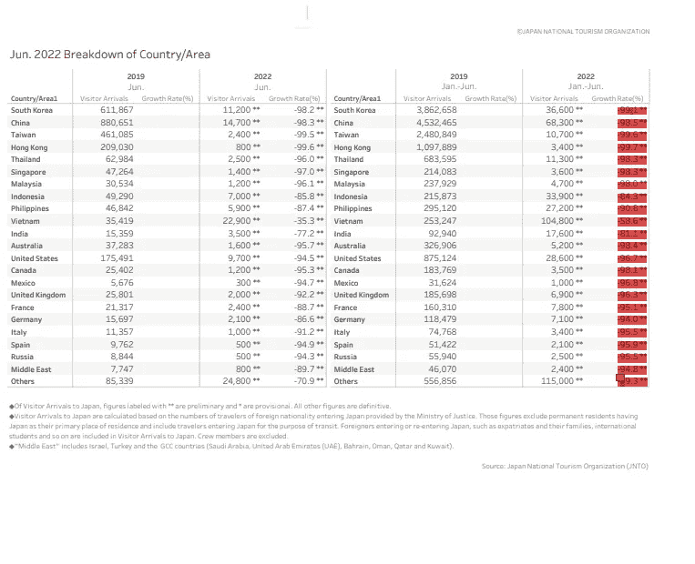

# 救济反弹或牛市恢复？

> 原文：<https://medium.com/coinmonks/relief-rally-or-bull-market-resumes-40011d6cc61d?source=collection_archive---------16----------------------->

在上次美联储会议后，我们目睹了加密和美国股市快速而显著的反弹，当时杰罗姆·鲍威尔重申，随着利率达到 2.25%-2.5%的中性水平，未来它们将更加受数据驱动。这意味着美国随后将联邦基金利率上调至一个平衡点，此时它们既不会刺激经济活动和投资，也不会减缓经济增长，从而使美国经济正常运转，换句话说，经济生产和需求处于平衡状态。加上他的声明和上周的 CPI 数据，当时美国报告通胀放缓，从 9.1%(6 月份的数据)降至 8.5 %，低于 8.7%的预测，投资者收到了他们的剂量，就像吸毒者一样(就我们而言，是乐观的剂量)，因此市场出现反弹。

S&P500 本周收盘上涨 3.26%，纳斯达克紧随其后，连续 5 天上涨 3.08%。

在加密市场，随着合并的临近和替代硬币，我们看到以太坊的一些重大收益，而稳定硬币的市场份额正在下降，这证实了资本从稳定硬币和比特币向以太坊和替代硬币的转移，因为市场参与者对增加的风险敞口更加放心。在下面的图片中，你可以看到 altcoins 的每周收益非常可观。以太坊仅在过去 30 天就上涨了 74.47%，自 6 月 18 日低点以来上涨了 100%以上。



7 days gains for major altcoins such as Solana, Avalanche, Chainlink and others



Ethereum gained 74.47% in just 30 days as the merge approaching

显然，投资者稍微乐观一些，愿意在市场上承担更多风险，但主要问题依然存在。这是新一轮牛市的开始，还是仅仅是熊市中的一次令人宽慰的反弹——警告，谨慎行事！！？？让我们一起来看看得出结论的几个要点。

回到中性利率，以及为什么杰罗姆·鲍威尔的声明中提到，尽管通货膨胀率高达 40 年，中性利率仍在下降。

[根据穆罕默德·埃里安、](https://www.bloomberg.com/news/articles/2022-07-29/summers-says-powell-s-call-on-neutral-fed-rate-indefensible)安联公司首席经济顾问和彭博意见撰稿人以及劳伦斯·萨默斯美国经济学家的说法，美联储关于达到中性水平的声明只不过是“一厢情愿”和“中性水平的邮政编码更高”。

萨默斯认识到，鲍威尔在 2018 年底做出了同样的声明，即像现在一样达到 2.25%的中性水平，但通胀率低于 2%。如果我没有弄错的话，这个数字远远低于 8.5%。见下图。那么，为什么鲍威尔称利率符合中性水平，就像他在 2018 年底宣布通胀率为 2%一样，而当前的通胀率是联邦基金利率的 4 倍。在我看来，这些话只是为了在 8 月份假期之前让市场平静下来，也是为了让我们在未来几年更高的通胀中放松，新的标准可能是 4-5%的年通胀率，而不是 2%。



恐惧和贪婪指数在缓慢和逐渐改善后，勉强达到中性水平。在最近的去杠杆化事件和市场参与者失败后，投资者仍然更倾向于恐惧，因此恐惧和贪婪指数并不能证实牛市，反弹可能是短暂的。



Fear & Greed Index sits at highest level since April 2022

**截至 2022 年 7 月的美国就业形势。**

尽管失业率处于创纪录低点，7 月份非农就业人数增加了 52.8 万，但一个小细节可以解释这种就业形势，并证明劳动力市场并不像美联储希望我们认为的那样强劲。见下图，在创造的 528，000 个工作岗位中，303，000 个是兼职工作，因此表明随着商业环境恶化和工作时间减少，许多人从事兼职工作是为了跟上支出/价格上涨。

```
**The number of persons employed part time for economic reasons increased by 303,000 to
3.9 million in July. This rise reflected an increase in the number of persons whose
hours were cut due to slack work or business condition**
```

美联储大声疾呼，劳动力市场非常强劲，失业率处于创纪录的低水平，但劳动力参与率比疫情之前的水平低 1.5 个百分点，这表明人们离开劳动力市场，不打算回来，而且永远离开了。劳动力疲软意味着美国经济增长放缓和潜在工资上涨。显然不是我们所期望的结果。



Labor force participation rate sits below pre-pandemic levels at 62.1 ( 63.4 pre-pandemic levels)

我看到的另一个有趣的表格显示，当谈到旅游业时，事情完全变了。下文强调的一些国家报告称，与 2019 年 1 月至 6 月相比，2022 年 1 月至 6 月期间，其游客人数下降了 90%至 100%。国家包括中国、泰国、印度尼西亚、印度、美国、英国、墨西哥、俄罗斯(嗯，这种下降对我来说并不奇怪)。全球游客数量的放缓可能进一步表明全球经济整体放缓，并重申世界许多地区即将出现的衰退。



总而言之，我确实相信我们仍处于熊市，股票和密码将很快恢复下跌，可能与秋季开始相吻合。随着未来更多的动荡和全球经济的疲软，机会将开始显现。经济衰退时期，如果有足够的火力在旁边，可能会在未来几年产生改变生活的收获。这并不是说我在最近的下跌中没有买更多的密码，我说的都是基于事实，多头还没有到，波动应该会回来。开始购物吧！！

祝大家周日愉快！

**免责声明**:我必须警告你，有些观点可能是我个人的偏见，但是，我会尽我所能为你提供关于特定主题的客观观点。我不是理财顾问，所有文章只会有严格的教育目的。

> 交易新手？试试[密码交易机器人](/coinmonks/crypto-trading-bot-c2ffce8acb2a)或[复制交易](/coinmonks/top-10-crypto-copy-trading-platforms-for-beginners-d0c37c7d698c)