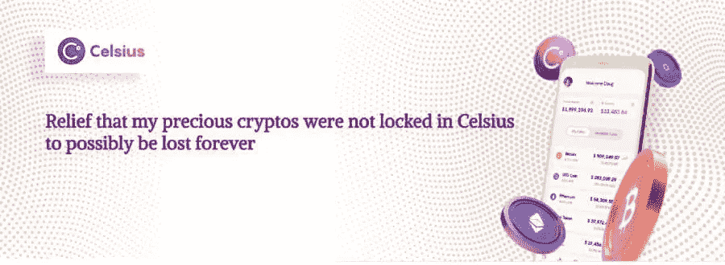

# 欣慰的是，我珍贵的密码没有被锁在摄氏温度，可能会永远失去…

> 原文：<https://medium.com/coinmonks/relief-that-my-precious-cryptos-were-not-locked-in-celsius-to-possibly-be-lost-forever-15996dfa2192?source=collection_archive---------38----------------------->

前天，我的心麻痹了[看了这条新闻](https://cryptobriefing.com/i-am-suicidal-celsius-customers-respond-to-firms-bankruptcy/)，关于摄氏存款人考虑自杀与摄氏可能无法履行他们的义务，返回他们的存款人的加密存款。

我可以想象他们的痛苦，因为我也在 2 年前将我珍贵的密码存放在 Celsius 钱包中，当时我对密码还很陌生，只是太害怕维护自己的钱包，认为我必须安全地保存私钥，这太有压力了。

我太害怕在 2020 年末尝试 DEFI 或 metamask。我记得我曾经把我的密码放在 CEX 交易所的钱包里，就像币安一样。我对 2018-2019 年非常乐观。

It took a long time for me to enter the world of DEFI and use Metamask

我在 2020 年才全职进入 crypto，当时由于 Covid 的情况，我失去了我的网站更新工作。

# 在冒险进入 DEFI 和自我保管加密钱包之前，我进入了摄氏！！

我也想赚取收益，但 defi 对我来说太可怕了，我也不想尝试使用以太坊区块链进行 DEFI，因为我太害怕那些区块链费用了。

因此，即使在 2020 年，我也不知道如何使用元掩码，从以太坊到币安智能链网络等设置元掩码网络。这对我来说太可怕了！！

最终，我通过 Polygon 进入了 [DEFI，并在](https://www.publish0x.com/investing-and-trading/a-crypto-enthusiast-s-first-proper-defi-experience-using-the-xmmkrvr)[刷到了以太坊交易费](https://www.publish0x.com/investing-and-trading/a-crypto-enthusiast-s-first-proper-defi-experience-using-the-xmmkrvr)，因为我想尝试好的 DEFI dapps，而不是像 Polygon 中的 [Aave](https://www.publish0x.com/investing-and-trading/my-understanding-of-how-defi-lending-business-using-crypto-a-xelvzrq) 那样没有太多跟踪记录的币安智能链中的 dapp。无论如何…

所以，我在寻找更容易获得收益的方法，这就是为什么我把我的比特币、以太坊资产都存入了 Celsius。Celsius 在 BTC、LTC 和 ETH 以相同的存款加密货币支付了良好的存款利率。最终，我也赢得了 CEL 代币。在某个时间点，CEL 代币的价格攀升，我实际上用 CEL 代币赚了很多钱，并对 BTC 和联邦理工学院的收益率感到满意。

[Trading view chart.](https://www.tradingview.com/x/os8L6SlG/) There was a period between March 2021 and July 2021 when CEL token prices were very attractive!!

同样吸引我的是，从 Celsius 中取出你的密码并没有太多的交易费用，所以它非常可爱。这意味着，无论把我的 BTC 联邦理工学院的钱存入另一个钱包需要多少区块链费用，都是由 Celsius 承担的。

> 交易新手？试试[加密交易机器人](/coinmonks/crypto-trading-bot-c2ffce8acb2a)或者[复制交易](/coinmonks/top-10-crypto-copy-trading-platforms-for-beginners-d0c37c7d698c)

## 著名的密码教育家 Nicholus Mertin 在他的 youtube Datadash 频道上推荐使用 Celsius wallet

[DataDash youtube channel](https://youtu.be/iAhFhdSbtgg)

我的前加密大师 Nicholas Mertin 在他的 DataDash youtube 频道中也向投资者推荐了 Celsius wallet，让他们进行存款并获得被动收入，所以我觉得 Celsius 是保存加密资产的好地方。

尼古拉斯确实说过，Celsius 的创始人亚历克斯·马辛斯基在他创办的其他企业中有着出色的业绩记录，我确信这是真的。

亚历克斯在 Datadash 的频道中接受了多次采访，即使当卢娜-UST 崩溃时，尼古拉斯也说卢娜-UST 没有基本面，因为许多这样的算法稳定指数之前已经死亡螺旋上升，投资者最好将他们的资产放在像 Celsius 这样的安全贷款平台上，在那里他们可以获得良好的加密收益率。

然而，我知道尼科尔斯一定非常信任 Celsius 和他的朋友 Alex，因为他的 Digifox 钱包提供了 Celsius 的服务，所以我相信他没有任何不可告人的理由向他的观众推荐 Celsius，因为他自己透露 Celsius 赞助了他的许多剧集，他的频道合作伙伴也是如此。

# 感谢我从 Celsius 拿走了我珍贵的密码，所以它们是安全的(:

我对[我在 UST 和露娜](/coinmonks/crypto-insights-from-my-failed-investment-journey-in-terra-assets-ust-and-luna-744a0a5c1585)的决定非常失望，慢慢地开始觉得作为一个加密人我失败了，但我必须提到，我很高兴我很久以前就决定把我的加密资产从 Celsius 中取出来，尽管这些收益很容易，我的前加密大师和我仍然最喜欢的加密 youtubers 之一(Nicholus Mertin)推荐 Celsius 平台来存放我们的加密。

如果我一直呆在摄氏温度，我所有珍贵的“是的，我珍贵的比特币和 Ehetheum”将会永远消失！！

# 我退出摄氏钱包的原因！！

我记得从 Celsius 撤出我资产的原因是:

1.我实际上很担心我的加密资产，因为我一直听到“不是你的密钥不是你的加密”这个词。哦，是的，我知道我必须在离线资源中维护所有这些钱包单词短语的记录，并安全地保存它们，但现在我已经习惯了。我已经决定将我的 BTC 和联邦理工学院转移到原子桌面钱包，即使我不会获得收益。

2.coindesk 在 Celsius 上发表文章称，该公司可能在发放无抵押贷款，尽管那篇文章称，Celsius 的无抵押贷款部分肯定是非常小的一部分，但我感到不安。

3.我并不完全理解 Celsius 的条款和条件，我感觉他们可以随心所欲地控制客户的存款。我们不会知道 Celsius 贷款给谁的细节。

虽然 Alex 说 Celsius 贷款给机构，但总是抵押和担保贷款，他们偿还利息，Celsius 偿还给客户。

然而，由于我无法阅读所有的条款和条件，也无法找出漏洞，所以我决定退出 Celsius。

4.最后，我对 Celsius 感到恼火，因为我需要经常在手机上下载 Celsius 应用程序。没有桌面应用。打开 Celsius 应用程序通常需要很长时间，而且我也不觉得将我的加密提取到一个白名单加密钱包地址很方便。

最终，我从 Celsius 中取出了我所有的密码，并将我的 CEL tokens 兑换成了一个有望自我控制的非托管钱包，其密码阶段和访问权限都在我的监管之下。

# 令人欣慰的是，我没有陷入这种摄氏密码危机事件

好吧。我做了一个明智的决定，对此我很高兴，没错，我和卢娜-UST 一起失去了很多，但我还没有失去所有，如果我留在摄氏温度下保存我的密码的话。

在此期间，我听到了关于 Celsius 的消息，他们变得更加透明，他们的账户细节记录在 Horizen 区块链的某个地方。我还不得不提到亚历克斯展示了印有“unbank yourself”字样的运动 t 恤。

Celsius is claiming its very transparent in its dealings in its [website](https://celsius.network/) still!! Really there, that’s an eye wash!!??

我想告诉那些在摄氏温度下损失了存款的人，也许仍然有可能拿回你的资金，找到它，也许存款人可以起诉摄氏温度。自杀的想法可能会出现，我自己对[卢娜-UST 消灭](/coinmonks/crypto-insights-from-my-failed-investment-journey-in-terra-assets-ust-and-luna-744a0a5c1585?source=your_stories_page-------------------------------------)感到非常难过，但不要放弃，不要让这些事件阻止其他人在加密空间学习和做一些事情。

我真的为 Celsius 的储户感到难过，我真的希望他们能拿回他们的资金。我有更多的东西要写，关于我现在对摄氏温度的理解，以及所有最近发生的事情，我将很快在另一篇文章中介绍。

***我不禁心存感激，庆幸自己决定退出摄氏！！感谢上帝保佑我！！***