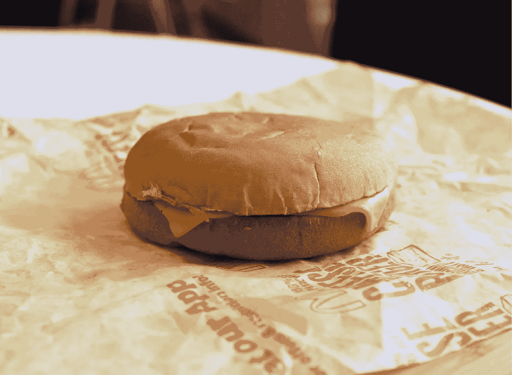
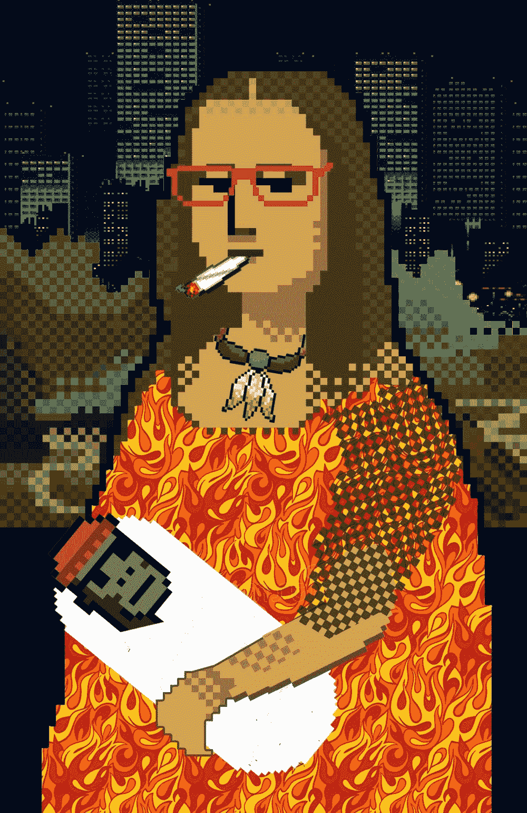
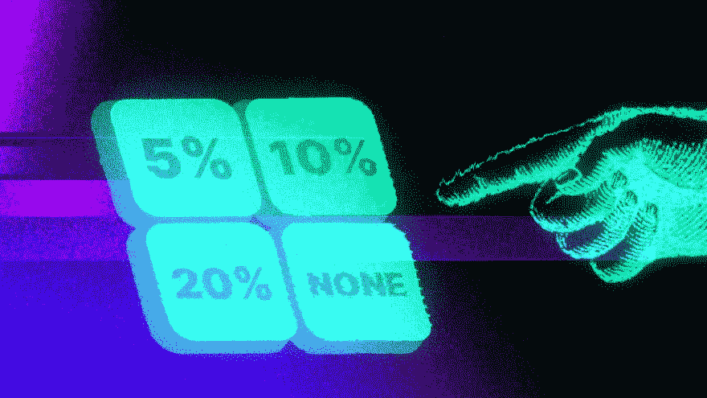
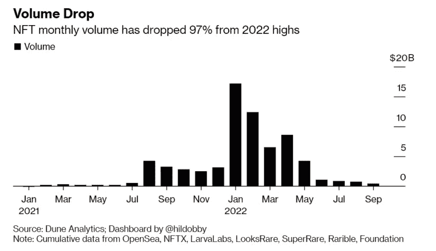

# 取消 NFTs 的版税就像没有馅饼的巨无霸

> 原文：<https://medium.com/coinmonks/removing-royalties-from-nfts-is-like-having-a-big-mac-with-no-patty-b98dc9ae0640?source=collection_archive---------34----------------------->

Is it still a burger if there isn’t a patty?

Web3 描绘了一个非常好的故事，整个故事都是关于“拥有所有权”、“权力给人民”和“参与，而不仅仅是观察”。

对艺术家来说，这很有意义。

以前，他们不得不依赖第三方出版商、艺术机构和独裁的社交媒体巨头来推广他们的作品，而现在，他们可以直接与自己的观众进行互动。

他们可以直接与他们的支持者接触，利用 web3 提供的新技术做更多的事情。

想象一下这个场景。

达·芬奇在 1503 年画了《蒙娜丽莎》,却从未从中获利一分钱。

在 web3 出现之前的那些日子里，没有简单的方法来跟踪和监控版税。

NFT Art is taking on imaginative forms these days.

随着最近对 NFT 的大惊小怪，允许 NFT 的艺术家或所有者收取版税的概念特别有趣。

智能合同和区块链理工大学已经允许任何人控制他们从每笔交易和随后的 NFT 销售中收取多少版税。

围绕 NFTs 的宣传和营销越大，社区越大，越受欢迎，产生的需求就越多，因此交易也就越多。

翻译:给艺术家更多的版税。

想象一下达芬奇能够为他的画设定一个小的版税费用。

几个世纪以来，随着他的作品代代相传，他的遗产将获得丰厚的版税。

Should royalties be removed from NFTs altogether?

是的，这样做有经济上的好处，但这也是关于尊重所有权和尊重遗产。

在某些方面，它给了艺术家更深的意义和更多的经济动机，让他们做更多的工作，付出更多的努力来创作高质量的作品。

这可能是贪婪吗？

也许是这样，但现在想想，挣扎中的艺术家现在可以有意义地将他们的时间和精力投入到制作他们最好的作品中，而没有资源的限制，也不必担心把食物放在桌子上。

绝对有一个崇高的理念，我们都可以向往。

然后是贪婪。

这导致了扯皮和诈骗。

但那是以后的事了。

因此，当新的 NFt 市场 X2Y2 决定让版税可选时，加密界反其道而行之。

” ***如果这成为趋势，我就退出 web3。忽视创作者的版税不是创新，而是倒退。”***

NFT trading and interests has plummeted in 2022.

为什么他们甚至考虑取消版税？

嗯，这是一个竞争激烈的市场，作为该领域的新成员，X2Y2 希望与 Sudoswap 等公司竞争，后者也是免版税的。

从长远来看，它对 web3 生态系统健康吗？

从 NFTs 中拿走版税肯定会扼杀游行的气氛。

版税激励创作者继续建立品牌，并推动极限。

它就像一个内在的激励工具。

去除这一点，创作者将不再有强烈的理由坚持品牌建设和社区发展。

-

我们应该取消非专利技术的版税吗？

-

# startups # business # startupx # growth # sudi media # culture # sudos WAP # x2 y2 # strategy # eth # BTC # crypto # opensea # markets # bear market # NFT # royalty # NFT market

> 交易新手？试试[加密交易机器人](/coinmonks/crypto-trading-bot-c2ffce8acb2a)或者[复制交易](/coinmonks/top-10-crypto-copy-trading-platforms-for-beginners-d0c37c7d698c)