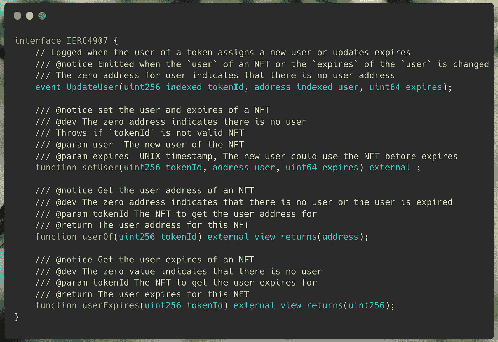

# 可出租的非森林公园(ERC-4907):第一部分

> 原文：<https://medium.com/coinmonks/rentable-nfts-erc-4907-949225d476a9?source=collection_archive---------1----------------------->

> 游戏化非功能游戏世界中急需的标准。

Photo by [Robert Linder](https://unsplash.com/@rwlinder?utm_source=medium&utm_medium=referral) on [Unsplash](https://unsplash.com?utm_source=medium&utm_medium=referral)

在现有的 NFT 世界中，我们可以感觉到注入市场的数字资产收藏量突然增加。当然，NFT 已经不仅仅是个人资料图片(PFP)了。

随着 NFT 收藏品的供应量增加，用户现在清除了对一些支持资产的公用事业的强烈需求。值得庆幸的是，Play2Earn (P2E)和 Gaming 元宇宙 NFTs 的概念已经成为直接而简单的解决方案，以公用事业为这些资产提供支持。

随着游戏越来越受欢迎，购买基于游戏的 NFT 资产，可能真的会更贵，主流用户更难获得。虽然有 NFT 租赁平台可用，但市场上现有的解决方案在安全性方面仍然缺乏鲁棒性，并且需要高成本的开发和集成。

# 什么是 NFT 出租

NFT 租赁的工作方式相同，如何在现实世界中的任何其他租赁工作。假设你想拥有一辆豪华车，暂时用几天。最好的节省成本的方法不是买一辆新车，而是在规定的天数内租一辆车，并在你的期限结束后归还给车主。同样，这个想法是暂时租用 NFT 几天，一旦租期结束，就归还给合法的主人。

同样从 NFT 所有者的角度来看，假设如果我拥有一辆 NFT，而不是简单地长期持有，NFT 可以被出租，并被用作从 NFT 赚取被动收入的来源。虚拟土地可以“租”和“用”来构建场景，代表游戏资产的 NFT 可以“租”来“用”在游戏内。

# 传统的 NFT 租赁系统

由于 NFT 租赁没有设置标准，NFT 租赁的传统设置中最常遵循的方法之一是使用*保证临时所有权变更*。所有者将所有权转让给想要租赁 NFT 的用户，并附带一些担保/保证，即被租赁的用户将在租赁期结束后归还 NFT 的所有权。这种传统方法最常见的实现之一涉及*托管所有权。*

当您出租 NFT 时，原所有者对出租的 NFT 没有控制权，完全基于对出租用户/托管所有者的信任。是的，听起来很冒险。

> “有没有想过 Opensea 令牌 ID 中的巨大数字实际上意味着什么！! "
> 检出: [Opensea TokenId:已解释](/coinmonks/opensea-tokenid-explained-f420401f5109)

# NFT 的角色需求

NFT 的"*所有者"*和使用 NFT 的"*用户"*可能不总是相同的。可能有一个 NFT 的“*所有者“*将它出租给另一个“*用户*”，将这些数据存储在链上使得出租更加强大和安全。角色指定了用户和所有者之间的界限，使得管理权限和执行相应的操作变得容易。
**举例**:虽然“*owner”*可以自由转让 NFTs，但是 NFT 的“u*ser”*不应该被允许转让，限制他只能使用租用的 NFT。

# **两用 NFT 租赁标准**

> *ERC - 4907*

Photo by [Vincent van Zalinge](https://unsplash.com/@vincentvanzalinge?utm_source=medium&utm_medium=referral) on [Unsplash](https://unsplash.com?utm_source=medium&utm_medium=referral)

对公用事业 NFT 的持续需求，使得双重角色标准成为实现可出租 NFT 的最佳模式之一。简单的实现和提供的安全性，就 NFT 租赁而言，这是一种可行的机制。

**ERC-4907** ，在 ERC-721 的`*owner* role`之外增加了一个`*user* role` ，并增加了数据`*expires*` ，将最终用户权限方便租用。

在传统的租赁平台中，一旦租期结束，所有者必须手动收回他们的用户权限。这样做是一个相当繁琐的过程，尤其是如果同时租用多项资产。除了不方便之外，这也被证明是昂贵的天然气。
包含`*expires*`是至关重要的一步，因为它消除了业主不便的这些问题，并证明了 gas 的有效性。

与传统的租赁系统不同，虽然 NFT 已经租出去了，但你仍然是 NFT 的所有者，并对其拥有完全的控制权。

# IERC4907

IERC4907.sol ( [source code](https://github.com/sidarth16/Rentable-NFTs/blob/main/interfaces/IERC4907.sol) )

*   `**UpdateUser(...)**` **:**
    每当新用户被分配到 tokenId(或)时，当 tokenId 的用户被更新时，发出事件`UpdateUser(...)`。
*   `**setUser( tokenId, user, expires)**` **:**
    在函数`setUser(...)`中，给定的`*user*`地址被设置为传递的`*tokenId*`的用户。`*expires*`是 UNIX 时间戳，在此之后，此`*tokenId*`的用户权限将被撤销(即，用户只能在`*expires*`之前使用此 NFT 令牌 Id)。
*   `**userOf( tokenId ) -> returns address**` **:** 这个`view`函数，返回当前用户给定的`*tokenId*`。
    如果令牌当前没有用户(或)分配给此`tokenId`的用户权限已经过期，则该函数返回零地址。
*   `**userExpires( tokenId ) -> returns uint256**` **:** 此`view`函数返回 UNIX 时间戳，在该时间戳处，给定`*tokenId*`的用户权限将被撤销。分配给此`tokenId`的用户只能在返回的 timestramp 之前使用此 NFT。如果`tokenId`当前没有用户，该函数返回零。

## 注意:

*   `userOf(uint256 tokenId)`功能可以实现为`pure`或`view`。
*   `userExpires(uint256 tokenId)`功能可以实现为`pure`或`view`。
*   `setUser(uint256 tokenId, address user, uint64 expires)`功能可以实现为`public`或`external`。
*   当用户地址改变或用户过期时间改变时，必须发出`UpdateUser`事件。
*   用`0xad092b5c`调用时，`supportsInterface`方法必须返回`true`。

> “使用荷兰拍卖机制进行 IPO / ICO 的基本演练，以及为什么它在区块链市场被广泛采用。！! "
> 查看:[荷兰拍卖— IPO/ICO](/coinmonks/dutch-auction-ipo-ico-e02d4441a286)

# 结论

租用不可替换的令牌在 NFTs 范围内提供了一个全新的机会。ERC 4907 中的双重角色机制允许协议从所有权中提取用户权限，这对于 NFT 租赁来说至关重要。

**协议规定:**

*   **实现简单:** 易于实现并提供*向后兼容性*
*   **角色到 NFT** **:**
    有了双重的“*所有者*”和“*用户*”角色，管理贷方和借方在 NFT 上能做什么和不能做什么就变得容易多了。
*   **上线时间管理**(`expires`)**:**
    NFT 的“*用户*”在租期结束后自动撤销。
*   **轻松的第三方集成:**NFT 的所有者现在可以将 NFT 租给一些用户，同时在抵押贷款平台上使用 NFT。租赁使用 NFT 的“*用户*角色，抵押使用*所有者*角色。

# 创作者笔记

非常感谢您的阅读。如果有任何疑问，请随时联系我们。
帖子已经太长了，
让我们看看**在 solidity contract** 中实现了同样的功能，以及本系列第二部分 ***中的 **Brownie 测试用例**。***

> 查看: [**第二部分:可出租的 NFTs(ERC-4907)**](/@sidarths/rentable-nfts-erc-4907-part-ii-954cc27d22e9) **可靠性**智能合同实现和使用 **Brownie** 进行测试

关注区块链、NFTs、Defi、智能合约等更多内容
*联系我*[***Twitter***](https://twitter.com/sidarthx0)*[***LinkedIn***](https://www.linkedin.com/in/sidarths/)[***邮箱***](http://ssidarth1999@gmail.com/) 。*