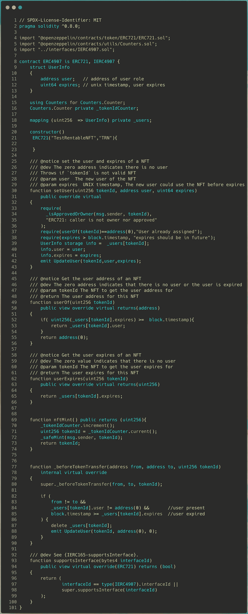

# 可出租的国家森林公园(ERC-4907):第二部分

> 原文：<https://medium.com/coinmonks/rentable-nfts-erc-4907-part-ii-954cc27d22e9?source=collection_archive---------0----------------------->

> **可靠性**智能合同实施和使用 **Brownie** 进行测试

Rentable NFTs

# 介绍

欢迎回到 ***系列第二部****！！！
在[](/coinmonks/rentable-nfts-erc-4907-949225d476a9)*的第一部分中，我们已经讨论过:**

*   **NFT 租赁和传统租赁系统**
*   **双重角色 NFT 租赁标准**
*   **IERC 4907**

**现在，我们已经了解了 NFT 租赁的核心概念，让我们开始使用 IERC 4907 实现可租赁的 NFT 智能合同。这可能会成为一篇冗长的阅读文章，因为我们将会对合同和测试用例进行彻底的解释。**

```
****Note**: 
The logic for renting used here are only for mock implementation purposes.
For better understanding of this blog, Please have a quick look into the [*Part1*](/coinmonks/rentable-nfts-erc-4907-949225d476a9) of the series.**
```

# **智能合同**

****

**ERC4907.sol : [raw_source_code](https://github.com/sidarth16/Rentable-NFTs/blob/main/contracts/RentableNft.sol)**

> **关注我的 Github repo 获取完整代码:[**Rentable-Nfts**](https://github.com/sidarth16/Rentable-NFTs)**

# **合同解释:**

> **智能协定的代码演练和解释实现**

# ****继承**:**

*   ****ERC721 . sol
    继承了 ERC 721 令牌标准的所有功能。****
*   **IERC4907.sol
    继承了接口[*ierc 4907*](https://github.com/sidarth16/Rentable-NFTs/blob/main/interfaces/IERC4907.sol)*r*enting 功能，需要在我们的合同中实现。**

# **设置全局变量:**

```
****struct UserInfo{** address **user;   //** *address of user role*uint64 **expires; //** *unix timestamp, user expires* **}****mapping (uint256  => UserInfo)** private **_users;****
```

*   ****struct UserInfo** :
    存储用户`address`和各自的用户`expires` UNIX 时间戳**
*   ****_ users**:
    token id 到其各自`userInfo`结构的映射。**

# **功能:**

## ****setUser(**uint 256**token id，** address **user，** uint64 **expires)****

```
****function setUser**(uint256 **tokenId**, address **user**, uint64 **expires**)
   public override virtual
**{**
  **require**(**_isApprovedOrOwner(msg.sender, tokenId)**,
          "ERC721: caller is not owner nor approved");
  **require**(**userOf(tokenId)==address(0)**,"User already assigned");
  **require**(**expires > block.timestamp**, "expires should be in future");
  **UserInfo** storage **info** =  _users[tokenId];
  **info.user** = user;
  **info.expires** = expires;
  **emit UpdateUser(tokenId,user,expires);**
**}****
```

**该函数用于给给定的`tokenId`设置一个`user`，直到给定的 UNIX `expires`时间戳。**

**在这里，我们首先检查:**

*   **`msg.sender`被授权设置用户。**
*   **用户已经被设置到此`tokenId`。**
*   **`expires` UNIX 时间戳有效**
*   **一旦验证完成，细节在`userInfo`中更新并映射到给定的`tokenId`。**
*   **最后，一旦用户被设置，事件`UpdateUser`被发出。**

## ****user of(**uint 256**token id)****

```
****function userOf**(uint256 **tokenId**)
   public view override virtual **returns**(**address**)
**{**
   if( uint256(**_users[tokenId].expires**) >=  **block.timestamp**){
      return **_users[tokenId].user**;
   }
   return **address(0)**;
**}****
```

*   **该视图函数返回`tokenId`的当前活动用户。**
*   **这里我们从`userInfo`映射中检索 tokenId 的`expires`。如果当前时间戳仍然小于过期时间戳，我们返回用户，如在`userInfo`中，因为他仍然是 NFT 的活动用户。**
*   **每当给定的`tokenId`没有当前活动用户时，返回零地址**

## **用户过期(uint256 令牌 Id)**

```
****function userExpires(**uint256 **tokenId)** 
   public view override virtual **returns**(**uint256**)
**{** return **_users[tokenId].expires**;
**}****
```

*   **该视图函数返回`tokenId`的用户到期时间戳。**
*   **这里我们访问`_users`映射来检索`tokenId`的`userInfo`结构并返回`expiry`时间戳。**

## **nftMint()**

```
****function nftMint()** public returns (**uint256**)
**{**
   _tokenIdCounter.increment();
   uint256 **tokenId** = _tokenIdCounter.current();
   **_safeMint(msg.sender, tokenId)**;
   return **tokenId**;
**}****
```

*   **简单如说，这个函数是用来将`mint`721-NFTs 到`msg.sender`**

## **_ before token transfer(address from，address to，uint256 tokenId)**

```
****function _beforeTokenTransfer**(
   address **from**, address **to,** uint256 **tokenId**)
   internal virtual override
**{
   super._beforeTokenTransfer(from, to, tokenId);**
   if (
       **from** != **to** &&
       **_users[tokenId].user** != **address(0)** &&    *//user still present*
       **block.timestamp** >= **_users[tokenId].expires** *// user expired* ){
        **delete** _users[tokenId];
        **emit UpdateUser(tokenId, address(0), 0);**
   } **}****
```

*   **这个函数只是进行一些基本的内务处理，并删除不需要的数据，如果存在的话。**
*   **如果过期的用户仍然保留在用户映射的内部记账中(`_users`)，则是多余的不需要的数据。**
*   **在传送 NFT 和相应更新事件被发出之前，这些过时的映射被移除和删除。**

**现在我们已经准备好了合同，让我们使用 Brownie 框架进行一些基本的功能测试。**

> ***“使用荷兰拍卖机制进行 IPO / ICO 的基本演练，以及为什么它在区块链市场被广泛采用。！! "
> 查看:* [*荷兰拍卖— IPO/ICO*](/coinmonks/dutch-auction-ipo-ico-e02d4441a286)**

# **布朗尼测试:**

> **使用 Brownie 进行智能合约测试**

```
****NOTE:** *Refer* [*Brownie docs*](https://eth-brownie.readthedocs.io/en/stable/index.html) *for setting up brownie environment***
```

**Brownie Test**

> **Brownie 设置和测试用例的完整代码请参考这里:[**Test _ rentable . py**](https://github.com/sidarth16/Rentable-NFTs/blob/main/tests/test_rentable.py)**

## **初始设置**

```
**from **brownie** import **ERC4907**, **accounts**, **chain**
import **brownie**
import **pytest**
from **web3.constants** import **ADDRESS_ZERO****deployer** = **owner1** = **owner2** = **user1** = **user2**  = None
**DAY** = 1 * 24 * 60 * 60**@pytest.fixture(scope="module")
def testNft():**
   **global** deployer, owner1, owner2, user1, user2
   deployer, owner1, owner2, user1, user2 = **accounts[0:5]**
   **testNft** = **ERC4907.deploy(**{"from":deployer}**)**
   **return testNft****
```

**导入所需的库后，我们用默认值初始化常量和全局变量。**

**函数`testNft()`被赋予`module`的范围，因此在测试模块开始时将仅被调用一次(与 hardhat 中的 `*before()*` *相同)。相同的契约将被用于所有保持其状态的测试。然后，我们从部署者的帐户部署`ERC907`合同。***

## **测试案例 1**

> **铸造 NFT 并检查它们的用户和所有者**

```
****def test_mint(testNft)**:

   ***# Mint Nfts***

   tx = **testNft.nftMint**({"**from**":**owner1**})
   id1 = tx.return_value
   print(f'Minted NFT ( TokenId : {id1} )') tx = **testNft.nftMint**({"**from**":**owner2**})
   id2 = tx.return_value
   print(f'Minted NFT ( TokenId : {id2} )') ***# check Nft Balance***
   assert testNft.**balanceOf**(owner1.address) == 1
   assert testNft.**balanceOf**(owner2.address) == 1 ***# check Owners***
   assert testNft.**ownerOf**(1) == owner1.address
   assert testNft.**ownerOf**(2) == owner2.address ***# check Users***
   assert testNft.**userOf**(1) == ADDRESS_ZERO
   assert testNft.**userOf**(2) == ADDRESS_ZERO**
```

**使用我们已经部署的 testNft 合同。 ***拥有者 1*** 和 ***拥有者 2*** 铸造他们的 NFTS。我们断言这些生成的令牌 id 的所有者和用户详细信息的正确性**

## **测试案例 2**

> **分配用户角色并租用 NFT**

```
****def test_renting(testNft):** rent_expire_time = chain.time() + **2*DAY** ***# set user to the NFTs*** testNft.**setUser**(**1**, **user1**.address, rent_expire_time,
                   {"from" : owner1.address}) testNft.**setUser**(**2**, **user2**.address, rent_expire_time,
                   {"from" : owner2.address}) ***# check Owners***
   assert testNft.**ownerOf**(1) == owner1.address
   assert testNft.**ownerOf**(2) == owner2.address ***# check Users***
   assert testNft.**userOf**(1) == user1.address
   assert testNft.**userOf**(2) == user2.address ***# Check expires***
   assert testNft.**userExpires**(1)==rent_expire_time
   assert testNft.**userExpires**(2)==rent_expire_time**
```

**由于我们的 NFT 已经生成，我们现在将用户设置为令牌。`user1`被赋予了`tokenId: 1`的用户角色，而`tokenId: 1`是`owner1`的用户，`tokenId:2`也是如此。`expires`时间戳被设置为从当前时间戳起 2 天**

**我们检查用户的详细信息是否正确更新，并且
确保这不会影响这些令牌 id 的所有者。`expires`时间戳应该等于`rent_expire_time`(从当前时间算起 2 天)。**

****

**Brownie Break**

> **“有没有想过 Opensea *令牌 ID* 中的巨大数字到底是什么意思！! "
> 结帐:[***Opensea TokenId:Explained***](/coinmonks/opensea-tokenid-explained-f420401f5109)**

## **测试案例 3**

> **不能将多个用户角色分配给单个 NFT。**

```
****def test_double_renting(testNft):** ***# Owner cannot rent a NFT to not more than 1 users***

   with brownie.**reverts**("**User already assigned**"): testNft.**setUser(**
                      **1**, user2.address, chain.time() + 1*DAY,
                      {"from":owner1.address}
      **)** testNft.**setUser(**
                      **2**, user1.address, chain.time() + 1*DAY,
                      {"from":owner2.address}
      **)****
```

**由于我们的 NFT 已经创建和租用，我们现在再次尝试将用户设置为令牌(tokenId 1 和 2)。因此，双重租用相同的代币。在这里，`tokenId: 1`和`tokenId: 2`的所有者分别试图再次将他们的 NFT 出租给`user2 , user1`。在这样做的时候，我们期待一个回复消息，声明`*"User Already Assigned"*` *。*因此，明确多个用户角色不能分配给单个 NFT。**

## **测试案例 4**

> **作为所有者，Nft 的用户没有权限/特权。**

```
****def test_user_nft_transfer(testNft) :** **# User should not be able to transfer NFTs** with brownie.**reverts**(
    **"ERC721: transfer caller is not owner nor approved"**): testNft.**safeTransferFrom**(
                             owner1.address, user1.address, **1**,
                             {"from":**user1**.address}
    )**
```

**这里我们执行一个非常简单的健全性检查，只是为了证明用户作为所有者没有权限和特权。这里，用户试图将 NFT 从所有者的地址转移到他自己的钱包地址。但是，我们期望交易回复到声明`"*caller is not owner nor approved"*` *。***

## **测试案例 5**

> **为 Nft 分配的用户角色在给定的过期时间戳后过期。**

```
****def test_renting_expired(testNft):** **# 2 days After Renting** chain.**sleep**(**2*DAY** + 1)      *#Fast forwarding 2 days*
   chain.mine(1) **# Check expires** assert testNft.**userExpires**(1) < chain.time()
   assert testNft.**userExpires**(2) < chain.time() **# check Users**
   assert testNft.**userOf**(1) == ADDRESS_ZERO
   assert testNft.**userOf**(2) == ADDRESS_ZERO**
```

**在*测试用例 2、*中，我们已经将租用`expires`时间戳设置为从当前时间起 2 天。因此，为了检查过期功能，我们将时间戳快进到未来的 2 天，并尝试查询用户。
我们首先确认当前时间戳大于用户的到期时间戳，确保用户的*租用已经到期*。
既然租用用户已经到期，我们期待一个`Zero Address`，请求当前活动用户的令牌 id 1 和 2。**

# **编译并运行测试用例**

**现在测试用例准备好了，让我们测试 brownie 的契约。
假设您的系统中已经设置了 brownie env。确保您的`Tests`文件夹中有 test _ cases([*test _ rentable . py*](https://github.com/sidarth16/Rentable-NFTs/blob/main/tests/test_rentable.py))。
现在打开 cmd 并运行:**

```
**>>> brownie test -v**
```

****

**耶！我们所有的测试用例都成功地通过了。**

# **结论:**

**通过这种双重角色的实现，现在可以高效地实现租用 NFT。
这里使用的租用逻辑仅用于*模拟实现*的目的。
你可以根据需要随时更新实现的逻辑。其他功能如`userTransfership()`等。。。可以添加到这个现有的实现中，使它更加有趣和有用。**

# **创作者笔记**

**非常感谢您的阅读。如果有任何疑问，请随时联系我们。
关注区块链、NFTs、Defi、智能合约等更多内容
*联系我*[***Twitter***](https://twitter.com/sidarthx0)*[***LinkedIn***](https://www.linkedin.com/in/sidarths/)[***邮箱***](http://ssidarth1999@gmail.com/) 。***