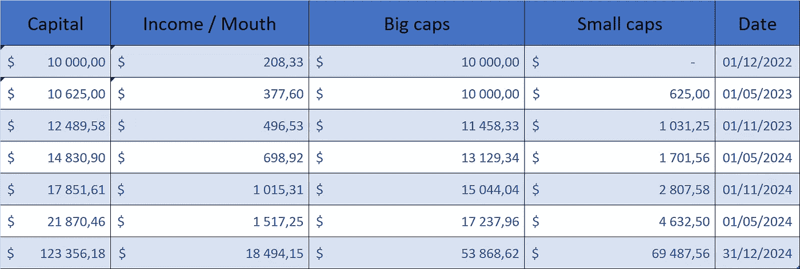

# 为下一轮牛市的巨大成功重新启动计划

> 原文：<https://medium.com/coinmonks/restart-plan-for-huge-success-to-next-bull-run-17ccaa4815e7?source=collection_archive---------36----------------------->

Photo by Scott Graham

2021 年，DeFi 让成千上万的钱包体验了百万。

*许多没有拿到奖金的秘密百万富翁发现自己很沮丧。*

*UST 和卢娜的崩盘是我们投资组合下跌的主要原因。*

***(虽然对我们来说，收益依然很大)。***

DeFi 协议当时都被指责为庞氏骗局。

然而，DeFi 复制了传统金融的做法。没有歧视，也具有区块链的透明度。

# **我们不必扔掉一切！**

由我们来分析协议和项目。然后，委托我们的资产的利益。

迪菲不会死。这是银行寻求生存的未来。

贝莱德最近与比特币基地合作，向他们的客户提供 BTC。

从这个结论，我们可以建立一个恢复计划。我们应该回到 2021 年的价格水平，然后再超越。

建立一个可持续的被动收入。**利用预计在 2024/2025 年的下一个牛市周期。**

*(阅读 2024 年、2028 年、2032 年比特币价格的文章。).*

# 耐心点！

主要陷阱在于不惜一切代价寻找有吸引力的回报。通过跟随你的情绪来委托你的资本是最好的出错方式。

只要不知道底部，就不应该贸然推出去。冒着看到你的投资组合价值几乎不会下跌的风险。我们不希望这样！

让我们记住，高风险有可能带来高回报，反之亦然。

我们必须考虑市场和技术风险。以及对放置资产的协议的信心。

宏观经济仍然具有威胁性。因此，比特币上的 9k€仍然是可能的。

至少我们应该看到 17k€的回归。这将构成一个双底。

替代硬币的下跌将会更加显著。

现在看到的上涨是一种反弹，原因是押注下跌的小投资者纷纷平仓。

只要我们不突破 26k 美元/比特币水平，我们就不会回到看涨状态。

所以，让我们在积累这种被动收入之前，等待合适的信号。

# 底层/比特币，接下来呢？

我们将通过关键水平的反弹来了解底部。

或是宏观经济形势的改善。

从这一点来看，开始向 DeFi 重新注入流动性是合理的。

# 恢复策略。

先把钱投在大盘股上。

从今天开始。确定你喜欢的生态系统。那些你想长期接触的人。

问自己这个问题。你为什么想在那里投资？

以太坊，索拉纳，马蒂奇，BNB，宇宙，沙盒？

确定有吸引力的池和回报。

那些是来自你喜欢的生态系统的组合符号。

这样，在市场调整时就不会后悔。

*(因为总有一些，即使是牛市也是如此)。*

**例如:**

你马厩的 20%

你马厩的 20%

原子渗透法 20%的马厩

你马厩的 20%

你的马厩的 20%将被用来加强你的地位，以防出现调整。

每个人都会根据自己的投资组合选择流动性池，

**风险接受/目标回报。**

当然，这些 LP 代币提供的回报会很低。

这些代币的波动性将低于小型股。

大盘股会比小盘股先涨。

# 走向小盘股和高收益。

无论市场趋势如何，总会有机会。让我们记住***AAVE，煎饼，十八 INU。***

*(阅读文章* [*我在 Crypto 中实现 100k 的牛逼经历，在一个水龙头上从 0 开始*](https://sinainthecity.medium.com/achieve-100k-in-crypto-starting-from-0-dogecoin-shiba-inu-4a60cdfdea62?source=user_profile---------2----------------------------) *)*

这个想法是用大盘股赚来的部分收入(高达 50%)来投资**更“奇特”的协议，小盘股。**

> 你的摇钱树为推动你投资组合的未来之星提供资金。

# 具有难以置信的上涨潜力的高风险小盘股。

通过寻求**高于 500%甚至 1000%的 APR** 以及通过目标价格上涨**5%到 10，000%。**

大多数风险资产和协议不会成功，或者会停滞不前。风险由你来管理！

抓住合适的机会，在利润到来时抓住它。

# 结果。

在 stable 中，你可以用一个 10k 起价的袋子建立一个 200 美元/月的低风险被动收入。

随着时间的推移，在预计于 2024 年底或 2025 年初开始的下一轮大牛市之前，你的被动收入和初始投资将会翻倍。

*(根据目前获得的统计数据)。*

小型股和高收益协议将增加你跑赢大盘的机会。

下面是一个模拟。

Photo by Sina L Assadi

这个想法不仅是为了不错失下一波市场浪潮，而且是为了从中获取最大利润。

这篇文章将帮助你建立你的策略。

需要个性化学习的， [**写我**](mailto:sina@lacircum.com) 。我会尽快回答你。然后，我们可以一起做！

> 交易新手？试试[加密交易机器人](/coinmonks/crypto-trading-bot-c2ffce8acb2a)或者[复制交易](/coinmonks/top-10-crypto-copy-trading-platforms-for-beginners-d0c37c7d698c)