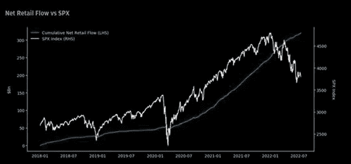

# 散户大军买入下跌，收益崩溃已经开始，历史熊市在望

> 原文：<https://medium.com/coinmonks/retail-army-buying-the-dip-earnings-collapse-has-begun-historical-bear-markets-in-perspective-3658133a6f9a?source=collection_archive---------35----------------------->

嘿，我是基兰！市场又将迎来新的一周，以下是需要注意的关键事件，以及来自投资银行的最有趣的宏观研究。我希望在本周的[贸易节目](http://www.traderseed.io/)中与你交谈。一如既往，如果你有任何问题，只需回复此邮件，我会非常乐意回答任何问题。

# 每周观察列表

财报季又回来了，很可能成为本周的焦点。上周的银行盈利结果喜忧参半，CPI 报告超调以及随后美联储在下次加息规模上的来回波动淹没了任何单个公司的新闻。本周我们将看到来自特斯拉、网飞、威瑞森、J&J 和美洲银行的数据。许多本周公布财报的知名科技公司的预期已经降低，问题将更多地集中在最糟糕的时期是否已经过去。

欧洲央行(ECB)将于周四做出备受关注的利率决定，在美国上周出人意料的上涨后，将有几份 CPI 报告出炉。

# 宏观视角

**高盛(Goldman Sach)的情绪指标……重回极端买入区域。**高盛“情绪指标”衡量散户、机构和外国投资者在过去 12 个月的股票头寸。读数低于-1.0 或高于+1.0 表明极端位置，这对预测未来回报很重要。

收益暴跌从本周开始。看到整个市场的情绪如此迅速地变得消极，这是值得注意的，因为街对面的卖方分析师正在以惊人的速度下调估计:在过去的 5 天里(截至周四，在净基础上)有 500 多个名称被降级，而自 GFC 以来仅 4 周就有这么多名称被降级(根据 BBG)。随着如此多的负面因素被反映到股票价格中，看看股票在收益季节如何交易将会非常有趣。

**散户大军何时投降？散户仍在向市场注入大量资金，买入下跌股票。图表显示零售净流量与 S & P500。完全没有明显的外流。**

**“超级富豪”何时投降？**图表显示美国银行私人客户现金持有量占管理资产的百分比。从这张图表中可以看出，他们的超级富豪客户还没有清算他们的投资，并度过了这段低迷时期。一旦我们看到市场投降和清算，我们可能只会期待市场触底。

**技术流入依然强劲。**图表显示行业资金流向。

**实际工资连续 15 个月负增长..**随着美国整体通胀率升至 9.1%的 40 年高点，6.7%的名义工资增长将不会降低通胀率。基于每周收入，实际工资比一年前下降了 4.4%。此外，实际工资连续 15 个月负增长。

**透视历史熊市**

我希望你觉得这很有趣，很有用。如果您有任何反馈或问题，请告诉我，然后**点击“关注”按钮！**

祝你一周愉快！基兰
www.traderseed.io

你能通过 Traderseed 挑战吗？证明你的交易技巧，赚取高额回报。起价 75 美元的节目！！点击这里查看新节目 [**！**](http://www.traderseed.io/)

> 交易新手？尝试[加密交易机器人](/coinmonks/crypto-trading-bot-c2ffce8acb2a)或[复制交易](/coinmonks/top-10-crypto-copy-trading-platforms-for-beginners-d0c37c7d698c)