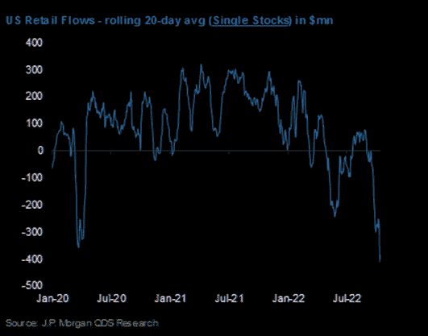
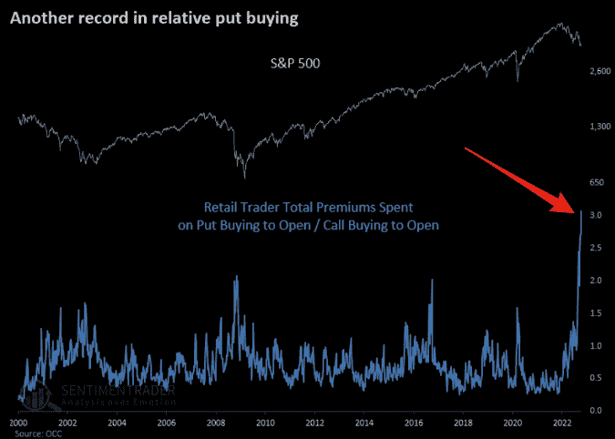
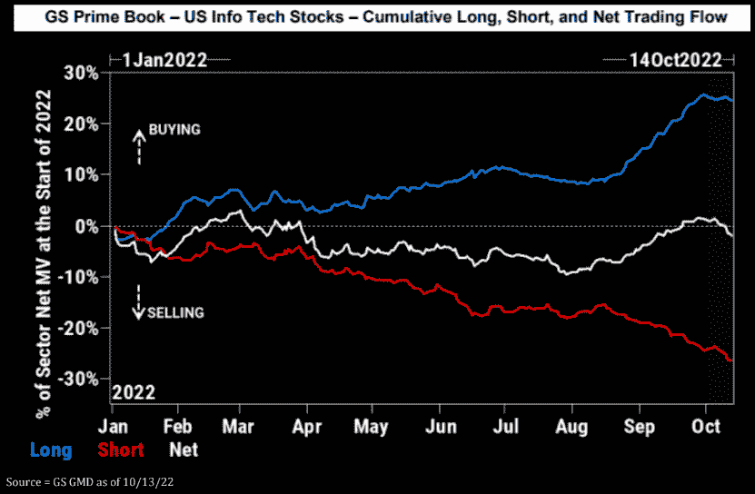
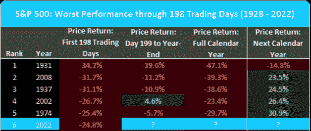
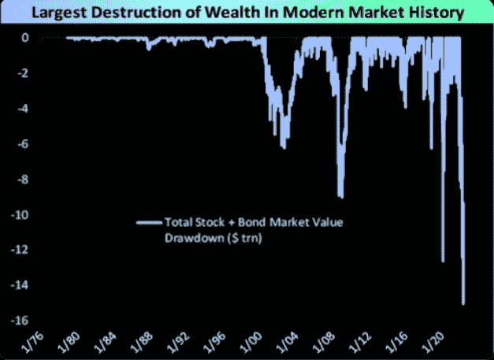
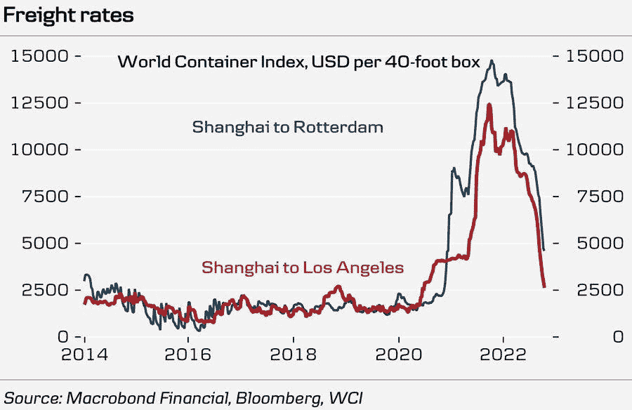
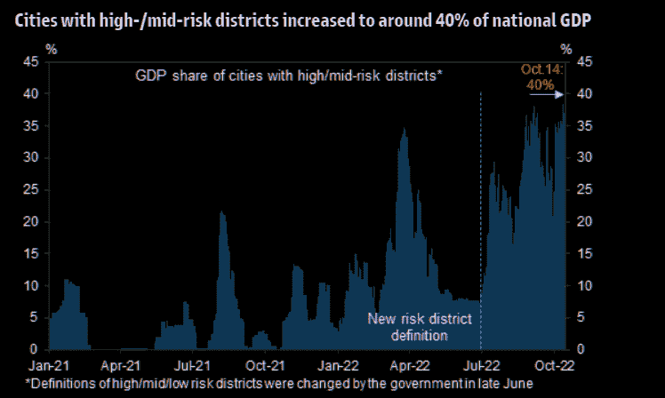

# 散户投降已经开始，对冲基金做空科技股，这是历史上最大的财富损失

> 原文：<https://medium.com/coinmonks/retail-capitulation-has-begun-hedge-funds-shorting-tech-largest-destruction-of-wealth-in-history-478f8a1ac7cb?source=collection_archive---------13----------------------->

嘿，我是基兰！市场又将迎来新的一周，以下是需要注意的关键事件，以及来自投资银行的最有趣的宏观研究。我希望能在本周的[贸易挑战](http://www.traderseed.io/)中与你交谈，并且一如既往，如果你有任何问题，请在下面给我留言。

# 每周观察列表

第三季度财报季本周开始，这可能是多年来最关键的财报季。投资者和交易员不仅非常关注公司的报告，也非常关注它们的预测。

在其他地方，在上周美国通胀数据公布后，焦点将转向美国房地产市场，周三将公布建筑许可、新屋开工和成屋销售报告。

中国将于周二发布第三季度国内生产总值(GDP)数据，尽管预计增长将较上一季度反弹，但中国经济仍有望录得近 50 年来最慢的年增长率。

# 宏观视角

**散户投降已经开始。历史告诉我们，要让市场出现有意义的底部，我们需要看到散户和机构投资者的投降式抛售。上周，我们看到散户恐慌抛售股票，导致净零售流量低于 2020 年 3 月的低点。**

**零售对冲。不仅如此，上周我们看到散户投资者以前所未有的水平购买下跌保护。图表显示卖出/买入比率。该图表中的峰值通常与市场底部一致。**

**对冲基金也在抛售。**机构玩家呢？上周，对冲基金卖出科技股的速度是自 4 月份以来最快的。科技股是这个市场的关键，而对冲基金现在是净空头。高盛(Goldman Sachs)指出，上周“总体而言，在激进做空的推动下，我们看到了 4 个月来最大的净卖出，空头与多头的比例为 5 比 1”。随着散户和机构一周比一周做空，短线挤压反弹的条件已经具备。

**雨后…** 标准普尔 500 指数在这个时间点(198 个交易日)下跌超过 2022 点的年份…看看下一个日历年的表现…

**史上最大的财富毁灭。**以美元计算，这次熊市是历史上最大的财富损失，以 GDP 计算也是第二大损失(2008 年更糟)。

**运费暴跌。**有利于通胀，但也可能代表需求崩溃。

**中国全押在 Covid Zero 上。**10 月 10 日至 12 日，《人民日报》连续三天发表了三篇文章，强调中国坚持“动态零 Covid 政策”的重要性，发出了迄今为止最明确的信号，即零 Covid 政策不会在短期内被放弃。高盛(Goldman Sach)最新的高频跟踪器显示，高/中风险区的城市现在占全国 GDP 的 40%！

我希望你觉得这很有趣，很有用。我每周一写这份时事通讯，所以**一定要关注我**！像往常一样，把风险管理放在第一位，安全交易，保持敏捷。

祝你一周愉快！
基兰
www.traderseed.io

想要交易本周的市场吗？ 100k 程序从 **$75** 开始！！点击这里查看新节目 [**！**](http://www.traderseed.io/)

[**查看节目**](http://www.traderseed.io/)

> 交易新手？试试[加密交易机器人](/coinmonks/crypto-trading-bot-c2ffce8acb2a)或者[复制交易](/coinmonks/top-10-crypto-copy-trading-platforms-for-beginners-d0c37c7d698c)