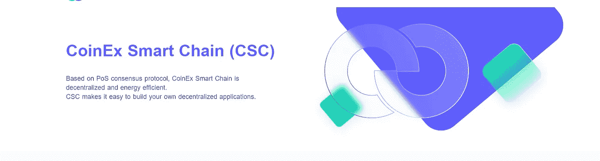
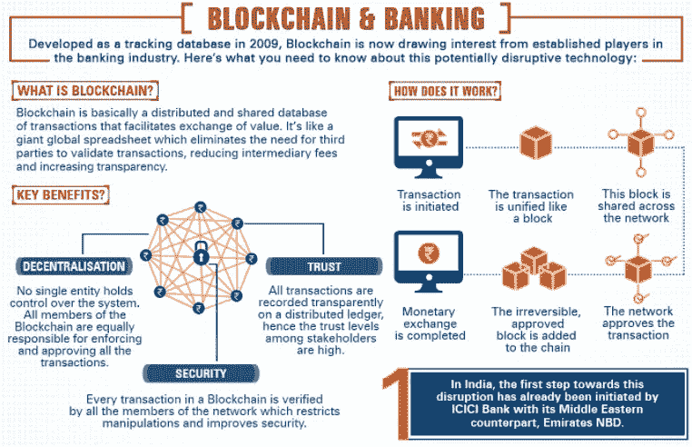
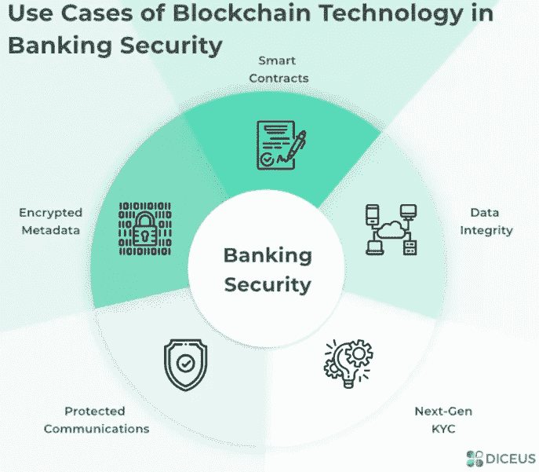
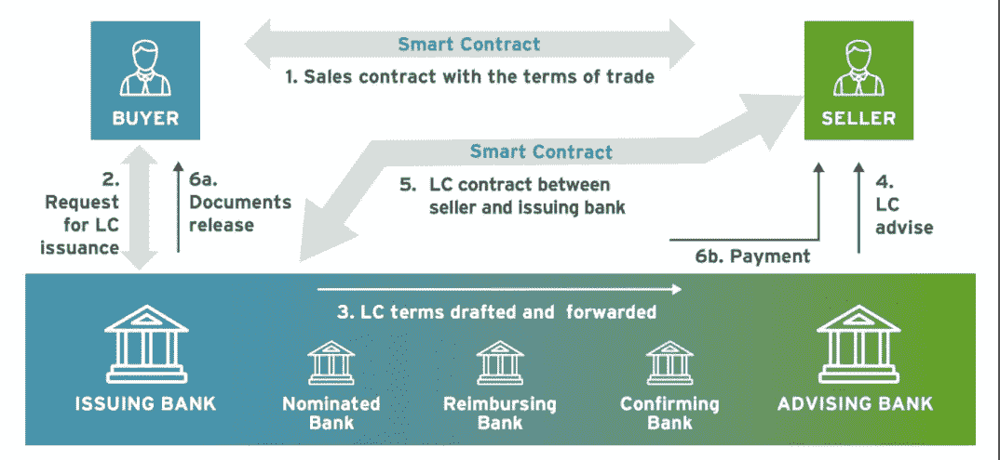
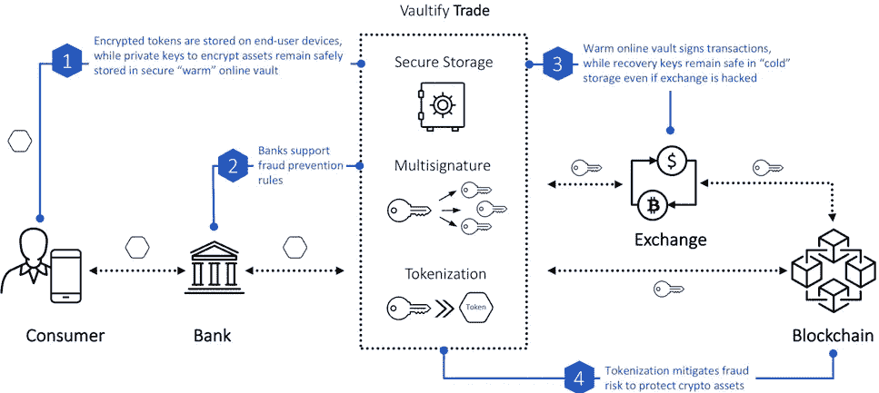
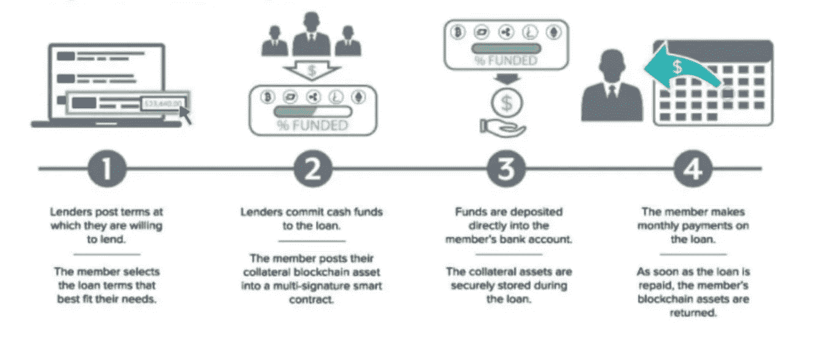
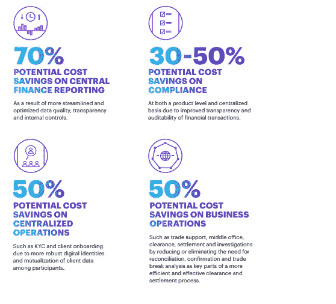
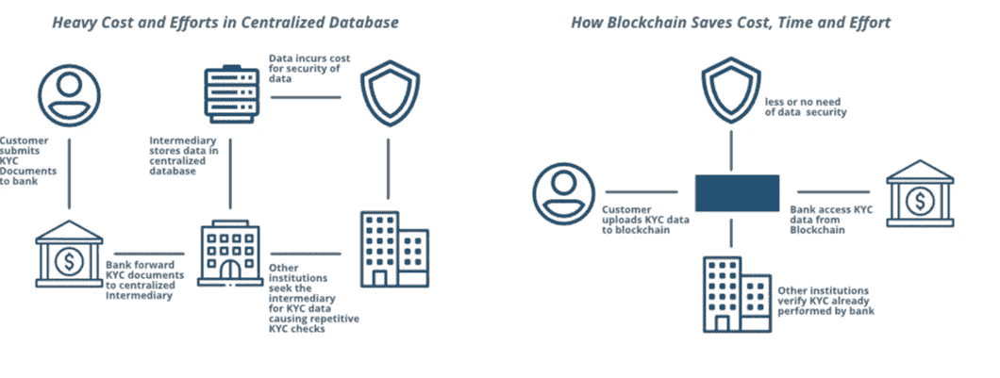
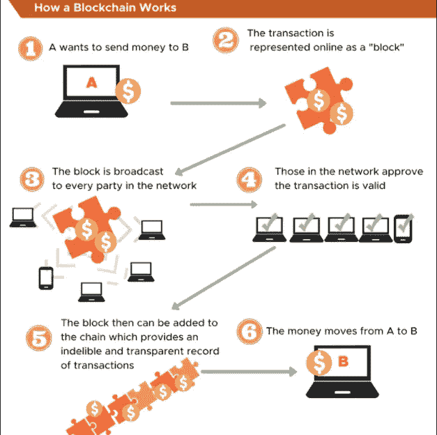
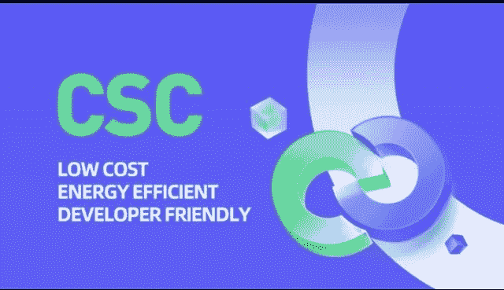

# 革命性的银行业务:CSC 银行业务

> 原文：<https://medium.com/coinmonks/revolutionized-banking-banking-with-csc-e90f77c0cfb2?source=collection_archive---------47----------------------->

由于技术的巨大进步，银行业在过去十年发生了翻天覆地的变化。像许多行业一样，银行业正在适应客户不断变化的需求。随着区块链技术的进步，未来几年，客户只需轻轻一点，就能拥有分行。随着区块链理工大学取消中央权威，客户将完全控制决定如何管理和控制他们的资金。银行业将继续变得更加人性化，再次回归到个性化的本地关系，就像银行过去与客户的关系一样。

## 挑战

DeFi(或“分散金融”)是区块链公共金融服务的总称，如 CSC。有了 DeFi，你可以做银行支持的大部分事情——赚取利息、借款、贷款、购买保险、交易衍生品、交易资产等等——但它更快，不需要文书工作或第三方。与一般的加密一样，DeFi 是全球性的、点对点的(意味着直接在两个人之间进行，而不是通过一个中央系统进行路由)，匿名的，并且对所有人开放。

# 以下是技术彻底改变银行业的几种方式:

## 1.没有长队

消除长时间等待的第一步是引进自动取款机，它把取钱的时间缩短到几秒钟。当自动取款机被方便地放置在许多城市的杂货店和便利店等各种位置时，人们访问他们的银行账户变得更加容易。随着电子银行的引入，易用性得到了扩展。区块链正获得如此多的关注和采用，因为它的核心优势在于其架构和它提供的无数机会。它是完全透明的、廉洁的分类账，并且由于其密集分布的性质，对黑客攻击具有极强的抵抗力。

*   随着传统 ATM 系统的存在，加密 ATM 的 hav 也出现了，使加密银行业务具有了优势。加密自动柜员机(ATM)是独立的电子亭，允许用户购买和出售加密货币，以换取现金或借记卡。加密自动取款机不像传统的自动取款机那样连接到你的银行账户；相反，它们与用户的数字钱包连接，处理交易并向客户发送密码。世界上有成千上万的加密自动取款机。

## 2.一键交易

通过与电子商务网站的整合以及电子钱包和电子现金的引入，人们只需在屏幕上轻轻一点，用正确的信息登录，就可以完成交易。有了 defi 应用程序，人们不再需要携带借记卡或信用卡。如果你有一部电话，你就有了一个完整的个人银行基础设施。

## 3.即时服务

钱包或皮夹丢了？需要屏蔽您的卡以防止身份被盗？只需在应用程序中关闭它或发送短信，瞧，即时安全。不仅如此，即时转账和支付现在每天都在发生。

# 区块链在银行领域的优势

## 1.易受网络犯罪的影响:增强安全性和减少欺诈

2021 年，银行业的勒索软件攻击增加了 1318%，到 2025 年，由于网络犯罪，全球将损失 10.5 万亿美元。

虽然银行业一直在采用最佳实践来进行身份验证、验证、确认，并促进在线和移动服务，但他们拥有的交易渠道越多，产生的感染点就越多。与大量手机和基于互联网的支付网关集成总是伴随着安全负担，管理整个生态系统中的每一个流程线程都变得很困难。

**Blockchain solves the security issues for many scenarios and assets in banking, as shown above.**

另一方面，像 CSC 这样的区块链具有内置的安全性，因为它具有去中心化和廉洁的分类帐特征。因此，这是银行的一个可靠选择。在银行业使用区块链将带来可验证的交易，以及防止数据操纵和黑客攻击的网络保护。由于所有的交易都透明地记录在一个分布式的分类账上，利益相关者也享有更高的信任度。

## 2.商业和贸易便利化的全球联系

银行最初的宗旨是促进社区贸易和商业，但多年来，这种宗旨已经局限于特定的地区、人群和行业。缺乏适当的支持性基础设施、可靠和健全的安全以及确保全球银行业务流程标准化的措施一直是主要的制约因素。

区块链是一个强大的工具，可以在全球范围内使用，具有内置的安全性，并具有无可辩驳的可信度。因此，银行可以利用它在全球范围内建立、促进和便利贸易和商业。

## 3.全球运营

当涉及到促进单个组织或一组组织的全球运营时，当前的银行系统带有大量的文档和堆积如山的文书工作。最重要的是整个验证、交易率以及不同国家的银行监管差异。

将区块链添加到银行生态系统中，不仅可以简化全球运营管理，还可以让合作伙伴组织通过智能合同查看、监控和执行各种与银行相关的任务。

DEFI SUBSTITUES PAPERWORK WITH SMARTCONTRACTS

***区块链提供分散式账本技术，使用代币代替文件、智能合约来确保履行所有条款和条件；和透明度，以确保所有相关方的单一真相来源，如上图***

## 4.资产交易

截至目前，银行业资产交易的整个概念要么处于休眠状态，要么是多余的，要么仍处于萌芽阶段。有许多银行不提供这项服务，而那些提供资产交易的银行也提供有限的服务。安全、验证和跨行业实体的参与是其背后的一些主要原因。

采用区块链可以降低资产交易费用，稳定传统证券市场，还可以帮助银行节省整个过程，因为透明的操作。随着越来越多的人发现加密银行是一种更好、更透明、更容易享受贸易利益的方式，加密银行在全球范围内引起了广泛关注。

**How blockchain facilitates secure and streamlined trading of crypto assets**

随着人们意识到投资和交易多样化资产的重要性，银行也开始转向以区块链为基地的资产交易。

## 5.加速验证过程

有许多组织和个人是高优先级客户，并且由于他们的银行和投资组合，他们必须通过许多安全和认证检查。一些常见的例子包括面部识别、视网膜扫描、生物识别、特定用户代码等。所有这些安全检查对于确保正确的身份验证和用户验证是必不可少的。然而，它们是冗长的。

区块链将为银行及其客户提供加速的验证过程，同时允许客户更安全地使用银行服务。这方面最近的一个例子是目前许多金融机构正在使用的 ZKP 或零知识证明。如果需要，用户可以选择身份验证、身份识别的方式，甚至可以选择他们同意在安全检查期间与其共享身份的人。

# 区块链在银行业的应用

在这里，我们将强调区块链成功加强银行业的一些要点。

## 1.改善信贷和贷款服务

传统银行场景中的信贷和贷款管理流程是一项耗时费力的任务。银行根据第三方公司提供的客户信用评级提供贷款。这种类型的评级有时被证明对客户极其不利，也在很大程度上影响了他们获得贷款的能力。

在区块链环境中，即使是复杂的程序化贷款或抵押贷款，也能以点对点的方式更快、更安全地处理贷款。简单的快速贷款已经帮助许多用户获得成功的贷款。

SIMPLE LOAN EXECUTION IN DEFI

***由于贷款协议的所有条款和条件都是通过智能合同记录的，这种合同极其简单可靠，因此贷款和还款变得更加安全。***

## 2.降低费用

在这里，我们将讨论区块链技术使银行机构受益的各种方式，降低成本是其中之一。

**区块链可以在很多方面降低运营成本，比如:**

*   中央财务报告的成本节约
*   合规性和法规方面的成本节约
*   降低集中化流程和运营的成本
*   企业运营的成本节约

STATISTICS ON THE ADVANTAGE OF DEFI

## 3.更实惠的 KYC

KYC 或“了解您的客户”是一种可靠且受欢迎的身份验证流程，所有银行和金融机构都遵循这一流程。尽管有助于客户授权和验证，但 KYC 是一个成本高昂的过程，因为银行必须不断更新。此外，银行必须访问特定的数据库来访问 KYC 数据，除非该特定数据库也被更新，否则不可能更新银行中的 KYC 详细信息。

现在，这就是银行业的区块链技术被证明是一个明智选择的地方。在区块链上，所有参与方或成员都拥有在任何数据资源中完成的所有更改和刷新的最新、真实和透明的视图。

**因此，当 KYC 更新时，银行不必在新客户加入时启动 KYC 协议，如下图所示**

ACCELERATED VERIFICATION PROCESS WITH DEFI

## 4.汇款和跨境交易

随着世界朝着更加开放的银行生态系统和移动货币的方向发展，每年的跨境交易总额达到 180 万亿美元，并且随着时间的推移，这一数字还在不断增加。然而，仅向美国境外汇款一项交易就要花费 42 美元！

让整个情况变得更加糟糕的是，汇款要经过 3 到 5 天的等待时间，才能反映出收款人账户上的金额。

虽然传统的银行系统严重依赖于缓慢的认证和验证系统，但使用区块链技术不仅可以实现这些目标，而且还有助于更快的汇款。这是因为区块链使用 DLT，没有现金从一家银行或一个国家到另一个国家的实际流动。这减少了大量的运营费用，也有助于更快的汇款，跨境货币交易的手续费不到 1%。

## 5.点对点传输

点对点借贷或 P2P 借贷是指一个用户通过与银行账户或银行卡相连的移动设备向另一个用户汇款。当涉及到与朋友和家人分享金钱或分摊账单时，这些交易就派上了用场。

**银行的数字化解决了 P2P 领域的许多挑战，例如:**

*   要求两个用户都使用同一个应用程序，或者选择几个提供多种支付选项的应用程序
*   强大可靠的安全检查，确保交易能够抵御黑客和数据泄露
*   现有 P2P 模型缺乏灵活性

# 区块链是一种解决方案，但优化和业务相关的采用是成功的关键

尽管毫无疑问，区块链在银行业有许多令人惊讶的好处和使用案例，但必须明智地采用它这一事实也不容忽视。这是因为银行和金融部门对一个国家的经济和消费者都非常重要。因此，我们建议选择优化的、与业务相关的区块链解决方案，这些解决方案能够解决核心银行业痛点，并专注于您的发展障碍。

你想和一个迎合银行业的专家团队一起开始你的区块链项目吗？CSC 为您提供了一个非常高效的区块链，它拥有一个在所有主要领域(包括银行业)都有经验的生态系统。

# CoinEx 智能链— CSC

CSC 是世界领先的分散智能链，致力于为区块链建设基础设施，并遵循分散化和无许可区块生成的原则。CoinEx Smart Chain，一个去中心化、高效率的公共链，为开发者提供了一个高效、低成本的链上环境来运行去中心化的智能合约应用(DApps)和存储数字资产。

CSC 效率极高，交易费用低。通过 POS consensus 协议，CSC 在几秒钟内生成一个块，支持极高的 TPS，同时将交易费用保持在较低的水平。也就是说，很明显，CSC 拥有完美的生态系统来构建 Defi 应用程序和工具，以简化区块链的银行业务，因为在其生态系统中已经存在各种 Defi 工具。

CSC 有潜力创造一个更加开放、自由和公平的金融市场，任何人都可以通过互联网进入这个市场。

## 使用 CSC 的 Defi 的优势

*   **开户**:不需要申请任何东西，也不需要“开户”。你只需要创建一个钱包就可以了。
*   **化名**:你不需要提供你的姓名、电子邮件地址或任何个人信息。
*   **灵活**:你可以随时随地移动你的资产，无需征得许可，无需等待漫长的转账完成，也无需支付昂贵的费用。
*   **快**:利率和回报经常快速更新(快至每 15 秒一次)，可以明显高于传统华尔街。
*   透明:参与的每个人都可以看到全部交易(私人公司很少提供这种透明度)。

区块链不断增长的用例将从根本上改变银行业。银行业的区块链可以扰乱传统系统，并使现有系统过时。据说，基于区块链的解决方案每年的欺诈损失上限高达 90 亿美元。因此，开发一个安全的客户信息数据库并在多个金融机构间共享至关重要。结果是减少了银行间交易的时间、成本、工作量、安全性和透明度。银行业的区块链是克服不断增长的挑战和高效过渡到无现金社会的驱动力。

> 交易新手？试试[加密交易机器人](/coinmonks/crypto-trading-bot-c2ffce8acb2a)或者[复制交易](/coinmonks/top-10-crypto-copy-trading-platforms-for-beginners-d0c37c7d698c)