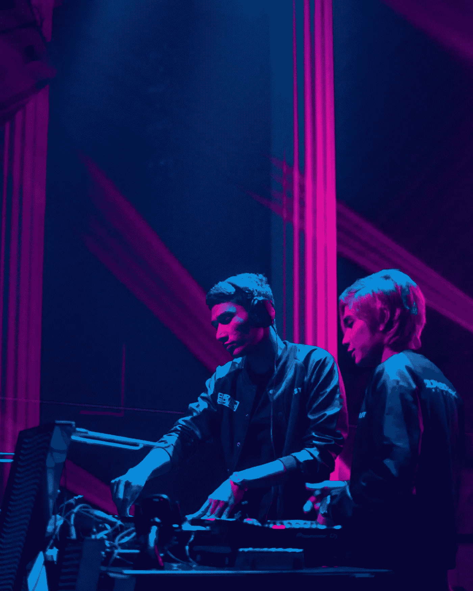
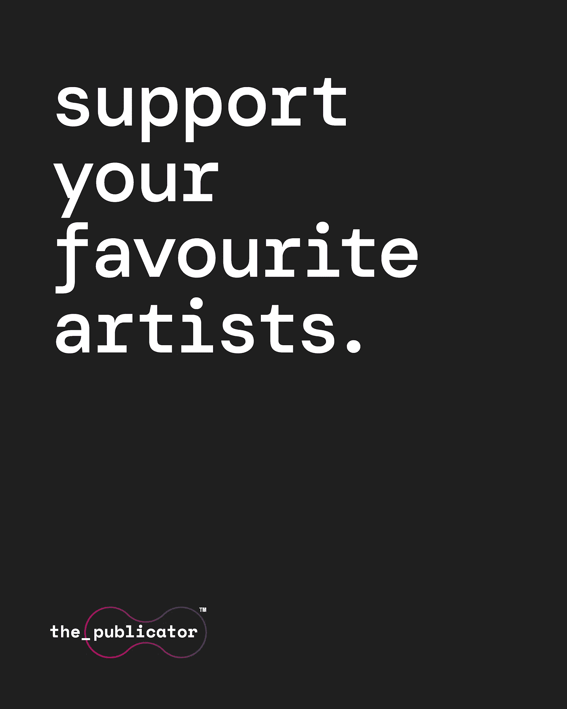

# 用 NFTs 重组音乐产业

> 原文：<https://medium.com/coinmonks/rewiring-the-music-industry-with-nfts-a6af3f907adb?source=collection_archive---------25----------------------->

在我们深入研究 NFT(不可替代的代币)对音乐家和内容创作者的变革性有多大之前，我想先讨论一个越来越相关的问题:

什么是 NFT？

简而言之，它是一种具有“真实世界价值”的数字资产。因为它们是可编程的，所以 NFT 可以采取多种形式。从 Sim 风格游戏中独一无二的装饰物品，到游戏开发研讨会的独家门票，甚至是一首歌的歌词——这些令牌的形状只受其开发者想象力的限制。

然而，任何警惕互联网的读者都可能会问这样一个问题:既然它们是数字的，这些代币就不能被复制吗？毕竟，在网上找到艺术品、音乐、视频等相似的拷贝几乎不是一件苦差事——往往是在没有所有者许可(或利益)的情况下拍摄的。

NFT 在数字所有权方面的优势在于它们与区块链的联系，以及区块链本身的去中心化特性。因为交易是面向公众的，相对安全且不可复制，所以 NFTs 可以追踪到其原始所有者。这并不是说代币不能被复制——一件数字艺术品和以往一样容易被剽窃。但是，这并不意味着 NFT 的原始购买者仍然是该令牌的可证明的个人所有者。

**我是个音乐家，我为什么要在乎？**

首先，让你的口袋变得更肥！正如任何在职音乐家或创意人士会告诉你的那样，获得自己应得的甜点是一个持续的、有时是不可逾越的障碍。一般来说，需要一个第三方中介来帮助艺术家的歌曲到达观众手中。当然，这意味着艺术家的相当一部分利润被转移了。尽管我们喜欢想象唱片公司占主导地位的日子已经一去不复返了，但艺术家的所有权仍然让人觉得不完整。

NFT 允许艺术家出售他们的音乐(无论以何种数字形式——甚至[专辑](https://decrypt.co/87035/damien-hirst-turns-his-drake-album-art-into-10000-ethereum-nfts)的封面也是一种甜蜜的象征！)直接传达给他们的听众。这也意味着艺术家和他们的观众之间的交流和联系可以更加个人化。例如，音乐人可以向 NFT 购买者独家发行 B 面歌曲，或者甚至组织与粉丝的会面。带来更有机、更健康和以艺术家为中心的音乐传播的潜力正在迅速成为现实。

**长寿！**

因为区块链分类账跟踪 NFT 的最初购买以及后来可能发生的任何可能的转售，艺术家有机会在最初购买代币后他们的创作可能进行的市场跳跃中分得一杯羹。换句话说，NFT 唱片转售的持续价值可以为其原创者带来持续的版税或利润，无论是独家单曲还是整张专辑。

这之所以成为可能，是因为“[智能合约](https://www.binance.com/en/blog/nft/all-you-need-to-know-about-nft-smart-contracts-568745413587703085)”，即区块链中内置的跟踪和认证所有权变动的机制。实际上，这意味着音乐人或内容创作者将有可能从个人销售中获得长期红利。创作者不必为了满足一个过度饱和的行业的需求而不断推出半生不熟的内容，而是可以专注于生产优质、个性化和独特的有“腿”的内容。简而言之，如果 NFT 在首次购买后特别受欢迎，那么每次转手都有可能带来长期收入。

最近，音乐行业的资深人士 Muse 做到了这一点，他们限量发行了他们最新的 NFT [专辑](https://en.cryptonomist.ch/2022/09/06/new-nft-album-muse-tops-charts/)。尽管乐队从发行中获得了可观的利润，但考虑到 Muse 的成功和受欢迎程度，NFT 本身的价值可能会飙升。

**余钱**

除了可能带来的经济影响，能够成为一个不那么集中、更加自我驱动的网络的一部分，可以说是艺术家的强大动力。可以理解，试图在索尼、华纳和环球等主要品牌的巨大阴影下，在自我推销的世界中航行是令人生畏的。NFT 为内容创作者提供了无需中间人就能接触到观众的机会——这是一种艺术家刚刚“起步”还未能体验到的信心。这可能会导致内容创作者和艺术家的巨大网络，他们是自我驱动的，不受组织需求和期望的约束，这是音乐产业未来的一个好兆头。我们认为对那些为此做出贡献的音乐人来说尤其如此！

Publicator 致力于为艺术家、粉丝和 NFT 爱好者创建一个平台，完全拥抱音乐行业的去中心化未来。请关注我们即将在[https://the-publicator.com](https://the-publicator.com/)举行的发布会和更新

> 交易新手？试试[加密交易机器人](/coinmonks/crypto-trading-bot-c2ffce8acb2a)或者[复制交易](/coinmonks/top-10-crypto-copy-trading-platforms-for-beginners-d0c37c7d698c)