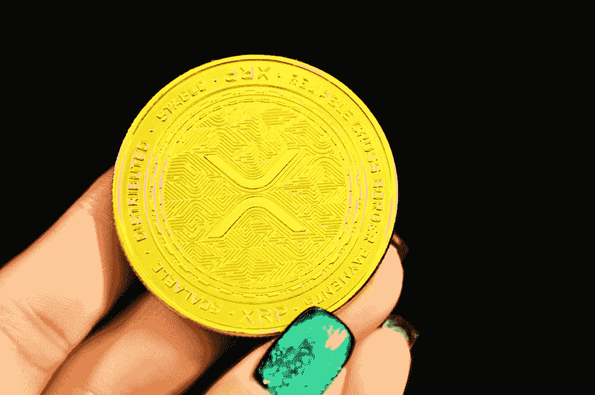

# 纹波对秒再次被延迟

> 原文：<https://medium.com/coinmonks/ripple-vs-sec-is-being-delayed-again-1842fffafbe6?source=collection_archive---------2----------------------->

Ripple 和美国证券交易委员会(SEC)之间的法律战再次被推迟。自 2020 年 12 月以来，Ripple 和 SEC 一直陷入法律战，当时 SEC 对 Ripple 提起诉讼，指控该公司出售未注册证券违反了证券法。

审判原定于 2021 年 3 月开始，但已经被推迟…