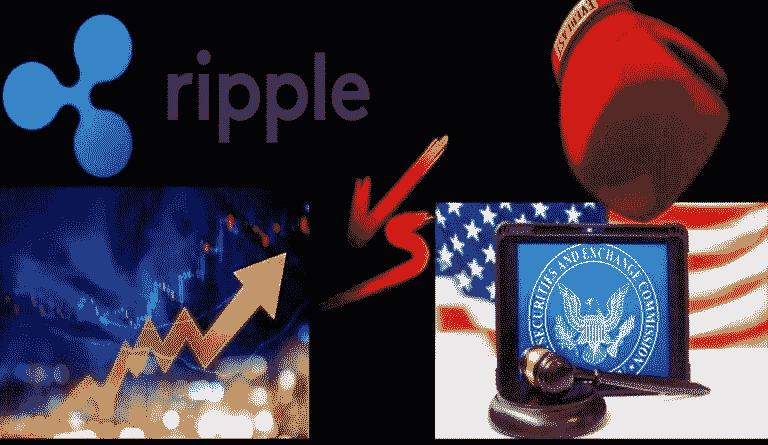

# Ripple 赢得对证券交易委员会的法官抨击机构的

> 原文：<https://medium.com/coinmonks/ripple-win-against-sec-as-judge-slams-agencys-f6d118039293?source=collection_archive---------23----------------------->

法官莎拉·内特伯恩(Sarah Netburn)拒绝了证券交易委员会(Securities and Exchange Commission)根据律师-客户特权保护其前官员威廉·辛曼(William Hinman)言论的动议，称该机构的诉讼策略是“虚伪的”。

# 涟漪赢得“希曼演讲”与 SEC 的口水战

Ripple 在与美国证券交易委员会(u . s . Securities and Exchange Commission)的对抗中，押注在战术和程序上取得重大胜利。

周二，美国治安法官莎拉·内特伯恩(Sarah Netburn)否认了 SEC 关于保密一次臭名昭著的演讲文件的动议，并命令其出示文件供法庭进行闭门审查。该机构前官员威廉·辛曼(William Hinman)在演讲中辩称以太坊不安全。“因此，通信的主要目的不是提供法律咨询以帮助证券交易委员会处理公众事务。必须出示文件，”裁决得出结论。

2020 年 12 月，美国证券交易委员会起诉 Ripple Labs Inc .及其两名高管 Brad Glaringhouse 和 Christian Larsen，指控该公司通过“一项未注册的、正在进行的数字资产证券发行”筹集了超过 13 亿美元。然而，在整个辩护过程中，Ripple 一直辩称，其实用硬币 XRP 不是一种证券。作为支持其辩护的主要论据之一，Ripple 引用了该机构前公司金融部主任 William Hinman 的讲话。

2018 年 6 月 14 日，Hinman [在雅虎财经(Yahoo Finance)的 All Markets Summit: Crypto 在旧金山举行的为期一天的活动上发言](https://www.sec.gov/news/speech/speech-hinman-061418)，他在发言中评论了该机构使用 Howey 测试来确定 ETH 是否构成安全。他说:

> *“且抛开伴随以太创建而来的集资，基于我对以太现状、以太坊网络及其去中心化结构的理解，以太目前的要约和销售都不属于证券交易。此外，和比特币一样，将联邦证券法的披露制度应用于当前的以太交易似乎不会增加多少价值。”*

Ripple 认为，Hinman 的言论与 SEC 关于 XRP 是一种证券的说法相矛盾。相比之下，该机构一直努力将演讲保密，并阻止它在法庭上被用作证据，声称这是一个“纯粹的个人差事”，并不反映该机构的政策。

> 交易新手？试试[密码交易机器人](/coinmonks/crypto-trading-bot-c2ffce8acb2a)或[复制交易](/coinmonks/top-10-crypto-copy-trading-platforms-for-beginners-d0c37c7d698c)

周二，法官 Netburn 驳回了 SEC 的动议，该动议将与 Hinman 演讲有关的内部文件置于律师-客户特权之下，因此阻止它们在法庭上出示。

> *“一方面，向法庭辩称该演讲与市场对 SEC 将如何或是否监管加密货币的理解无关，另一方面，Hinman 在起草演讲时寻求并获得了 SEC 律师的法律建议，这种虚伪表明 SEC 正在采用其诉讼立场来推进其预期目标，而不是出于对法律的忠诚。”*

几名法律专家在推特上评论这一决定，称这一进展是 Ripple 的重大胜利。在周二的推文中，德尔福数码的总法律顾问 Gabriel Shapiro [说](https://twitter.com/lex_node/status/1547027278927990785?ref_src=twsrc%5Etfw%7Ctwcamp%5Etweetembed%7Ctwterm%5E1547027278927990785%7Ctwgr%5E%7Ctwcon%5Es1_&ref_url=https%3A%2F%2Fcointelegraph.com%2Fnews%2Fhypocrisy-judge-denies-sec-motion-to-keep-hinman-docs-secret-in-ripple-case)这是“Ripple 的一次重大战术胜利”同样，辩护律师和前联邦检察官詹姆斯·k·菲兰(James K. Filan)以密切关注此案而闻名，[说](https://twitter.com/FilanLaw/status/1546993777474158594)这个决定是一个“身体重击”

SEC 起诉 Ripple 的结果可能会对整个加密行业产生深远的影响。对于监管机构来说，败诉可能意味着未来在销售未注册证券的相同指控下，开展其他加密项目将面临巨大困难。这也可能会极大地影响该机构正在进行的将该行业的大部分纳入其管辖范围的努力，因为这使得更广泛的加密资产更难被标记为证券。

点击关注我们的更多故事[。](http://t.me/etellworld)

> 加入 Coinmonks [电报频道](https://t.me/coincodecap)和 [Youtube 频道](https://www.youtube.com/c/coinmonks/videos)了解加密交易和投资

# 另外，阅读

*   [最佳卡达诺钱包](https://coincodecap.com/best-cardano-wallets) | [Bingbon 副本交易](https://coincodecap.com/bingbon-copy-trading)
*   [印度最佳 P2P 加密交易所](https://coincodecap.com/p2p-crypto-exchanges-in-india) | [柴犬钱包](https://coincodecap.com/baby-shiba-inu-wallets)
*   [八大加密附属计划](https://coincodecap.com/crypto-affiliate-programs) | [eToro vs 比特币基地](https://coincodecap.com/etoro-vs-coinbase)
*   [最佳以太坊钱包](https://coincodecap.com/best-ethereum-wallets) | [电报上的加密货币机器人](https://coincodecap.com/telegram-crypto-bots)
*   [交易杠杆代币的最佳交易所](https://coincodecap.com/leveraged-token-exchanges)