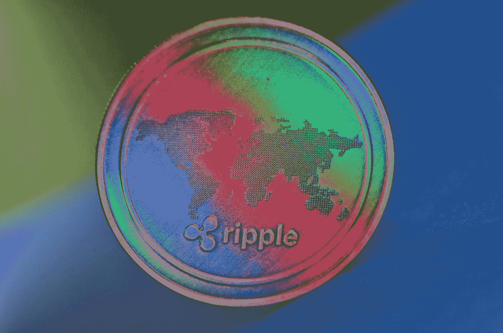

# ripple(XRP)2022–2025 年价格预测，11 月 25 日更新

> 原文：<https://medium.com/coinmonks/ripple-xrp-price-prediction-2022-2025-update-25th-of-november-b841b8242fa?source=collection_archive---------10----------------------->

Source photo [Monedă Cryptocurrency Unda — Fotografie gratuită pe Pixabay](https://pixabay.com/ro/photos/moned%c4%83-cryptocurrency-unda-xrp-3789232/)

## 托肯·XRP:这是什么？

XRP 代币于 2012 年作为加密货币推出。它支持自己的加密货币和支付网络 Ripple Net。为了庆祝发射，1000 亿 XRP 硬币被预先开采出来并分发给投资者和企业。