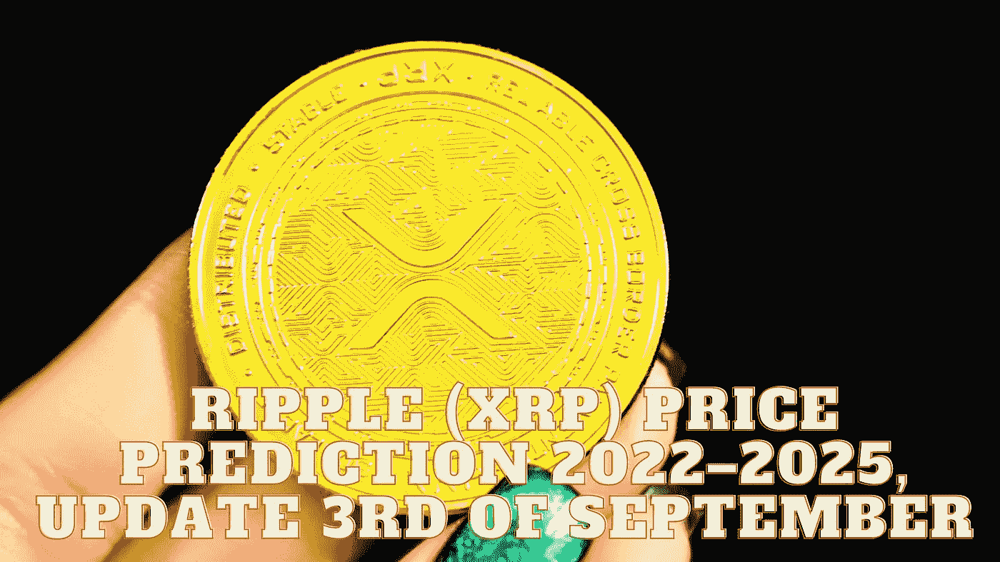

# ripple(XRP)2022–2025 年价格预测，9 月 3 日更新

> 原文：<https://medium.com/coinmonks/ripple-xrp-price-prediction-2022-2025-update-3rd-of-september-e8dd53496c24?source=collection_archive---------8----------------------->

Source photo Unsplash.com

# 什么是 XRP？

2012 年，XRP 成为第三个进入市场的加密货币。它支持自己的加密货币和支付网络 Ripple Net。在代币销售开始时，预先开采并向用户和企业发放了 1000 亿 XRP 代币。