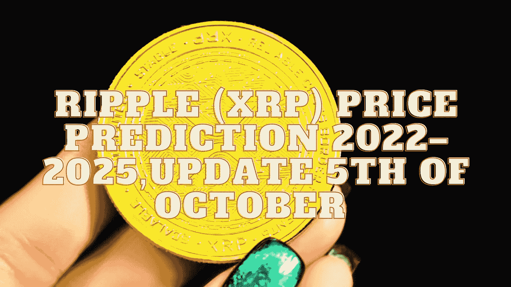

# ripple(XRP)2022–2025 年价格预测，10 月 5 日更新

> 原文：<https://medium.com/coinmonks/ripple-xrp-price-prediction-2022-2025-update-5th-of-october-1538ae14c584?source=collection_archive---------3----------------------->

Source photo Unsplash.com

# 什么是 XRP 代币？

2012 年，XRP 成为第三个进入市场的加密货币。Ripple Net 是一个支持本国货币的支付网络。开始时，预先开采了 1000 亿 XRP 代币，并分发给个人和企业。