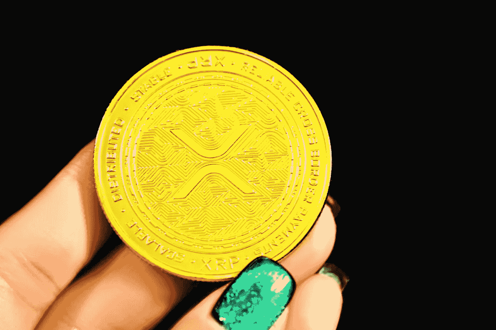

# ripple(XRP)2023–2025 年价格预测，12 月 21 日更新

> 原文：<https://medium.com/coinmonks/ripple-xrp-price-prediction-2023-2025-update-21th-of-december-db9b4d26e863?source=collection_archive---------6----------------------->

Source photo [gold round coin on persons hand photo — Free Gold Image on Unsplash](https://unsplash.com/photos/0kRsP5iRZI4)

## 到底什么是 XRP 代币？

2012 年，XRP 加密货币被引入市场。它支持自己的加密货币和支付网络 Ripple Net。1000 亿 XRP 代币被预先开采出来，并在代币销售开始时向公众和企业发行。