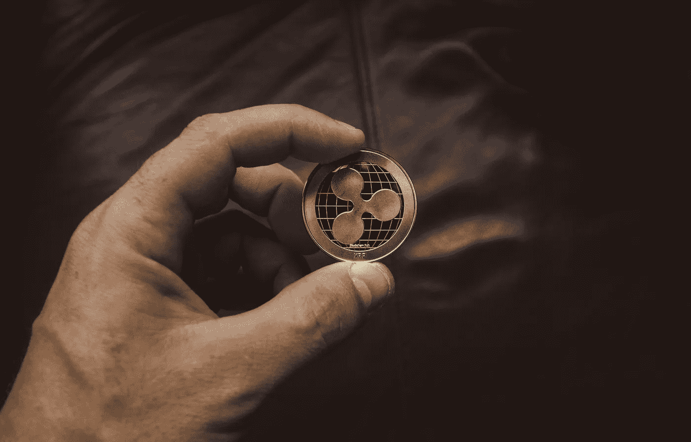

# Ripple (XRP)价格预测截止 2022 年 12 月–2025 年，12 月 17 日更新

> 原文：<https://medium.com/coinmonks/ripple-xrp-price-prediction-end-december-2022-2025-update-17th-of-december-8f4f6a21ce0c?source=collection_archive---------7----------------------->

Source photo [Person Holding Round Gold-colored Coin · Free Stock Photo (pexels.com)](https://www.pexels.com/photo/person-holding-round-gold-colored-coin-1108313/)

## 我怎样才能了解更多关于 XRP 代币的信息？

创造于 2012 年的 XRP 就是这样一种数字货币。它支持自己的加密货币和支付网络 Ripple Net。开始时，预先开采了 1000 亿 XRP 代币，并分发给个人和企业。