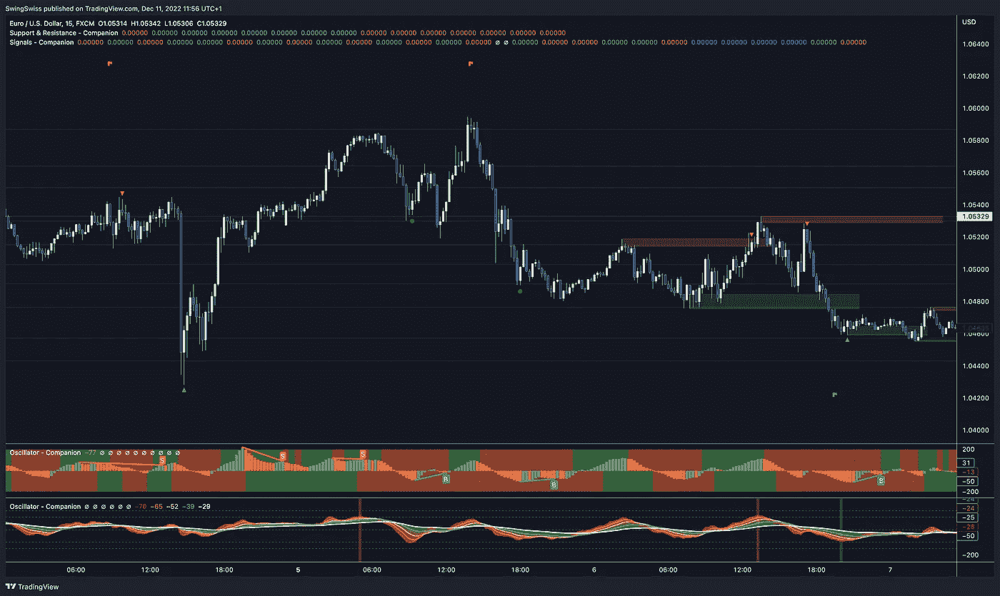

# 一家加密初创公司的兴衰——为什么我要让它起死回生，以及你可以如何帮助我！

> 原文：<https://medium.com/coinmonks/rise-fall-of-a-crypto-startup-why-i-am-bringing-it-back-to-life-and-how-you-can-help-me-b854b269fc17?source=collection_archive---------4----------------------->

从 2021 年最有希望的法国加密初创公司之一到熊市地狱，这里是我刚刚接管的 SwingSwiss 公司的故事。

Photo by [Giuseppe Patriarchi](https://unsplash.com/@labmagik?utm_source=medium&utm_medium=referral) on [Unsplash](https://unsplash.com?utm_source=medium&utm_medium=referral)

# 介绍

2017 年离职的时候，学了 Java，Python，Pine。根据我作为银行交易员的经验，我开发了几十个交易指标。
但是我从来没有推销过我的知识。我的工作只是供个人使用。

大约一年半以前，我寻找工具、概念和理论来改进我的设置(TMI)。
我遇到了一家名为 SwingSwiss 的初创公司。它在法国的加密社区中发展得相对较好，并且也进入了亚洲市场。SwingSwiss 提供了一套基于交易量分析的交易工具。他们在微观交易因子中发现了交易量模式，并用群体行为理论来预测宏观交易。这个概念立刻吸引了我*。*

*我和创始人取得了联系。我们聊了很多，我给了他一些建议，他分享了他的原始研究。没有过滤器。纯金的。*

*然而，我对他们的基本产品感到失望。这些工具与创始人精心设计的研究处于不同的层次。公司需要更多有经验的客户，但管理层需要做得更多。相反，他们坚持使用简单的、初学者友好的工具。*

**

*Photo by [Alexander Grey](https://unsplash.com/@sharonmccutcheon?utm_source=medium&utm_medium=referral) on [Unsplash](https://unsplash.com?utm_source=medium&utm_medium=referral)*

*当时，一切都进行得太顺利了，管理层不想为改变而烦恼，认为他们已经有了神奇的配方。这是一个激烈的牛市，业务呈指数增长…*

***一些里程碑:***

*   *15 个月内售出 8000 多份许可证*
*   *1.4 万推特粉丝*
*   *一个超级活跃的不和谐社区*
*   *与 CT 影响者的密切关系*

# *结束的开始。*

*该公司梦想扩张，并着手建设 crypto 的首个彭博终端这一颇为自负的项目。*

*那么，还有什么比推出 NFT 系列更好的融资方式呢？——(我是在讽刺。)*

*NFTs 需要实用程序。
首先，SwingSwiss 停止销售他们的指标，因为 NFT 现在是访问这些工具的唯一途径。然后，该公司提出从未来码头向 NFT 持有者提供被动收入。
**SwingSwiss 因自觉同意停止销售其唯一产品而自杀！该系列几乎瞬间售罄，但只有 1000 件。***

> *那是一年前，几乎是同一天。从那时起，该公司就没有任何收入，管理层每个月都要花费天文数字的资金来为码头融资。*

*尽管是熊市，他们还是像盲人一样向前走，拒绝面对现实。*

***结果:***

*   *没赚到钱*
*   *垂死的社区*
*   *糟糕的品牌形象*
*   *对 SwingSwiss 真实目的的困惑*

# *转折点。*

*创始人几个月来一直在为终端自动融资。尽管如此，他仍然相信这个项目，直到一个黑客夺走了他最大的钱包。这家伙是个出色的交易员，但过于情绪化，无法管理公司。我们仍然保持着联系，到那时，利用他的研究，我已经成功地为我引以为豪的$ETH 制定了长期战略。*

> *[阅读:仿生策略——或者所有算法交易策略应该如何开发](/coinmonks/the-bionic-strategy-or-how-all-algorithmic-trading-strategies-should-be-developed-a0a6b15330a0)*

*几个月来，我一直建议进行重大的组织变革，直到现在才有人愿意听我的。
我也知道我有复兴 SwingSwiss 的资本(他们没有)和愿望。我们必须坚持我们最擅长的，开发高端交易指标。*

# *接管*

*我已经获得了创始人和研究论文开发的数百个指标/策略。
我可以选择关闭公司，开始新的冒险，或者接管这艘正在下沉的船。*

*两个选择都很棒。他们的档案中有如此多的大脑价值，我们可以只用已经开发的东西来建立最好的交易系统。*

*但是，我重视社区，想给他们一个机会。所以，我决定让 SwingSwiss 继续存在下去，让我们的社区变得更强大。
从第一天开始我就加入了他们的行列，每天和他们聊天。*

*在我担任首席执行官的第一个月(今年 11 月)，我专注于产品并更新了所有工具，为短期和长期交易策略提供了一个同质的设置。*

**

# *现在怎么办？加入我吧！*

*我们的支持和阻力工具，以及我们的趋势分析软件，已经更新，随时可以使用。*

*我现在的重点是为专业散户交易者开发两套信号，这可以变成经验不足者的策略——我希望它们是短期加密和外汇。社区目前正在测试这两者。*

> *SwingSwiss 天生就有加密的想法，但 FX 将是我们的救赎。*

*2023 年将是外汇市场不可思议的一年，尤其是在亚洲和美国。SwingSwiss 将成为这一趋势中积极而重要的参与者。*

*从商业角度来说，我们需要给这个品牌一个营销上的亮点。NFT 项目让它吃了不少苦头，我们也需要远离法语社区。我们需要与交易社区、交易所和有影响力的人建立长期的合作关系。*

**

*Photo by [krakenimages](https://unsplash.com/@krakenimages?utm_source=medium&utm_medium=referral) on [Unsplash](https://unsplash.com?utm_source=medium&utm_medium=referral)*

*我正在寻找一个由世界各地的多学科人才组成的团队，和我一起合作，让事情发生。 无论你是社区经理、社交媒体营销大师、才华横溢的销售主管，还是内容创作者，[联系我](https://t.me/wisechief)！*