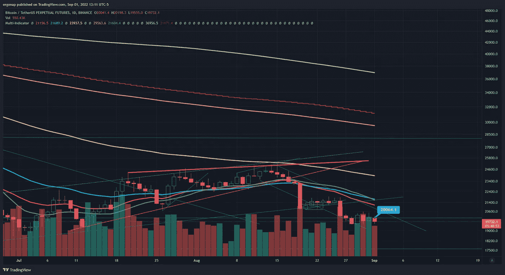
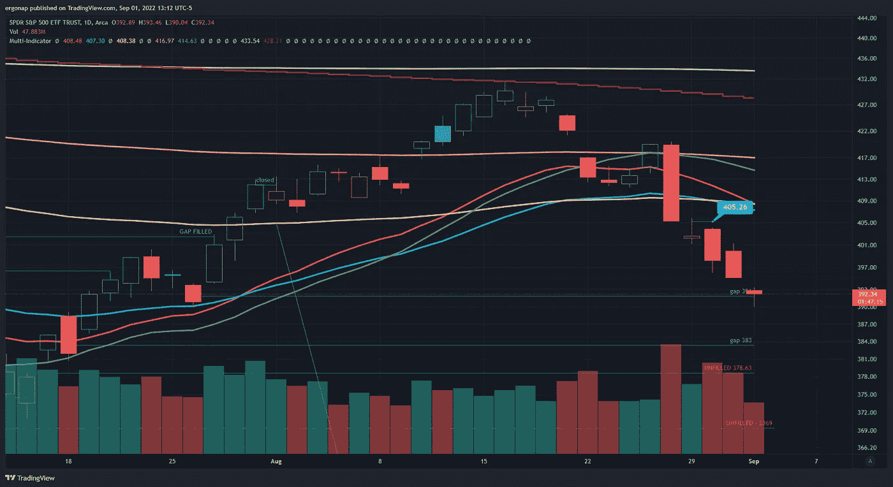
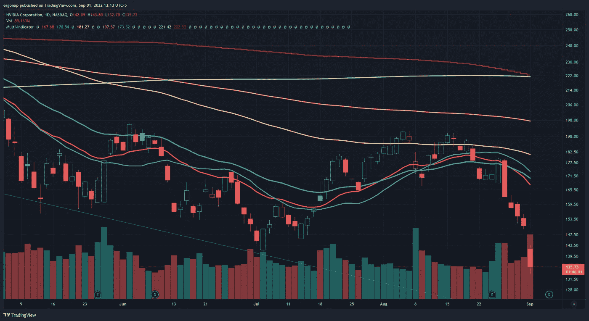
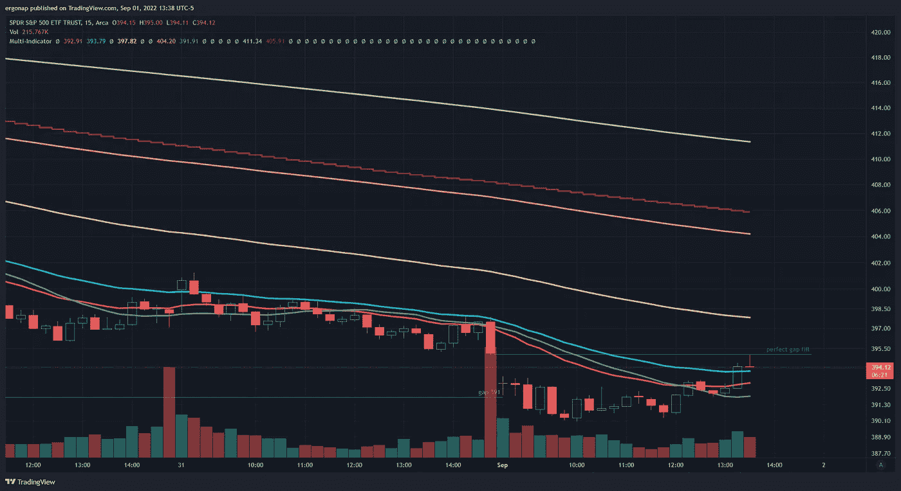
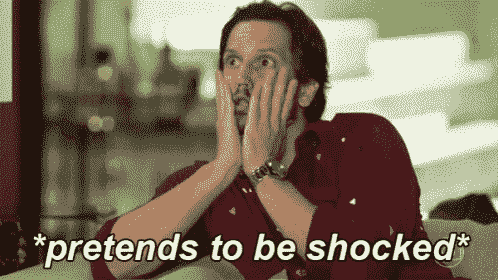

# 风险提醒

> 原文：<https://medium.com/coinmonks/risk-reminders-a9fbbd4784f2?source=collection_archive---------32----------------------->

## 加密货币市场/比特币分析 9/1

一、**假期**过了今天，周一见。让我们从提醒矿工们现有的危险越来越严重开始。没有多少人提到这篇文章。

 [## 加密崩溃中的比特币开采——矿业公司的创造性会计

### 艾米·卡斯特和戴维·杰拉德如果你喜欢我们的作品，请一定要报名参加我们的派对——这是艾米的，这是…

amycastor.com](https://amycastor.com/2022/08/04/bitcoin-mining-in-the-crypto-crash-the-mining-companies-creative-accounting/) 

这意味着$MARA 和$RIOT 等公司因利用其专用集成电路购买更多比特币而面临巨大的违约风险(是的，你没看错——双重杠杆)。同时他们拥有杠杆作用。无论如何，今年还会继续看跌吗？

我们越有可能看到下降。$BTC 看起来怎么样？不看好。cryptoquant 也遭遇了 BTC 的大规模抛售。

[https://www.tradingview.com/x/z2T06uyf/](https://www.tradingview.com/x/z2T06uyf/)

$间谍？正好填补了一个空白。修卡，我知道。没人玩他们说的差距，差距不重要，他们说，特别是长期！

First we gapped down…. [https://www.tradingview.com/x/68jpwuW0/](https://www.tradingview.com/x/68jpwuW0/) 🤷‍♂️

大型行业的不同组成部分也受到冲击，NVDA 美元创下今年新低。

[https://www.tradingview.com/x/ah4OJgWm/](https://www.tradingview.com/x/ah4OJgWm/)

我们会反弹吗？是的，最终，在某个地方。会持续吗？我可不这么认为。我认为这是另一个做空的机会。没有这种填补空白的东西。

equivalent to liq hunts in crypto. [https://www.tradingview.com/x/Ovc1RyB5/](https://www.tradingview.com/x/Ovc1RyB5/)

> 交易新手？试试[密码交易机器人](/coinmonks/crypto-trading-bot-c2ffce8acb2a)或者[复制交易](/coinmonks/top-10-crypto-copy-trading-platforms-for-beginners-d0c37c7d698c)