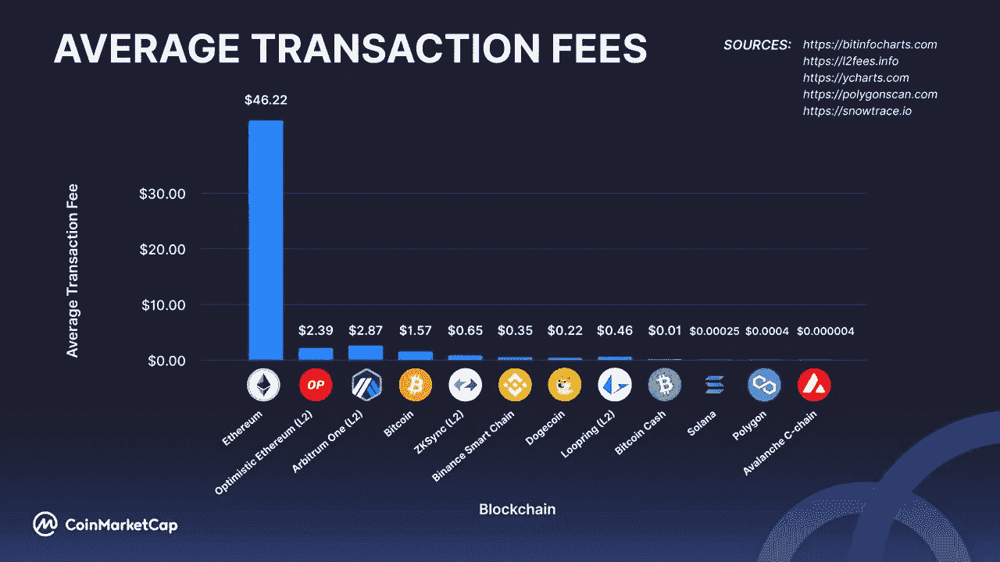
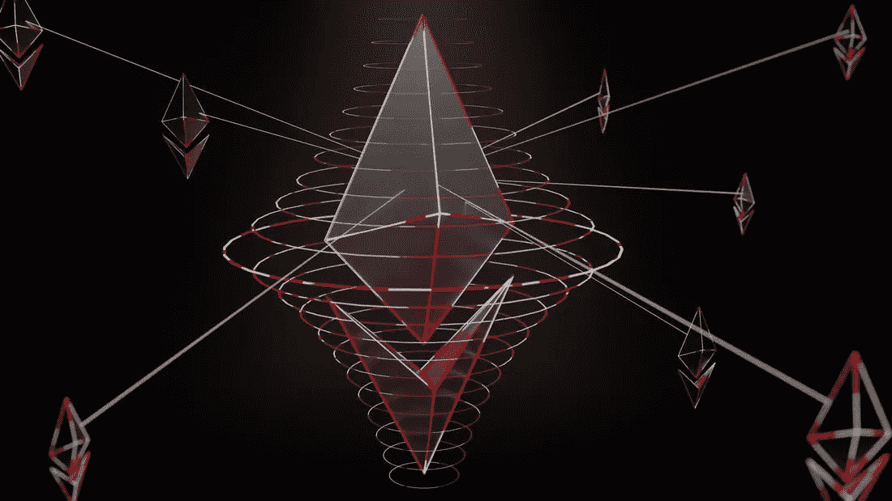

# 汇总—第 2 层解决方案如何帮助以太坊管理其可扩展性

> 原文：<https://medium.com/coinmonks/rollups-how-layer-2-solutions-help-ethereum-manage-its-scalability-97435e581ce9?source=collection_archive---------39----------------------->

Image by Choong Deng Xiang on [Unsplash](http://unsplash.com)

当你在一个领域工作了足够长的时间，就有可能开始认为你已经知道了该知道的一切。这是什么原因？自信还是骄傲？

区块链、加密货币、DeFi 离开了聊天……哎呀！

为什么会有人认为他们已经对区块链、加密货币和 DeFi 了解得够多了呢？没有机会了。自从开始关注区块链科技，每天醒来都是新手；这总是一个学习的过程。你不知道关于你的手艺的一切，并不意味着你不能在这方面做得更好。你必须每次都愿意学习和忘却，这就是我们在这里提出的观点。

这让我想到了我写这篇文章的原因。我最近决定提出一个关于以太坊的概念，这是我一段时间以来偶然想到的。这不是一个全新的概念，所以我想知道为什么我只是写它。我希望这不会暴露我，因为我不是以太坊的忠实粉丝。既然 DeFi 在这里玩，那就来探索一下吧！

你听说过 rollups 吗？

什么是汇总？

这是提高以太坊交易速度和可伸缩性的几种解决方案之一。

平均来说，以太坊处理交易的时间比大多数 T2 第一层区块链 T3 要长。如果你想加快这个过程，你必须支付更多的汽油费，以太坊知道如何用高昂的汽油费来花你的钱。不管怎样，不要难过；你要么在你的钱包上签字，要么不签字。

Image by [Coinmarketcap](http://coinmarketcap.com)

汇总使 Eth 链的交易处理更快，对用户来说价格更合理，改善了他们的 DeFi 体验。

汇总被设计成在单个事务中处理以太坊链上的许多事务。简而言之，它累积事务，同时从可伸缩性解决方案的用户那里收取少量处理费。这样做可以减少每个人不得不支付的费用，让他们花更少的钱买更多的东西，因此得名“rollups”

与第 1 层不同，第 1 层试图构建一个可以翻转 eth 链、覆盖更多 DeFi grounds 并获得更大市值的网络，汇总通常是为了提高 eth 链的效率而开发的。

将所有交易合并为一个交易，并按此进行处理！

rollup!

现在有两个正在使用的汇总解决方案。它包括*和 [*零知识(Z-K)上滚*](#cc34) 。*

***乐观累计***

*乐观汇总的操作非常直接。乐观汇总旨在相信事务在默认情况下是有效的——但这只是乐观的扩展解决方案(无论如何，这里有点极端)。被标记为“潜在有效”的交易会被兼任验证者的人质疑，他们可以决定交易是否应该完成。目的是使交易更快，并消除验证交易的复杂性，这涉及以太坊提供的工作证明共识。*

*为了验证交易是真实的，它被提交到以太坊网络。*

*验证通过该协议的交易的合法性的个人将被押上他们的 ETH，如果他们验证错误，他们将失去他们的 ETH。这是为了确保只有有效的交易才能通过网络。*

**

*Image by Shubham Dhage on [Unsplash](http://unsplash.com)*

***零知识(Z-K)汇总***

*虽然这是以太网的另一个扩展解决方案，但它的方法有些不同。与乐观汇总不同，它不能假定默认情况下某个事务是真实的，直到它至少验证了该事务已发生。*

*为了完成交易，“验证者”需要在数学上证明交易是有效的，而不需要进一步研究其细节。一个真实世界的例子是，能够仅通过一个人当前就读的学校的信息来确定他来自哪个国家。尽管这些知识并不自然对应，但是验证器可以使用零知识证明将它们联系在一起。*

*STARKs(可扩展的透明知识论证)和 SNARKs(简洁的非交互式知识论证)有效性证明是使用 Z-K 汇总来验证事务的加密证明。*

> *交易新手？试试[密码交易机器人](/coinmonks/crypto-trading-bot-c2ffce8acb2a)或者[复制交易](/coinmonks/top-10-crypto-copy-trading-platforms-for-beginners-d0c37c7d698c)*

***结论***

*汇总是[第 2 层解决方案](https://academy.binance.com/en/glossary/layer-2)，旨在通过快速验证主链需要更长时间处理的交易来加速以太坊链上的交易完成。*

*[乐观](https://www.optimism.io/)、[仲裁](https://loopring.org/#/)、 [dYdX](https://dydx.exchange/) 和 [Loopring](https://loopring.org/#/) 是可以探索的流行的第 2 层汇总。*

*一旦以太坊主链能够如 [Eth 2.0](https://www.forbes.com/advisor/investing/cryptocurrency/ethereum-2/) 所预期的那样管理其所有交易，使用这些第 2 层解决方案的必要性将会降低。不过，可能会有一些进步，可以改善这些汇总的显示方式。*

> *加入 Coinmonks [电报频道](https://t.me/coincodecap)和 [Youtube 频道](https://www.youtube.com/c/coinmonks/videos)了解加密交易和投资*

# *另外，阅读*

*   *[最好的卡达诺钱包](https://coincodecap.com/best-cardano-wallets) | [Bingbon 副本交易](https://coincodecap.com/bingbon-copy-trading)*
*   *[印度最佳 P2P 加密交易所](https://coincodecap.com/p2p-crypto-exchanges-in-india) | [柴犬钱包](https://coincodecap.com/baby-shiba-inu-wallets)*
*   *[8 大加密附属计划](https://coincodecap.com/crypto-affiliate-programs) | [eToro vs 比特币基地](https://coincodecap.com/etoro-vs-coinbase)*
*   *[最佳以太坊钱包](https://coincodecap.com/best-ethereum-wallets) | [电报上的加密货币机器人](https://coincodecap.com/telegram-crypto-bots)*
*   *[交易杠杆代币的最佳交易所](https://coincodecap.com/leveraged-token-exchanges)*