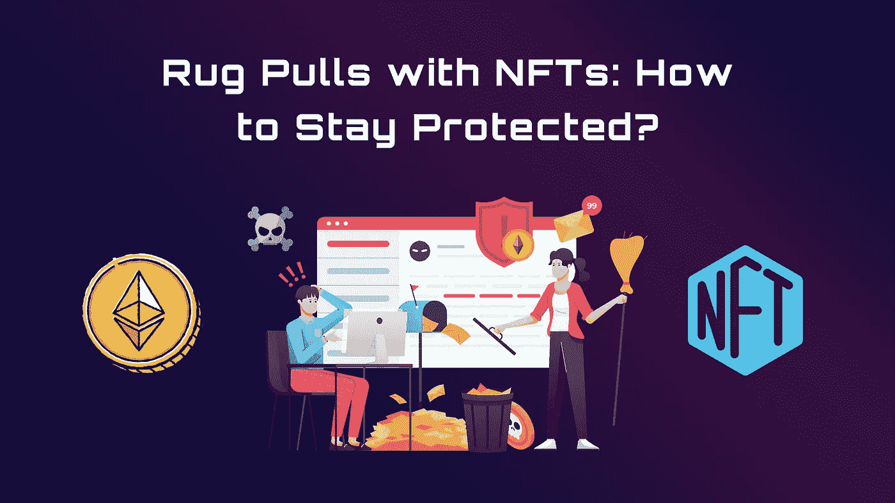
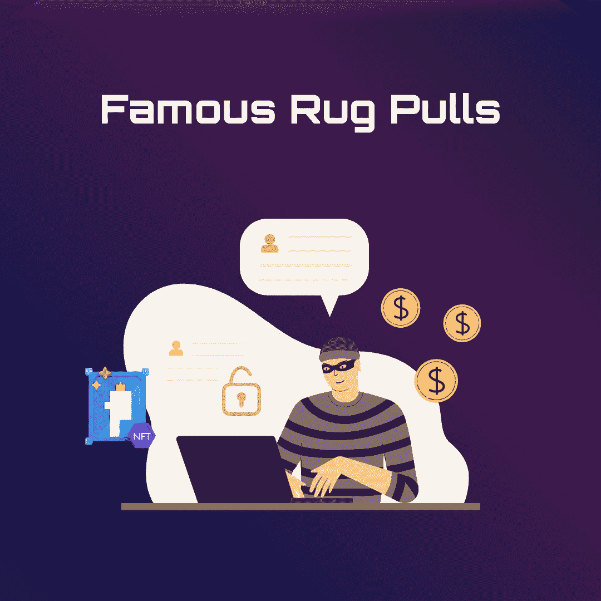

# 带 NFTs 的地毯拉头:如何保持防护？

> 原文：<https://medium.com/coinmonks/rug-pulls-with-nfts-how-to-stay-protected-f041992bed27?source=collection_archive---------39----------------------->

市场中的变化是不断的，你已经看到了 NFT 从诞生之日起就呈现出各种各样的形式。令人遗憾的是，虽然增长是不可否认的，但这个[密码行业](https://www.kaspersky.com/resource-center/definitions/what-is-cryptocurrency)一直受到各种欺诈者的困扰，他们试图利用新进入者的抢钱操作。

NFT 拉地毯是一种欺诈形式，其中 NFT 项目背后的团队带着所有资金消失。继续阅读，了解如何识别 NFT 地毯拉手，防止自己成为受害者。

# 地毯拉花是如何发生的？

在其最基本的形式中，拉地毯指的是一种商业退出骗局，其中项目的创始人或主要开发商在筹资后与投资者的现金分开。这些创始人经常提供诱人的建议，但未能实施项目或帮助投资者获得投资回报。拉地毯在加密中并不新鲜，最近的一次是 [Squidgame](https://www.washingtonpost.com/world/2021/11/02/squid-game-crypto-rug-pull/) token 拉地毯，当创造者窃取了数百万玩家高达 300 万美元的资产时，他们陷入了绝望。

通常是这样的:

一个团队发布适度数量的 NFT，并承诺给予更大的奖励，比如一个[区块链游戏](https://www.forbes.com/sites/theyec/2022/08/02/3-things-you-need-to-know-about-blockchain-gaming/?sh=665b9b184a85)、商品或特殊优势。NFT 的发布经常被炒作，有影响力的人经常被付钱来制造更多的热情。

人们被引诱购买这些非功能性食物作为投资，承诺在未来获得更有意义的东西。然后，剧组突然没了，项目取消了，钱都没了。有不同的类型。它并不总是发生得很快，项目逐渐消失，直到没有新的更新。

使用 NFTs 可以通过多种方式拉动地毯。首先，这些项目可能会提供他们的 NFTs 的预售，高调宣称他们是下一个最伟大的东西，并设定发布日期。在[代币](https://corporatefinanceinstitute.com/resources/knowledge/data-analysis/minting-crypto/)铸造之后，常见的结果包括:

*   当创始人在热情高涨时卖出股票，然后就消失了，这时就会出现抛售。一些个人可以拥有高达 40%的 NFT 藏品，可以想象，价格最终会下跌，给粗心的交易者留下非流动资产。
*   当开发者输入巧妙的合同编码来限制 NFT 持有者出售或提供后门访问，只允许开发者出售他们的代币时，这被称为**硬破解。**
*   开发者还可以将 NFT 与一种加密货币联系起来，**抬高**alt coin 的[价格，并消除流动性。](https://www.investopedia.com/terms/a/altcoin.asp)

许多人没有受过教育，为了快速赚钱的机会，他们很容易把钱扔掉。骗子由此获利。

# 如何识别地毯拉手？

不要以为只有新人被骗；即使是经验丰富的用户也可能上当。当你评价一些最不可思议的 NFT 地毯时，很明显任何人都可能成为欺诈的受害者。NFT 地毯拉花通常带有早期预警信号，例如:

## 1.未知创始人

尽管加密公司的匿名问题仍有争议，但最好还是与知名可靠的企业家合作。匿名可能会使人们陷入困境，因为如果出了问题，没有人可以挑战他们或寻求法律诉讼。作为 NFT 的粉丝，你应该调查所有可访问的社交媒体渠道和网站，以确保创始人的名字是真实的，而不仅仅是化名。

## **2。流动性**

在一个项目上投资的金额可能是另一个真实性或拉地毯的措施。一般来说，您应该查看数量、它存在的时间长度以及令牌的所有权百分比。如果流动性被锁定，这也是一个积极的迹象。好的计划要考虑几年，而不是几周或几个月。

## **3。社交机器人互动**

如今的社交媒体参与有多个方面，可以通过付费影响者购买机器人和赞助内容。首先，请记住，经得起时间考验的项目旨在产生高质量的工作，经常征求和评估输入，并减少错误。
假设项目有相当多的[不协调](https://discord.com/)和[电报](https://telegram.org/)约定。然而，除了 allowlists 的承诺和其他好处带来的吸引力之外，他们只得到少量的参与。在这种情况下，你应该小心谨慎。

## **4。动机不明**

在一个打算持续很长时间的项目中，一定水平的质量是必不可少的。许多 NFT 地毯公司的白皮书经常缺乏精确的蓝图，甚至可能包含抄袭的计划。白皮书不仅仅是一张宣传页，每一次使用它的努力都只是为了吸引人们。应该把更多的注意力放在用例、[、](https://www.financialexpress.com/blockchain/what-is-tokenomics-and-how-does-it-work/2619702/)和收益上，用图表和统计数据来支持这些主张。

# 著名的地毯拉花

## **进化出的类人猿**

《进化猿类》 NFT 系列是一个有计划的游戏的预告片，参与者将使用这些 NFT 角色争夺奖品。第一次 NFT 由进化猿下降，在五分钟内销售一空，显示了人们对它的热情。在第一次发行后仅一周，游戏的承诺兑现之前，创作者带着 798 ETH 消失了，抹去了他的社交媒体账户。

## **大猿爸爸**

[大爸爸猿俱乐部](https://news.coincu.com/60266-big-daddy-ape-club-1-3m-scam/)也是最受欢迎的 NFT 地毯拉花之一。这导致了 130 万美元的损失。这种拉地毯的行为值得注意，因为它甚至发生在 NFT 发布之前。此外，思域调查了其背后的团队，证明了识别欺诈有时是多么困难。

# 如何保护自己免受地毯拉扯？

防止成为拉地毯骗局受害者的最佳方法之一是在投资前对项目进行彻底的研究。一个 NFT 项目的综合研究应该包括对社区的更多了解和对团队的调查。检查该实体的社交媒体渠道，如 Twitter、Discord 和 Telegram，以更好地了解其进展。承诺兑现了吗？他们的网站专业吗？

另外，检查[流动性](https://www.investopedia.com/terms/l/liquidity.asp)；对于低流动性的 NFT 项目，将代币转换成现金或其他资产可能具有挑战性。交易量是一个可以帮助你确定项目流动性的指标。高交易量表明许多人在交易收藏品。NFT 风险投资的交易量有限，流动性很小，而且有一小群过度热情的客户，这可能意味着地毯拉骗局。

# 总结

随着每天都有新的 NFT 项目发布，观看经典骗局(如拉地毯)至关重要。保护自己免受此类骗局的第一步是了解它们是如何运作的。NFTs 总是会带来一些风险，但是识别可能指向欺诈的指标可以极大地帮助你，保持你的财务和 NFTs 的安全。

> 交易新手？试试[加密交易机器人](/coinmonks/crypto-trading-bot-c2ffce8acb2a)或者[复制交易](/coinmonks/top-10-crypto-copy-trading-platforms-for-beginners-d0c37c7d698c)