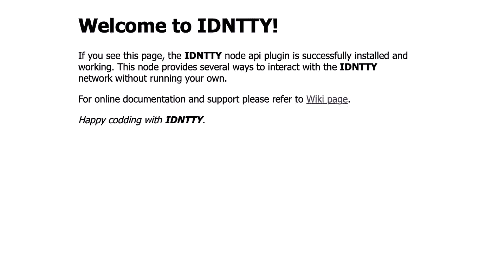

# 在 5 分钟内运行你自己的区块链节点

> 原文：<https://medium.com/coinmonks/run-your-own-idntty-blockchain-node-in-5-minutes-6fd048affa44?source=collection_archive---------14----------------------->


在我们看来，几乎任何技术开发中的一个主要问题是沉浸和第一步的艰难过程。如果你不能只是发布和尝试一些解决方案或系统，并且需要几个小时，有时几天，才能弄清楚它是如何工作的，那么大多数普通用户不会需要这个产品。

这就是为什么我们尽一切努力使我们自己的 [IDNTTY 网络节点](https://testnet.idntty.org)的安装尽可能简单易懂，即使对于一个对区块链技术，尤其是对 IDNTTY 基础设施工作细节不是很熟悉的人来说也是如此。

我们使用 Lisk SDK 开发我们自己的网络，这是[很好地记录了足够的](https://lisk.com/documentation/run-blockchain/index.html)，任何人都可以知道如何运行和配置他们自己的节点。但是，我们已经确保任何用户或开发人员只要想部署和运行他们自己的节点，都只需付出最少的努力。

# 为什么需要自己的节点？

这是你要问自己的第一个问题。如果您是一名普通的开发人员，并且希望开发自己的应用程序或将 IDNTTY 集成到您的应用程序中，您可以使用我们的网络节点并使用 API 来处理网络，而无需配置和维护您自己的基础架构。

以下是一些需要自己的节点的场景:

*   你想成为网络的代表，参与维护它，并锻造积木以获得奖励
*   您正在制作自己的应用程序，并希望通过方便的界面直接与网络互动
*   您想要获得关于网络交易的额外分析

# 在 docker 中运行您的节点

```
$ docker run -it --name idntty-node -p 5000:5000 idntty/node:latest
```

只需在安装了 docker 的电脑上运行一个命令就可以了。您不需要做任何其他事情，只需启动自己的节点。最新的节点镜像将被下载、部署并运行在 docker 中，名为 **idntty-node** 。

IDNTTY node setup in Digital ocean cloud

p 参数提供了一个端口 expose，这是必需的，以便您启动的节点可以与网络上的其他节点通信。

如果您想用自己的节点配置文件启动一个节点，您可以将它保存在本地计算机上，并使用-v 参数将其挂载到 docker 中。

```
$ docker run -d --name idntty-node -p 5000:5000 -v /opt/config.json:/path-on-local-computer/config.json:ro idntty/core:latest
```

一旦启动，节点必须找到其他根节点、其他对等节点，连接到它们并进行同步。

# 从源设置您的节点

> 这可能需要更长的时间，大约 15-20 分钟

如果您想运行自己的节点并对其进行微调，安装额外的插件或将它集成到您的应用程序中，您可以从源代码构建自己的[节点。](https://github.com/idntty/core)

以下步骤针对任何允许您运行 Ubuntu 20.0 及更高版本的云基础设施提供商。有时，防火墙的配置可能会有所不同，但除此之外，这个顺序将允许您安装和部署自己的节点。

# 步骤 1-更新我们的本地包索引和安装节点

由于这是我们在本次会议中与`apt`打包系统的第一次互动，我们将更新我们的本地包索引，以便我们可以访问最新的包列表。之后，我们可以安装工具来获取和安装软件包。以下所有操作都必须使用特权来完成。

```
$ apt update$ apt install **-y curl build-essential git**
```

Ubuntu 20.04 在其默认存储库中包含一个 Node.js 版本，可用于提供跨多个系统的一致体验。在撰写本文时，存储库中的版本是 10.19。这不会是最新的版本，但它应该是稳定的，足以快速体验这种语言。Ubuntu 20.04 版本 10.19 中包含的 Node.js 版本现在不受支持和维护。您不应该在生产中使用这个版本

要安装 Node.js 的不同版本，可以使用 NodeSource 维护的 *PPA* (个人包归档)。首先，我们将安装 PPA 以便访问它的软件包。从您的主目录中，使用`curl`来检索您的首选版本的安装脚本。

```
$ curl -fsSL [https://deb.nodesource.com/setup_16.x](https://deb.nodesource.com/setup_16.x) | bash -
```

PPA 将添加到您的配置中，并且您的本地包缓存将自动更新。现在可以用`apt`打包系统安装 Node.js 了。

```
$ apt install **-y nodejs**
```

通过运行带有`-v`版本标志的`node`，验证您已经安装了新版本:

```
$ node -v
```

# 步骤 2–准备 idntty 用户

虽然作为根用户运行可以让你完全控制一个系统和它的用户，但是这也是危险的，可能是破坏性的。对于常见的系统管理任务，最好添加一个无特权用户，并在没有 **root** 特权的情况下执行这些任务。这不是一个强制步骤，但是仍然建议创建一个单独的用户来运行您的 IDNTTY 节点。为此，请运行以下命令:

```
$ addgroup -gid 1100 idntty && useradd -d /home/idntty -m -s /bin/bash -u 1100 -g idntty idntty
```

之后，您需要创建一个目录，为它和创建的用户设置适当的权限，其中将存储运行您的节点所需的启动文件和附加库:

```
$ mkdir /opt/idntty$ chown -R idntty:idntty /opt/idntty
```

建议使用 idntty 用户的权限执行所有后续操作。为此，您必须使用以下命令切换到它:

```
$ su idntty
```

# 步骤 3 —获取源代码并安装软件包

如果您还没有这样做，克隆 [lisk-service](https://github.com/LiskHQ/lisk-service) GitHub 存储库，然后导航到项目文件夹并签出最新版本。

```
$ git clone [https://github.com/idntty/core.git](https://github.com/idntty/core.git)
```

*将目录切换到新的存储库，然后*从根目录安装所有 npm 依赖项。

```
$ cd core & npm i
```

因为我们使用 [Lisk SDK](https://lisk.com/documentation/lisk-sdk/index.html) 来构建我们的区块链应用程序，所以我们所有的节点都完全继承了 Lisk 提供的所有方法，这意味着您可以使用 [CLI 来管理您的 IDNTTY 节点](https://medium.com/r?url=https%3A%2F%2Flisk.com%2Fdocumentation%2Flisk-sdk%2Fapplication-cli.html)。

之后，您必须运行命令来启动节点:

```
$ ./bin/run start
```

过一会儿，您的节点应该找到 testnet 根节点(此时只有测试网络在运行)，并将您的节点与网络的其余部分同步。

# 步骤 4 —(可选)创建 IDNTTY 服务

一旦您配置了节点并准备在生产环境中运行它，您就需要运行一个守护进程，它将持续运行，甚至在您的终端会话结束之后。事实上，这有许多不同的选择。如果你只是想启动你的应用程序，你可以使用 [Forever](https://github.com/foreverjs/forever) 或 [PM2](http://pm2.keymetrics.io/) 来运行并在崩溃时自动重启。**但是，这不是后台任务**。

对于在服务器重启时开始的后台任务，您链接的帖子是正确的方法。你必须创造:

```
[Unit]
Description = Idntty blockchain application
After = network.target
StartLimitBurst = 3
StartLimitIntervalSec = 15[Service]
Type = simple
Restart = always
RestartSec = 5
ExecStart = /opt/idntty/core/bin/run start
User = idntty
Group = idntty[Install]
WantedBy = multi-user.target
```

到/etc/systemd/system/id ntty . service 文件中，然后使用 [systemctl](https://en.wikipedia.org/wiki/Systemd#Core_components_and_libraries) 来启动它:

```
$ sudo systemctl enable idntty.service
$ sudo systemctl start idntty.service
```

之后，您的节点将在您的服务器启动后自动启动。现在假设您的 Linux 发行版可以与 systemctl 一起工作。如果您的 Linux 发行版可以与 upstart 或其他软件一起工作，那么您需要在 google 上查找该进程管理器的说明。

# 步骤 5 —(可选)设置 nginx 以使用 API

Nginx 是世界上最流行的网络服务器之一，负责托管互联网上一些最大、流量最高的网站。这是一个轻量级的选择，既可以用作 web 服务器，也可以用作反向代理。对于我们的例子，我们将使用 Nginx 作为反向代理来发布本地主机服务，以便从所有外部 ip 地址进行访问。如果你有不止一个节点，Nginx 可以用来平衡这些节点的负载(我们不会在这篇文章中讨论)。

此外，如果您想使用 SSL 协议提供对主机 API 服务的访问，Nginx 也将帮助您完成这项任务。

因为 Nginx 在 Ubuntu 的默认存储库中可用，所以可以使用`apt`打包系统从这些存储库中安装它。由于这是我们在本次会议中与`apt`打包系统的第一次互动，我们将更新我们的本地包索引，以便我们可以访问最新的包列表。之后，我们可以安装`nginx`:

```
$ sudo apt update
$ sudo apt install nginx
```

在测试 Nginx 之前，需要配置防火墙软件以允许访问服务。在安装过程的最后，Ubuntu 22.04 启动 Nginx。web 服务器应该已经启动并运行。我们可以通过键入以下命令来检查`systemd` init 系统，以确保服务正在运行:

```
$ sudo systemctl status nginx
```

正如本 out 所确认的，服务已经成功启动。然而，最好的测试方法是从 Nginx 实际请求一个页面。为了让 Nginx 服务于这些内容，有必要用正确的指令创建一个服务器块。您可以直接更改默认配置文件，或者为您的域创建一个新的配置文件。

正如本 out 所确认的，服务已经成功启动。然而，最好的测试方法是从 Nginx 实际请求一个页面。为了让 Nginx 服务于这些内容，有必要用正确的指令创建一个服务器块。您可以直接更改默认配置文件，或者为您的域创建一个新的配置文件。我们将以编辑默认配置文件为例:

```
/etc/nginx/sites-available/default
```

为了通过使用*让我们加密*的免费 SSL 证书为您的域名设置 HTTPS，您应该继续阅读[如何在 Ubuntu 22.04 上使用让我们加密](https://www.digitalocean.com/community/tutorials/how-to-secure-nginx-with-let-s-encrypt-on-ubuntu-22-04)来保护 Nginx。例如，下面是我们自己用于公共节点的 Nginx 服务器设置。你可以在下面找到每个模块的解释。

```
# Default server configuration#server {
   if ($host = *your_domain*) { return 301 [https://$host$request_uri;](https://$host$request_uri;) } listen 80 default_server; listen [::]:80 default_server; server_name *your_domain*; return 404; # managed by Certbot}server {# Static pages SSL configuration# listen [::]:443 ssl ipv6only=on; # managed by Certbot listen 443 ssl; # managed by Certbot ssl_certificate ./fullchain.pem; # managed by Certbot ssl_certificate_key ./privkey.pem; # managed by Certbot include ./options-ssl-nginx.conf; # managed by Certbot ssl_dhparam ./ssl-dhparams.pem; # managed by Certbot root /var/www/html; index index.html; server_name *your_domain*; location / { try_files $uri $uri/ =404; }}server {
# Web services SSL configuration for Lisk API# listen 8090 ssl; server_name WS; ssl_certificate ./fullchain.pem; # managed by Certbot ssl_certificate_key ./privkey.pem; # managed by Certbot include ./options-ssl-nginx.conf; # managed by Certbot ssl_dhparam ./ssl-dhparams.pem; # managed by Certbot location / { proxy_pass [http://127.0.0.1:9000;](http://127.0.0.1:9000;) proxy_http_version 1.1; proxy_set_header Upgrade $http_upgrade; proxy_set_header Connection "upgrade"; proxy_read_timeout 86400; }}server {
# Node REST API SSL configuration# listen 8080 ssl; server_name API; ssl_certificate ./fullchain.pem; # managed by Certbot ssl_certificate_key ./privkey.pem; # managed by Certbot include ./options-ssl-nginx.conf; # managed by Certbot ssl_dhparam ./ssl-dhparams.pem; # managed by Certbot location / { proxy_pass [http://127.0.0.1:8000;](http://127.0.0.1:8000;) }}
```

**静态页面 SSL 配置**

这个模块描述了 Nginx 显示的静态文件的设置。如果有必要，你可以放置关于你的节点的附加信息(就像我们对 https://tn-alpha.idntty.org 做的那样)。

**Lisk API 的 Web 服务 SSL 配置**

如果您已经使用 Web 服务启用了与主机的通信，并且想要从公共网络提供公共访问，则必须发布它。默认情况下，IDNTTY WS 运行在本地 IP 和 9000 端口上。在上面的例子中，我们在端口 8090 上发布了该服务，并使用 SSL 协议对该访问进行了加密。

**节点 REST API SSL 配置**

如果您已经激活了使用 REST API 与您的节点通信的能力(在使用 REST API 的 IDNTTY 节点上可用)，您还必须将其发布到公共网络。默认情况下，REST API 服务运行在本地端口 8000 上，我们使用 SSL 协议在端口 8080 的公共地址上发布它。

完成后，保存并关闭文件。接下来，测试以确保您的任何 Nginx 文件中没有语法错误:

```
$ sudo nginx -t
```

如果没有任何问题，重启 Nginx 以使您的更改生效:

```
$ sudo systemctl restart nginx
```

Nginx 现在应该为你的域名服务了。您可以通过导航到`http://your_domain`来测试这一点，在这里您应该会看到类似这样的内容:



Default IDNTTY node welcome screen on Nginx

我们真心希望这份详细的手册能够让您自己安装和配置 IDNTTY 节点。但是如果你没有成功或者有什么问题，你随时可以在我们的不和谐聊天中提问: [https://lisk.chat](https://lisk.chat) 。

> 交易新手？试试[加密交易机器人](/coinmonks/crypto-trading-bot-c2ffce8acb2a)或者[复制交易](/coinmonks/top-10-crypto-copy-trading-platforms-for-beginners-d0c37c7d698c)