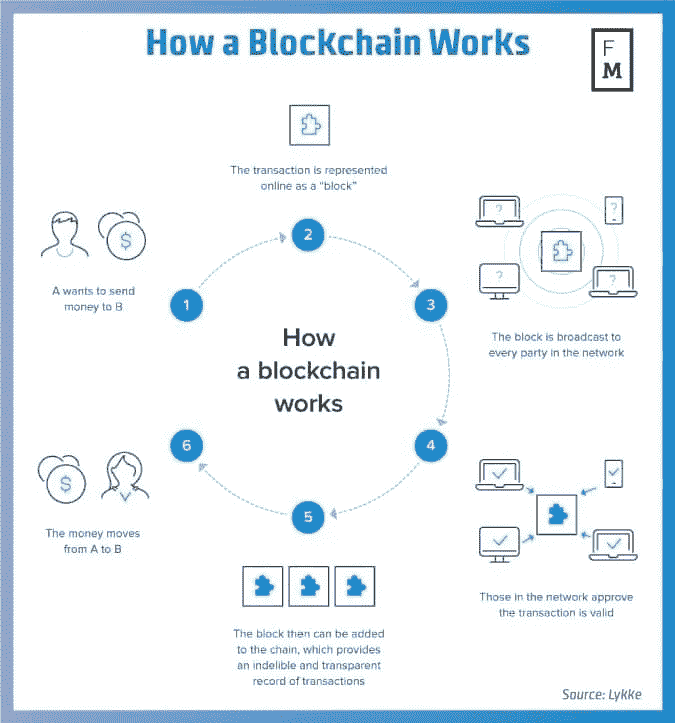
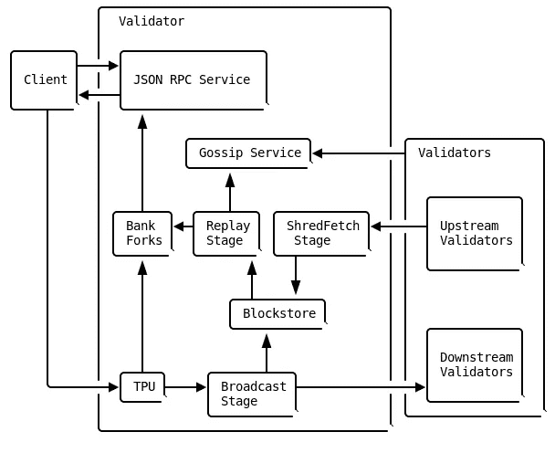

# 在 AWS 上运行 Solana 验证程序

> 原文：<https://medium.com/coinmonks/running-a-solana-validator-on-aws-bb86162eaf29?source=collection_archive---------4----------------------->

## 在 amazon web services 中运行 Solana 验证器实例的分步指南

Solana 是世界上速度最快但被低估的区块链之一，其生态系统在 Web3、Defi、NFTs 等加密领域过度增长。

在本文中，我们将讨论 Solana 中的验证器架构。此外，我们将着手在 AWS EC2 实例上运行 Solana 验证器。

注意:这是一篇技术文章，而不是投资建议！

## 用简单的话来说，区块链是如何工作的

对区块链有最起码的了解对于阅读和使用这篇文章是必要的。如果您熟悉区块链的概念，您可以跳过这一部分。



Fig 1\. How a blockchain works [1].

假设阿里想给莎拉汇些钱(见图 1)。该事务的数据在线表示为一个块。该块被广播给网络中的每一方，并且网络中的那些方验证该事务(验证者)。验证该块后，可以将其添加到链中(资金从 Ali 转移到 Sarah)。这一链条为交易提供了不可磨灭的透明记录。这就是为什么它被称为区块链(区块链！).

首先要熟悉的概念是*事务*。交易是由客户签署的一组指令。事务被自动执行，只有两种可能的结果:成功或失败。

一个*分类账*就像一个银行或者一个保存客户交易记录的数据库。所以分类账是包含客户签署的交易的条目列表。

> 交易新手？尝试[加密交易机器人](/coinmonks/crypto-trading-bot-c2ffce8acb2a)或[复制交易](/coinmonks/top-10-crypto-copy-trading-platforms-for-beginners-d0c37c7d698c)

## 索拉纳验证器

如前所述，验证器只是一个计算机实例，用于验证添加到分类帐中的交易。维护分类帐的一组验证器称为群集。

Solana validator 使用了*流水线*，这是 CPU 设计中的一个优化标准。当一个输入数据流需要在一系列步骤中处理时，它是正确的工具，并且不同的硬件负责每个步骤[2]。



Fig 2\. The anatomy of a validator [2].

索拉纳验证程序有两个管道进程:TVU 和 TPU。TPU 代表事务处理单元。它创建分类帐分录，用于领导模式，TVU 用于验证分录。

## 正在准备虚拟机

可以在 AWS 这样的云平台上的任何空服务器或虚拟机上安装和运行 Solana validator。你需要一个 12 核 24 线程或更多的 CPU，至少 128 GB 的内存，Ubuntu 20.04 和一个支持 cuda 的 GPU [3]。

在开始之前，请确保您已经安装了 Solana 命令行工具。它可以通过以下命令在 macOS 或 Linux 上安装[4]:

```
sh -c “$(curl -sSfL https://release.solana.com/v1.10.29/install)"
```

可以通过运行`solana --version`来测试安装。

因为我们要将我们的验证器连接到 Devnet 集群，所以需要通过`--url`参数来设置配置:

```
solana config set — url [http://api.devnet.solana.com](http://api.devnet.solana.com)
```

通过`solana transaction-count` 获取事务计数，我们可以确保集群是可达的。

## 调整系统

在运行验证器之前，为了优化的目的，有必要调整一些系统设置(增加 OS UDP 缓冲区和文件映射限制)。整个过程可以由一个叫做`solana-sys-tuner`的守护进程自动完成，这个守护进程包含在 Solana 二进制版本中[5]。

要运行它:

```
sudo $(command -v solana-sys-tuner) --user $(whoami) > sys-tuner.log 2>&1 &
```

## 生成身份

为验证程序创建身份密钥对:

```
solana-keygen new -o ~/validator-keypair.json
```

您的验证器身份密钥对在网络中唯一地标识您的验证器。**备份这些信息至关重要。**

如果您不备份这些信息，您将无法恢复您的验证器，如果您失去对它的访问。如果发生这种情况，你也将失去你的 SOL 分配。

要备份您的 validator identify keypair，**将您的“validator-keypair.json”文件或种子短语备份到一个安全的位置。**

到目前为止一切顺利，现在是时候设置 Solana 配置以使用生成的密钥对了:

```
solana config set --keypair ~/validator-keypair.json
```

输出应该类似于以下内容:

```
Config File: /home/solana/.config/solana/cli/config.yml
RPC URL: [http://api.devnet.solana.com](http://api.devnet.solana.com)
WebSocket URL: ws://api.devnet.solana.com/ (computed)
Keypair Path: /home/solana/validator-keypair.json
Commitment: confirmed
```

下一步是空投一些溶胶开始。请注意，此 airdrop 仅在 Devnet 和 Testnet 上可用:

```
solana airdrop 1
```

我们还需要一个取款人和一个投票账户。撤回帐户有权撤回您的投票帐户，它可以改变您的投票帐户的所有方面。所以很重要！

```
solana-keygen new -o ~/authorized-withdrawer-keypair.json
```

投票帐户:

```
solana-keygen new -o ~/vote-account-keypair.json
```

## 连接并运行验证程序

现在，我们已经准备好通过以下方式将验证器连接到集群:

```
solana-validator \
  --identity ~/validator-keypair.json \
  --vote-account ~/vote-account-keypair.json \
  --rpc-port 8899 \
  --entrypoint entrypoint.devnet.solana.com:8001 \
  --limit-ledger-size \
  --log ~/solana-validator.log
```

验证器将自动记录到一个文件中(在这个例子中是 solana-validator.log)。

如果验证器连接到网络，其 IP 地址和公钥将出现在以下列表中:

```
solana gossip
```

最后，请不要止步于此，请务必阅读官方文档以获得更多选项和准确信息[6]。

## 参考

*所有链接在本文发表时(2022 年 7 月 5 日)有效。

*   [1][https://www.pinterest.com/pin/654218283351673725/](https://www.pinterest.com/pin/654218283351673725/)
*   [https://docs.solana.com/validator/anatomy](https://docs.solana.com/validator/anatomy)
*   [3][https://developer.nvidia.com/cuda-gpus](https://developer.nvidia.com/cuda-gpus)
*   [https://docs.solana.com/cli/install-solana-cli-tools](https://docs.solana.com/cli/install-solana-cli-tools)
*   [5][https://docs . Solana . com/running-validator/validator-start # system-tuning](https://docs.solana.com/running-validator/validator-start#system-tuning)
*   [6]https://docs.solana.com/running-validator/validator-start