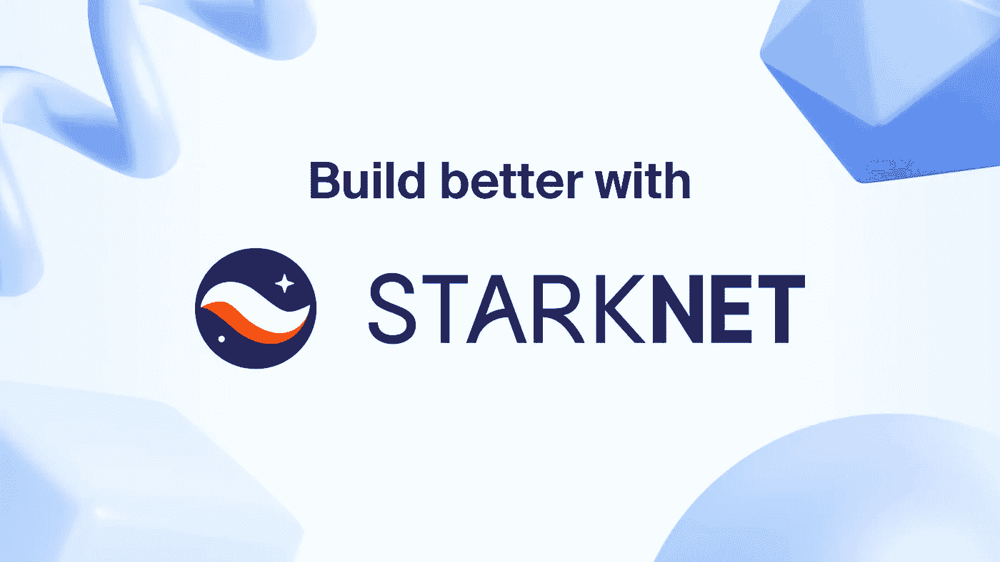

# 运行 StarkNet 节点(非常简单)v2

> 原文：<https://medium.com/coinmonks/running-starknet-nodes-very-easy-v2-92987909cebc?source=collection_archive---------9----------------------->



Build Better with StarNet

随着 Pathfinder 0.2.6-alpha 的发布，您不再需要任何额外的插件来构建 docker 映像。JSON-RPC 转发现在也可以工作了！我只能推荐使用 docker，而不是从源代码构建节点！

关于 StarkNet 和 Pathfinder 的背景，请查看我的原帖:[https://medium . com/coin monks/how-to-run-a-StarkNet-node-very-easy-7937 E3 a7d 942](/coinmonks/how-to-run-a-starknet-node-very-easy-7937e3a7d942)。

# 超级简单的设置

使用 Pathfinder 和 Watchtower 建立一个自我更新的 StarkNet 节点。

1.  克隆我的 docker 合成文件

```
git clone [https://github.com/0xytoken/pathfinder-docker.git](https://github.com/0xytoken/pathfinder-docker.git)
```

2.输入 repo 并调用 docker-compose up。

```
cd pathfinder-docker && docker-compose up
```

3.如果探路者和瞭望塔旋转得很漂亮，那么停止它们并再次运行命令，但这次是在分离模式(又名。背景)

```
docker-compose -d up
```

4.如果实例的端口是开放的，那么现在可以使用 JSON-RPC 端点在端口 9545 上查询节点的状态。

你可以在这里随意尝试一下[。](https://playground.open-rpc.org/?uiSchema%5BappBar%5D%5Bui:splitView%5D=false&schemaUrl=https://raw.githubusercontent.com/starkware-libs/starknet-specs/master/api/starknet_api_openrpc.json&uiSchema%5BappBar%5D%5Bui:input%5D=false&uiSchema%5BappBar%5D%5Bui:darkMode%5D=true&uiSchema%5BappBar%5D%5Bui:examplesDropdown%5D=false)

***瞧！✨欢迎来到 ZK 革命🚀***

**给自己一个大大的惊喜！你真棒！为自己支持#去中心化和#可及性而自豪！**

👇在 StarkNet discord 频道#full-node-success 与我们分享您的成功👇

[](https://discord.gg/Fx6zFE7n) [## 加入 StarkNet Discord 服务器！

### StarkNet 服务器是 StarkNet 所有参与者讨论和分享的地方。开发者，用户，基础设施，所有的事情都在谈论…

不和谐. gg](https://discord.gg/Fx6zFE7n) 

请随意查看我的 [crypto coda 页面](https://coda.io/@niklas-benjamin-muegge/crypto)获取更多指南和 alpha。

> 交易新手？尝试[加密交易机器人](/coinmonks/crypto-trading-bot-c2ffce8acb2a)或[复制交易](/coinmonks/top-10-crypto-copy-trading-platforms-for-beginners-d0c37c7d698c)