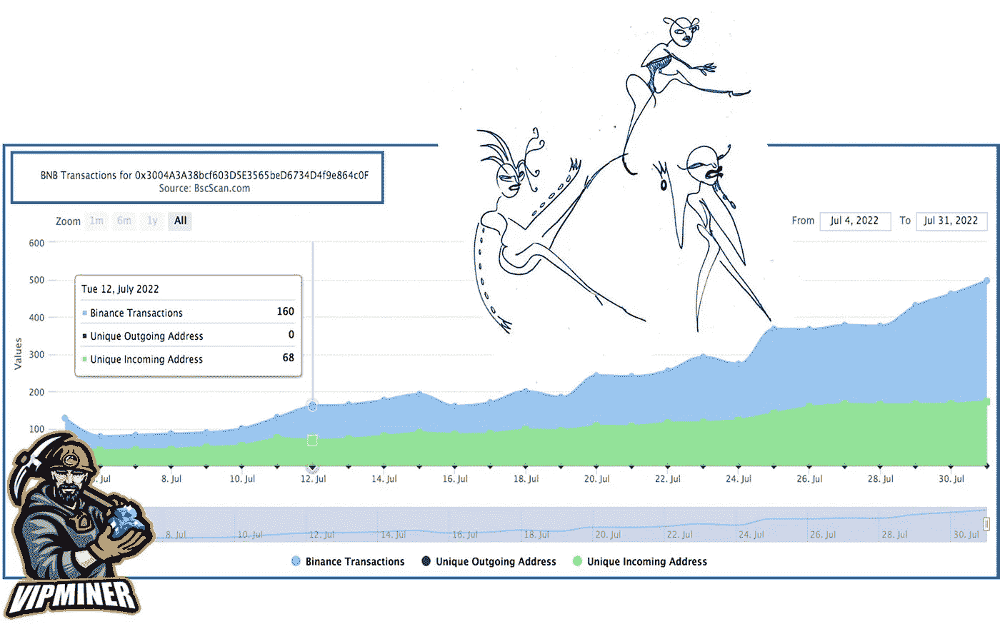
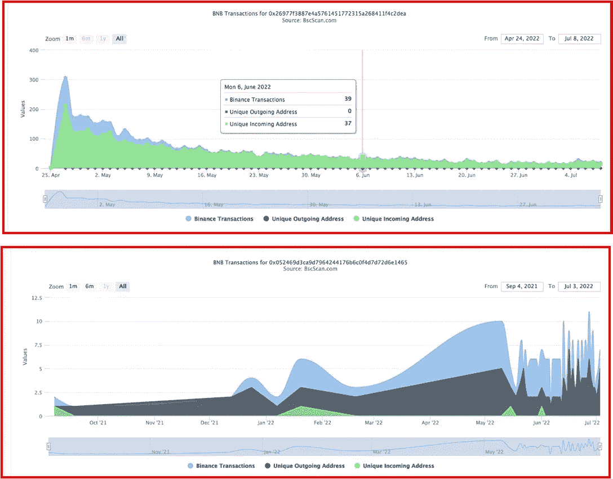
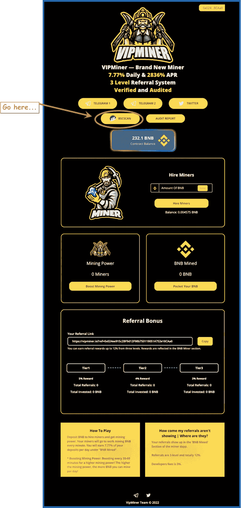
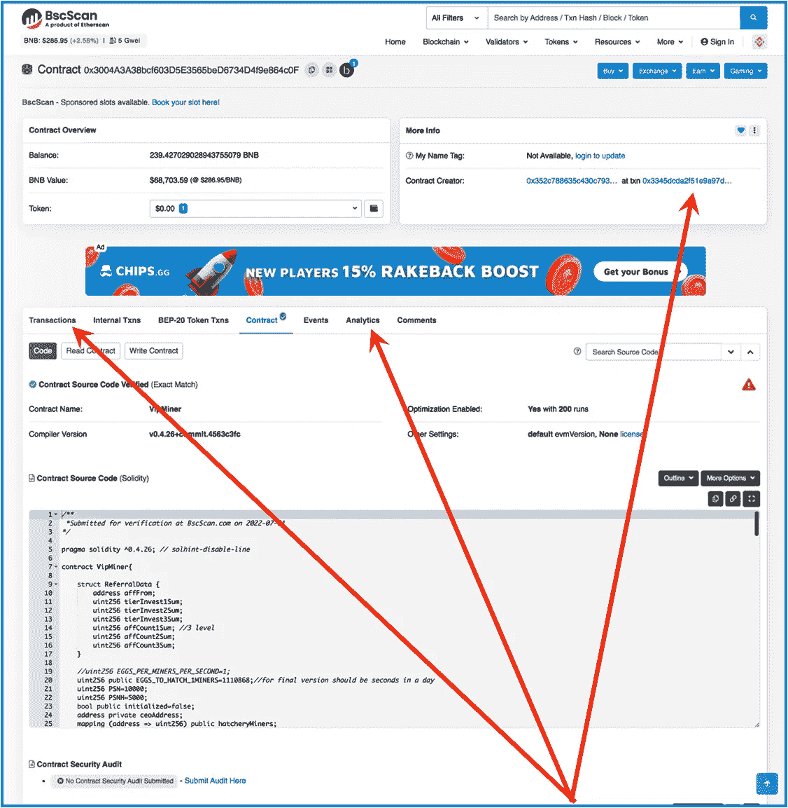
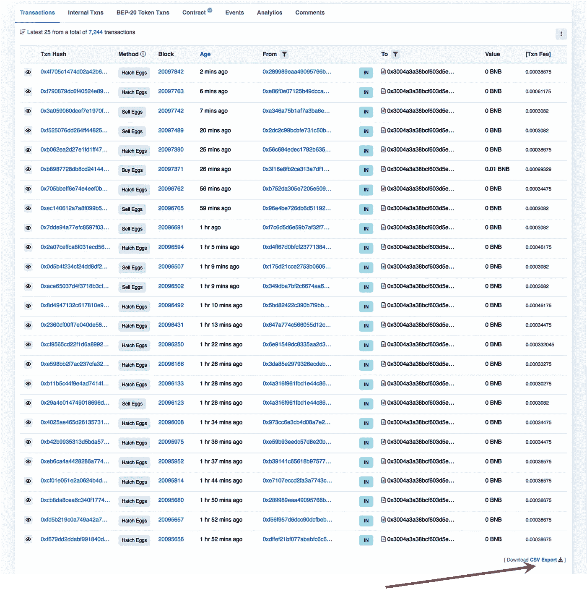
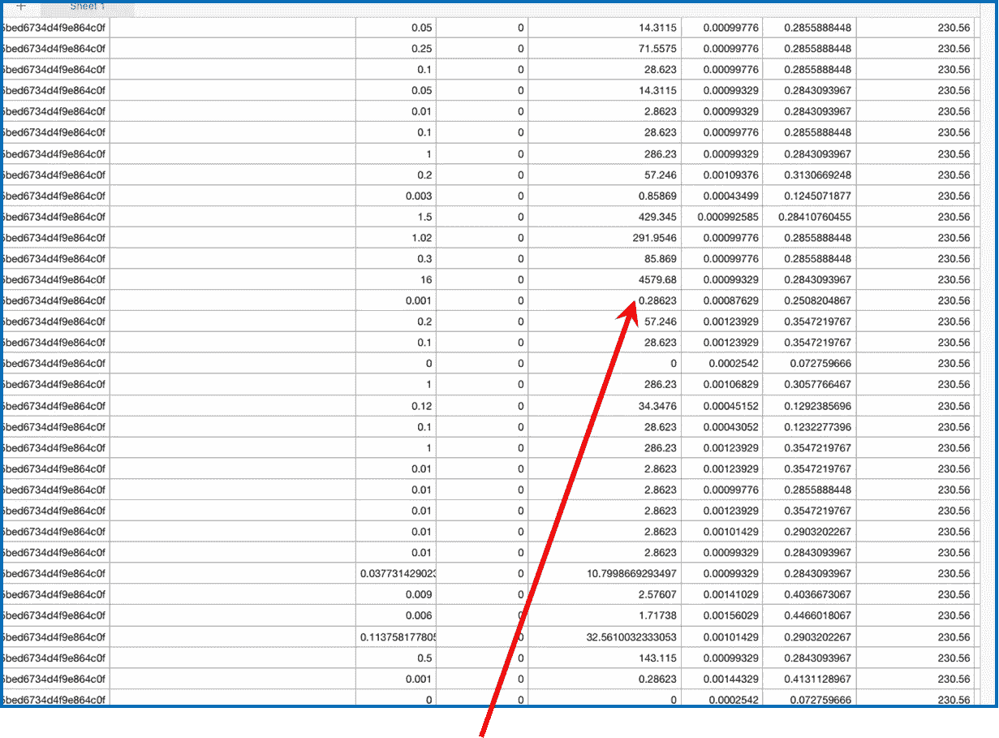
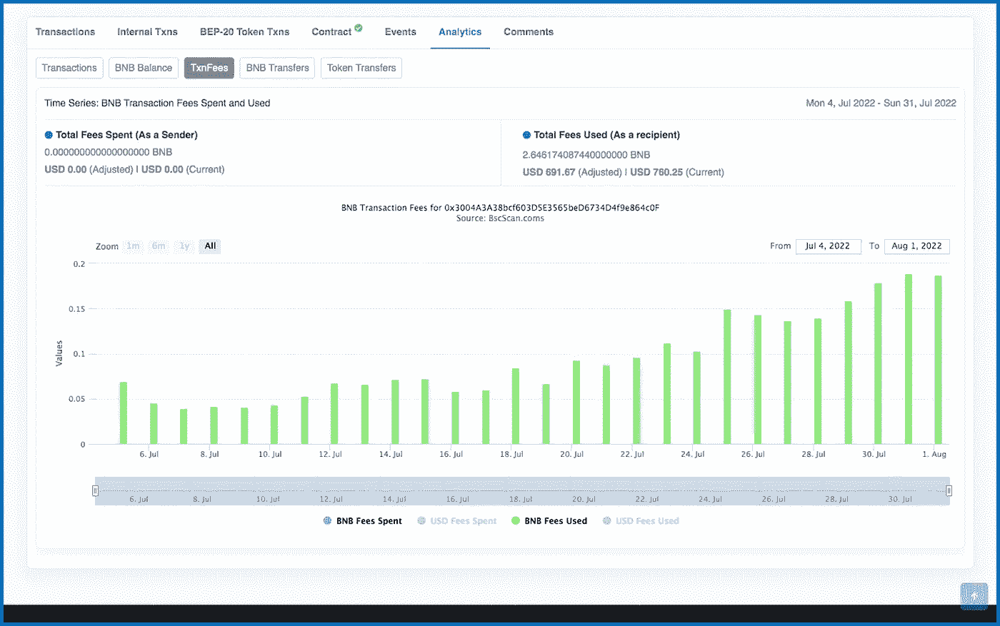

# 跑上那座山，没有任何问题

> 原文：<https://medium.com/coinmonks/running-up-that-hill-with-no-problems-f268d879a206?source=collection_archive---------18----------------------->

将一只脚趾伸入用于零钱加密赌注平台的步行交通中

As we’re all invested in going up that hill together, we should want to know: How many folks have contributed into this financial protocol? How much & how frequently have they invested?

我道歉——凯特·布什的那首歌显然在我脑海里(她的声音！).

然而，我确实认为，一个健康的零钱包矿工赌注平台的步行交通图应该类似于一个愉快的缓坡行走，如上面的例子所示。我说平缓是因为它不应该是一个不稳定的小山，造成不平坦的行走，就像我们看到的许多图表一样；下面是一些例子。

> 展示一个零花钱矿工项目健康状况的图表也不应该像一次令人生畏的爬山。如果一个协议图在第一时间不合理地飙升，我会很警惕；然后，它通常会下降，在另一边急剧下降。
> 
> 这是一个不平衡的钟形曲线&我们不想看到这些，也见下文。

向上的道路上的巨大沟壑可能会给项目带来麻烦，所以如果你突然觉得这条路可能不适合你，你绝对应该回头。

> 这些小型投资工具可能非常有利可图，或者如果你不小心，它们可能会从你的口袋里榨干你的每一分钱。我喜欢寻找新的地方来投资我的零花钱。然而，知道什么时候离开一个项目也是很好的。

## 健康的散步

步行交通图应该像一座总体上向上的小山，以舒适的步伐前进。如果你沿着图表的轨迹走，你可以想象这座山可能会在很长一段时间内平缓地向上延伸；或者也许图表看起来会在几个月后开始变得平稳。这些都是很好的爬山和散步的地方…

我希望这是一次至少持续一年的漫长而繁荣的金融之旅，因为更多即将到来的协议将继续争取更长的时间。

上面的流量图中的绿线显示了唯一的传入地址，这是显示每天有多少新投资者到达投资协议的直观方式。对于这个秘密产量的农业协议，绿线正稳步上升，速度很快。

> 请记住，这些都不是一个有利可图的口袋里改变加密赌注项目万无一失的预测。我们尽我们所能做最好的研究，在这个过程中，我们要么开始对这个协议感到舒适和有足够的信心去投资，要么决定走另一个方向。

Above: These are not pleasant hills…Nor were they pleasant for any investors who fell into them & lost their pocket-change. Again, it doesn’t have to be like that…

在我投资任何辛苦赚来的钱之前，我需要做一些调查。

然后，我总是去区块链数据库的合同页面——在这里是[BscScan](https://bscscan.com/address/0x3004A3A38bcf603D5E3565beD6734D4f9e864c0F#code)——收集尽可能多的信息。

我们如何在顶部创建图表？跟我来…

> 我探索和剖析新的口袋变化加密赌注协议。我要么把它们拆开，要么决定投资这个项目，鼓励它们的可持续性和持久性。这些矿工中很少有人会升到最高层；那些是我正在寻找的。

This simple pocket-change crypto staking project is called [VipMiner.io](https://vipminer.io?ref=0x024ee915c2BF9d12F98b750119051A752e18CAa0). Nicely for us, the smart contract is easy to find, along with the verified audit & a few socials(:

在所有币安智能链零钱项目的仪表板上寻找 BscScan 标志。如果合同链接不好找，我总是很警惕。我正在使用的例子是一个更新的简单的 crypto miner 项目，名为[VIP miner . io](https://vipminer.io?ref=0x024ee915c2BF9d12F98b750119051A752e18CAa0)；它是顶部那个爬山图的所有者。

> 我只投资我已经研究过的项目&写起来感觉舒服的项目。点击 VipMiner 链接，您将进入该投资协议；使用该平台将为我提供一个小的金钱介绍…谢谢。

点击 BscScan 将带您进入合同仪表板，如下所示:

Smart Contract Blockchain Transactions & Analytics is not easy to say more than once.

## 合同仪表板

VipMiner 智能合同的这个控制面板页面有许多很棒的快速信息，包括合同本身的开始代码。。。阅读这一页你会迷失方向。这是我寻找的三样东西:

## 1.时间戳

右上方的箭头指向合同创建者的地址；单击它以获得该项目的时间戳，这是它被 BscScan & begun 验证的时间。

## 2.处理

这将把你带到最新的交易，从最新的到最早的。在这一页上有很多东西需要了解。需要注意的一点是协议每分钟、每小时或每天接收多少事务。活动量有多大？他们是买、卖还是复利？

This is the main Transactions page; clicking the CSV Export link will bring you to the downloadable database for this miner.

上面的好迹象:我喜欢看到更多的孵化命令，而不是出售命令——在这个项目中，孵化是复利&出售是拿走你的回报&从协议中去除流动性…

## 整个数据库

点击上面的箭头，你会进入一个带有可下载的按日期搜索功能的页面。我们已经知道项目是什么时候开始的(*见时间戳)，所以也许我们想回到开始的时候，看看第一天投资了多少。下面是一个示例:

The timestamp for folk interacting with this protocol was about every three minutes on the 1st day. This is a sampling of a few hours. I see an addition of 16Bnb, or $4579, into the protocol on that day. Good stuff to see for yourself…

## 3.分析学

点击此合同的分析选项卡&您将看到本文顶部的图表。出于某种愚蠢的原因，这张山丘图让我想起了凯特·布什…

在“分析”选项卡上，有 5 个图表可供访问；不幸的是，有时有些没有被激活。我点击了“交易费用”标签，出现了下面的图表。同样，另一个事务图表位于文章的最上方。

This hill looks pretty inviting, too…

上图来自 [VipMiner](https://vipminer.io?ref=0x024ee915c2BF9d12F98b750119051A752e18CAa0) &显示，币安智能连锁的费用金额与合同的 TVL 成比例增加。这也是积极活动的一个指标…

咻…真多。接下来还有更多，敬请关注。谢谢你走到这一步。我希望你能在这篇关于我们生活的疯狂的密码世界的观点文章中找到一些有价值的东西。

当然谢谢你的阅读。总是很高兴有你跟着我…

## 不要脸的塞…

> 下面链接了一些积极有效的口袋零钱下注协议。当我不再觉得这是一个可靠的投资时，所有帖子的链接都会被删除。

DinoBusd.finance 是我最喜欢的,&财务效率最高的小金库&它发展得非常强劲。

[下面是对 DinoBusd.finance](/coinmonks/one-month-in-with-the-dinobusd-roi-pocket-change-crypto-miner-f54d20ee630f) 的深度挖掘。

 [## 迪诺布斯矿工

### DinoBusd——可持续发展是我们让您获得更高利润的关键

dinobusd.finance](https://dinobusd.finance/?ref=0x66ab1C0978Df3AC4c9cfa0b9e8bd6EcE4B57Ee9d) 

我也很喜欢[。我才刚刚开始和它互动，所以还没有启动](https://vipminer.io?ref=0x024ee915c2BF9d12F98b750119051A752e18CAa0)[我的好友账号](/@jebalucas/i-usually-play-by-the-rules-however-fdaf77d191b2)。

它没有白皮书，非常简单。我正在尝试，因为它检查了我所有的长期可持续采矿者的箱子。这篇文章很好地展示了该协议的优势。这是小钱，所以我愿意卖掉它。

与 VipMiner 共度一周&看看它给你什么感觉。

 [## VipMiner

复利是这个项目成功的关键。vipminer.io](https://vipminer.io?ref=0x024ee915c2BF9d12F98b750119051A752e18CAa0) 

我鼓励只玩你不需要的东西。在放弃你辛苦挣来的零花钱之前，请把这次谈话当作你整体研究的一小部分。

我哥们什么都画！我称之为他的账本系列。我喜欢下面的场景…

Azure envelope figures…

> 交易新手？尝试[加密交易机器人](/coinmonks/crypto-trading-bot-c2ffce8acb2a)或[复制交易](/coinmonks/top-10-crypto-copy-trading-platforms-for-beginners-d0c37c7d698c)