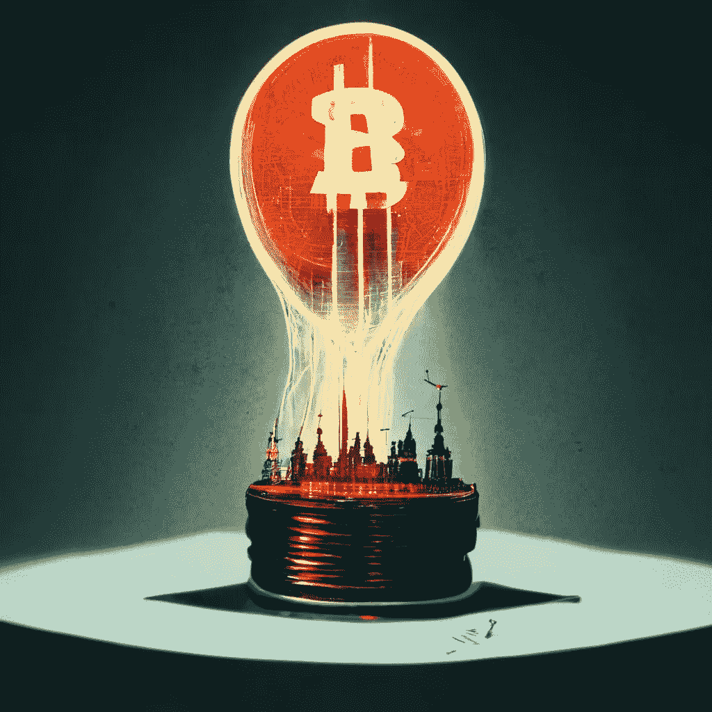
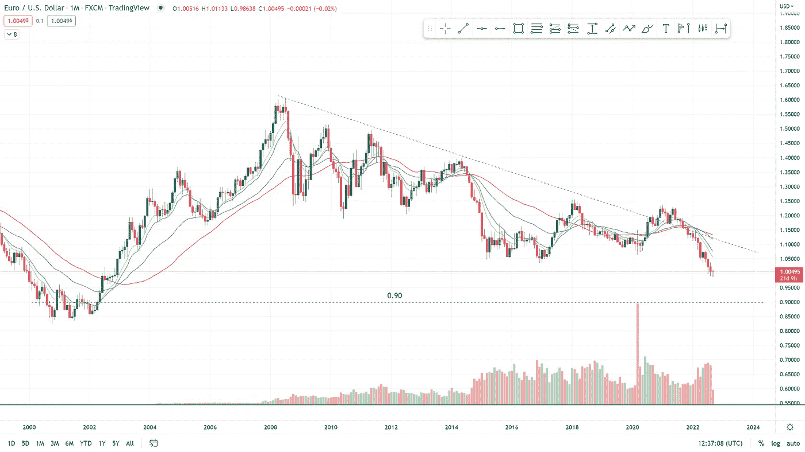
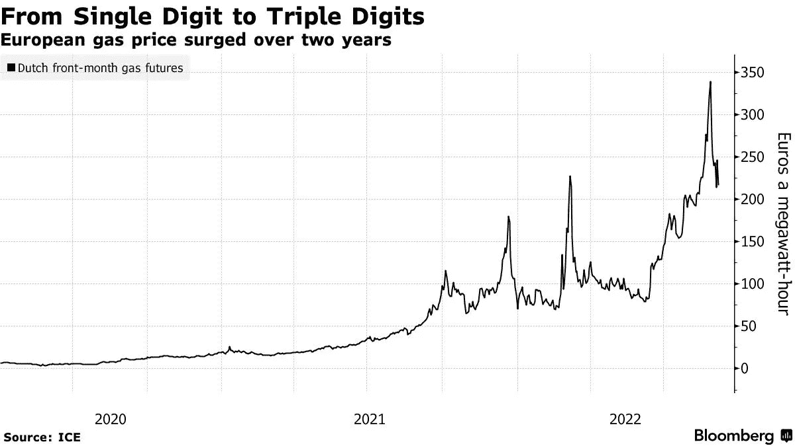
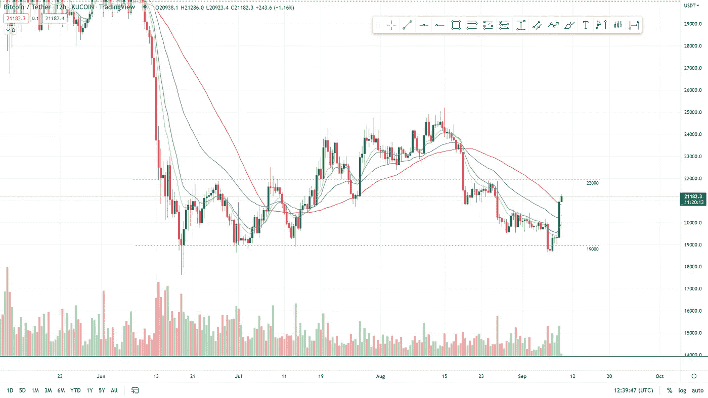
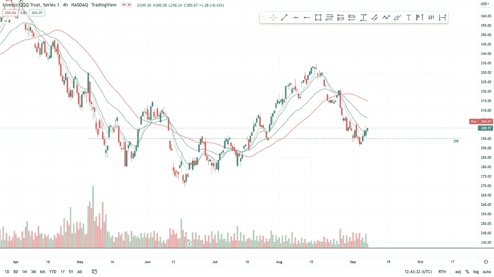

# 俄罗斯继续影响着全球能源和加密市场

> 原文：<https://medium.com/coinmonks/russia-continues-to-influence-the-global-energy-and-crypto-markets-7995f1f77fd0?source=collection_archive---------18----------------------->

*for the best reading experience of this article visit* [*www.boomish.org*](http://www.boomish.org/)

**在本周的报告中(9 月 2 日— 9 月 9 日)**

*   俄罗斯将使国际贸易加密支付合法化。
*   能源危机变得越来越明显，这是欧盟各国政府的计划。
*   以太坊贝拉特里克斯更新发布，标志着合并之路的第一步。
*   比特币从 18500 点低点反弹，逼近 22000 点。
*   QQQ 反弹支撑，可能引领大盘。

‍

‍

**俄国使国际贸易加密支付合法化**

俄罗斯即将通过在国际贸易中使用加密货币的立法，因为目前“没有加密货币的跨境结算是不可能的”。

‍

据当地新闻媒体塔斯社报道，俄罗斯银行和该国财政部已经同意，他们将不得不重新考虑他们对加密货币的立场。

‍

俄罗斯似乎在寻找美元的替代品，以保证他们许多商品的有效贸易。

‍

历史上反对使用加密作为支付方式的俄罗斯似乎希望允许加密支付，因为目前西方对俄罗斯的广泛制裁。

‍

仍然需要引入必要的监管框架。

‍

‍

‍

**欧洲能源危机和欧盟消费者保护计划**

上述能源危机继续给全世界人民带来负担。对未来几个月灰色寒冬的恐惧尤其笼罩着欧洲国家。

‍

欧洲中央银行和英格兰银行已经宣布他们可能推出“能源救助”。

‍

“芬兰已经发出‘雷曼兄弟’时刻的警告，电力公司面临突然的现金短缺”([彭博](https://zwobrd.clicks.mlsend.com/te/cl/eyJ2Ijoie1wiYVwiOjExMjYzMSxcImxcIjo2NTc4OTc3OTM4MDI3NDU2MixcInJcIjo2NTc4OTc3OTk0NDQwODQ4Nn0iLCJzIjoiY2E5ZGQyNDNhOTY3MTBjYyJ9))。

‍

英国新任首相利兹·特拉斯最近公布了一项计划，以应对不断上涨的消费能源账单。“刺激方案”式的计划可能会在未来一年半的时间里耗资 1，300 亿欧元。

‍

该计划将大约占英国国内生产总值的 5.9%。

‍

英国占 GDP 的刺激方案大约相当于美国 1 万亿美元的刺激方案。

‍

目前预计，在未来 24-48 个月内，整个能源危机将耗费欧洲大陆约 2 万亿€，相当于 GDP 的 15%。

‍

随着天然气危机的发生，英镑和欧元兑美元汇率大幅下跌，这对相关国家的公民构成了重大威胁(见图 1)。

‍

自年初以来，天然气价格上涨了 4 倍之多(见图 2)。

‍

天然气危机不仅影响欧洲，最大的亚洲经济体也是能源和天然气的进口国。

‍

‍

甚至中国和日本也受到了很大的影响，并以公民安全的名义建立了安全措施。

‍

一些消费者和政治家认为政府应该监控汽油价格，并对其加以限制。虽然这也带来了很多问题。

‍

Equinor 公司负责天然气和电力的高级副总裁胡庆炉·豪根在最近的一次采访中详细说明了全球价格政策的问题，他说:

‍

“电力是一个地方市场，即国内市场，所以在这种情况下，政府有可能采取一些措施进行控制……但天然气价格上限的问题不同，因为天然气市场是全球性的，因此不那么容易管理。”

‍

天然气价格管理的核心问题是供应不足，价格政府不会影响天然气的供应，因此不会缓解紧张局势。

‍

*图 1100 万欧元兑美元 1999–2022(交易视图)
欧元兑美元自 2008 年以来的下跌趋势，可能的支撑在 0.90*

*图 2 欧盟 2020-2022 年天然气价格(彭博社)*

‍

‍

***以太坊的合并贝拉特里克斯 Upgra* de**

合并正式定于 9 月 15 日进行。虽然有一个范围，但大多数专家预计 9 月 15 日会发生期待已久的合并。

‍

贝拉特里克斯硬分叉，以太坊合并前的最后升级已于 9 月 6 日星期二正式激活。

‍

目前，以太坊主网(PoW)和信标链(PoS)协同工作。Bellatrix 升级旨在确保验证器产生更新的信标链块，这些信标链块将在合并之前合并并与 PoW 代码调整一起工作。

‍

虽然升级只是一小步，但这是合并过程的开始。

‍

在贝拉特里克斯的升级中，一些小问题应该被注意到。

‍

大约 5%的信标链验证节点未能及时更新，但这似乎对网络没有重大影响。以太坊网络用户还指出，在 Bellatrix 升级后，600 个块中有十分之一的块丢失率。

‍

这些问题中的大部分应该很容易补救，但是当合并在 9 月 15 日实际发生时，它们肯定可以被视为可能出错的警告信号。

‍ [点击这里阅读更多关于“合并”的内容](https://zwobrd.clicks.mlsend.com/te/cl/eyJ2Ijoie1wiYVwiOjExMjYzMSxcImxcIjo2NTc4OTc3OTM4NzYxNDU5NixcInJcIjo2NTc4OTc3OTk0NDQwODQ4Nn0iLCJzIjoiNjRmZWJkNzA2OGQ3MDUwNSJ9)

‍

‍

**比特币价格分析**

自 8 月 15 日达到反弹峰值以来，比特币的大幅下跌让投资者看到了持续的下行。

‍

持续下跌的底部位于 6 月份的 18500 点左右。

‍

自触及低点以来，比特币迄今已大幅反弹超过 15%。

‍

比特币似乎正在 19000 至 22000 点之间形成一个区间，目前的反弹在 22000 点之前有强大的支撑。

‍

鉴于 21000 点附近可能出现盘整，投资者应注意当前价格，此后我们可以看到 22000 点阻力位的延续。

*图 3 12H BTC 2022 年 6 月—2022 年 9 月(TradingView)*

‍

**QQQ 价格分析**

自 2020 年以来，QQQ with 一直是牛市和熊市的市场领导者。

‍

QQQ 在 295 水平上出现了干净的反弹，这是 7 月份的突破阻力位，也是突破后重新测试的支撑。

‍

尽管目前的反弹还没有出现非常显著的涨幅，但未来几天仍有可能出现一些后续反弹。
‍

必须指出的是，FOMC 将在 9 月 21 日召开会议，会议期间继续加息的可能性很大。

‍

更多的加息意味着大范围市场抛售的高度变化，这是一个警示性的故事，在过去几个月里为许多投资者节省了大量资金。

*图 4 4H QQQ 2022 年 4 月—2022 年 9 月(交易视图)*

> 交易新手？尝试[加密交易机器人](/coinmonks/crypto-trading-bot-c2ffce8acb2a)或[复制交易](/coinmonks/top-10-crypto-copy-trading-platforms-for-beginners-d0c37c7d698c)