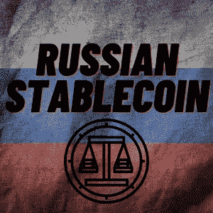

# 俄罗斯创造了一个稳定的货币——中国、朝鲜和白俄罗斯加入使用它

> 原文：<https://medium.com/coinmonks/russia-creates-a-stablecoin-china-north-korea-and-belarus-to-join-in-using-it-ce903c59616d?source=collection_archive---------30----------------------->

对世界各地参与加密货币的投资者来说，稳定的硬币是一个重要的组成部分，俄罗斯现在已经正式宣传其对该市场的兴趣。稳定硬币可以与你能想到的任何资产挂钩，无论是像美元这样的外汇货币，还是像黄金这样的稀土矿，稳定硬币都具有独特的性质…