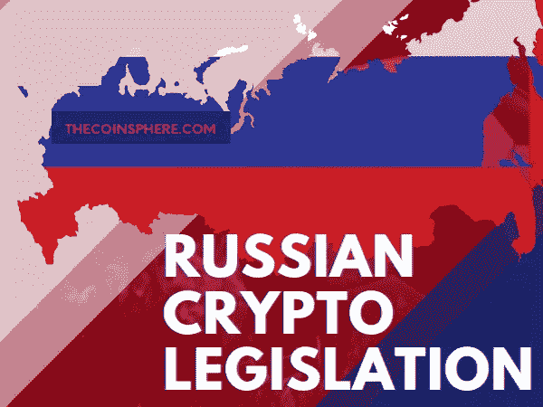

# 俄罗斯将通过新的“数字货币”法律

> 原文：<https://medium.com/coinmonks/russia-will-pass-new-digital-currency-laws-40cd20a4018c?source=collection_archive---------39----------------------->

[**For the best Crypto News in the world, visit TheCoinSphere.com**](http://thecoinsphere.com/)

无论你生活在 [*中国*](http://thecoinsphere.com/world-news/how-a-case-involving-litecoin-changed-chinas-stance-on-crypto/) 、美国*、 [*亚美尼亚*](http://thecoinsphere.com/world-news/armenia-the-new-mining-capital/) ，还是现在的 [*俄罗斯*](http://thecoinsphere.com/world-news/russia-creates-a-stablecoin-china-north-korea-and-belarus-to-join-in-using-it/) ，都有新闻在全面加密中发生。*

*在决定入侵乌克兰之前，弗拉基米尔·普京早在 2022 年 1 月就命令他的所有财政部长一起为“数字金融资产”的未来制定具体的法律*