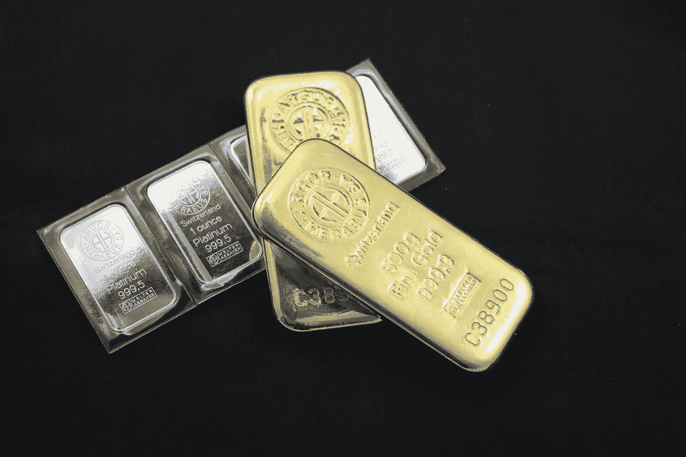
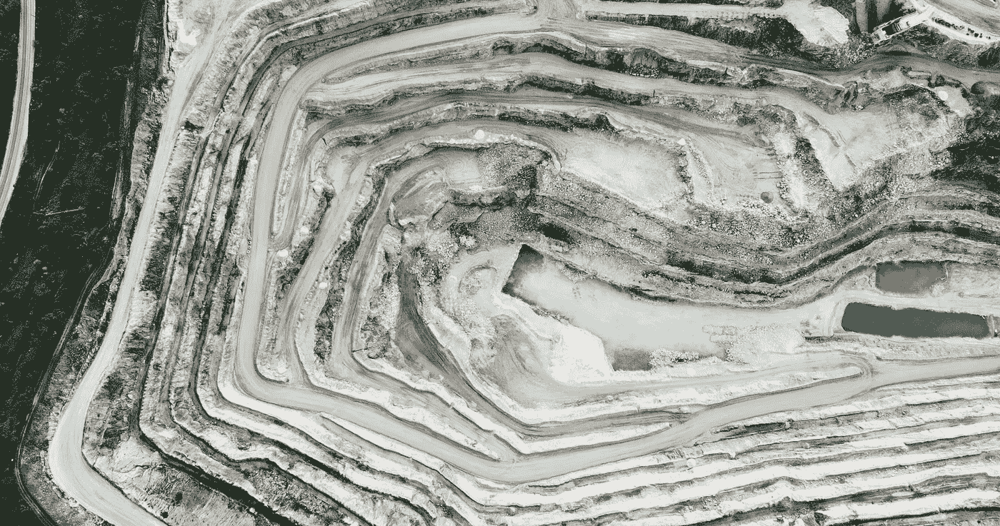

# 俄罗斯寡头投资 Atomyze:一家出售资产支持数字代币的区块链公司

> 原文：<https://medium.com/coinmonks/russian-oligarch-invests-in-atomyze-a-blockchain-firm-selling-asset-backed-digital-tokens-75067507392c?source=collection_archive---------13----------------------->

俄罗斯是世界上最昂贵的伏特加和毛皮大衣的产地，这个国家一直以其武器储备而闻名，现在正在将贵金属资产支持的代币添加到其收藏中。

俄罗斯央行最近批准了资产支持代币操作 [Atomyze](https://atomyze.us/) 。这对俄罗斯的令牌化和加密货币的未来意味着什么？

尽管最初遭到政府和央行的反对，但似乎政府和央行正开始批准某些数字货币。据说，一种针对卢布的央行数字货币正在酝酿之中。

## 俄罗斯的数字资产

虽然不清楚政府对加密货币、点对点交易和用加密货币购买商品的立场，但俄罗斯公民正在使用它们。

超过[1730 万人，占俄罗斯总人口的 11.9%已经拥有加密货币，他们对加密货币的兴趣正在增加。](https://triple-a.io/crypto-ownership-russia/)

俄罗斯中央银行最近批准了俄罗斯所有的区块链公司 [Atomyze](https://atomyze.us/) 的数字代币。Atomyze 的主要利益相关者是 Interros 公司。Interros 的总裁和主要所有者是弗拉基米尔·波塔宁，他是俄罗斯首富，拥有 261 亿英镑的净资产。

“[俄罗斯央行](https://moderndiplomacy.eu/2022/02/04/interros-had-invested-in-atomyze-which-became-first-crypto-register-company-in-russia/)首次将该公司纳入数字金融资产(DFA)登记册。这方面的国家法律 2021 年 1 月才生效。”

## 什么是 Atomyze？

Atomyze 是一家区块链公司，提供多种资产支持证券，如钯、铂、金、银、铜、镍和钴。

这些代币用于工业交易，并得到其主要采矿和冶金公司 Nornickel 的钯产品的支持。

然而，你不应该感到惊讶，弗拉基米尔·波塔宁也是首席执行官和 34.59%的金属矿业公司- [诺镍](http://www.nornik.ru/)的所有者。这家矿业公司雇用了 73，000 多名员工。

支持数字代币的资产来自 Nornickel mining，区块链公司 Atomyze 的主要股东也是弗拉基米尔·波塔宁。

此外，Nornickel 因其对环境的负面影响而受到批评。Nornickel 承诺清理其负面环境影响，并取得了进展。但在 2022 年，[诺里尔斯克镍业公司旗下的一家发电厂发生了一起重大漏油事件](https://en.wikipedia.org/wiki/2020_Norilsk_oil_spill)，多达 21000 立方米的柴油涌入河流，被描述为俄罗斯现代史上第二大漏油事件。

## Atomyze 不是什么

Atomyze 正在使用区块链来吸引资产支持证券的买家；然而，它是高度集中的，并利用这种技术向全球更多的投资者提供贵金属。

与比特币等无担保加密货币相比，工业令牌是更安全的资产，因为它们有实物资产的支持。区块链技术使这些资产的交易在网络上安全，并允许这家俄罗斯公司在全球范围内提供这些服务。Atomyze 在俄罗斯、美国和瑞士提供服务。

然而，一个关键的区别是，Atomyze 是一个集中的区块链资产支持的数字令牌，不像比特币和其他分散的加密货币那样是自治的和分散的。Atomyze 提供代币来简化实物资产的购买，并向投资者提供服务。Atomyze 的服务面向投资者，并被批准用于工业交易。

虽然提供资产返还代币有利于业务发展，但**这不是为普通人创造的数字资产。**“2022 年 6 月，[英国](https://en.wikipedia.org/wiki/United_Kingdom)因波塔宁是“弗拉基米尔·普京总统核心集团”的主要寡头之一而对其实施制裁。"

# 回避制裁

象征化可能是保持俄罗斯经济持续发展的一个因素。自俄罗斯入侵乌克兰以来，针对俄罗斯政府的制裁一直在削弱其经济。尽管如此，看起来数字资产和他们的津贴可能能够绕过这些限制。

这对俄罗斯加密货币的未来意味着什么？你认为俄罗斯最终会将比特币和其他加密货币合法化吗？如果是，你认为这会对全球市场产生什么影响？请在下面的评论中告诉我你的想法。

需要专门研究加密货币的作家吗？[点击此处](https://www.fiverr.com/share/XYRlK2)了解更多关于我的服务的信息。我可以帮助您创建内容，教育您的观众对密码相关的东西！