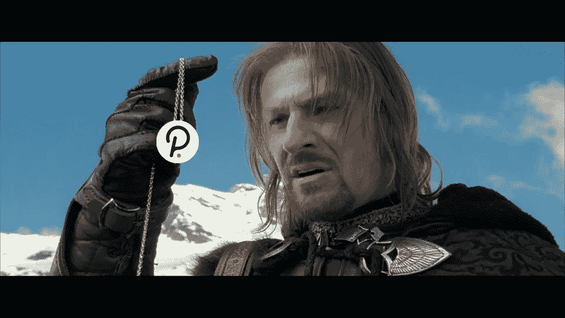

# Rust 入学考试，我的学院之旅

> 原文：<https://medium.com/coinmonks/rust-entrance-exam-my-journey-to-the-academy-81549291638f?source=collection_archive---------6----------------------->

~dwulf

# 哈利波特波尔卡多魔法学院

1 月 10 日，学院在布宜诺斯艾利斯开始为期 4 周的学习。加文·伍德博士将教授并讲解波尔卡多特生态系统的所有核心问题。

这是我第二次尝试注册，第一次我有点担心我是否能及时拿到护照，现在我比以往任何时候都更需要获得它，因为这个机会并不遥远，它是现场直播的，但我还是注册了，因为我心情很好，希望不会有任何障碍。

是的，进入是免费的，但不是免费的，进入学院将有一个核心锈蚀理解测试。

## 棘手问题

正如所有技术性质的事情一样，在被允许参与之前，一个人必须证明自己的技术才能，当然 Web3 是在买单，但正如我多年来所学到的那样，一个人仍然需要一定水平的技能来支付这些账单。毕竟，我并不指望有免费的午餐。

这将以生锈测试的形式出现，最有可能测试我们对基本原则和代码概念的理解。我是 Rust 新手，但我的栈在年轻时一直是 JavaScript 和 Python 加 C/C++的。

别害怕，德伍尔夫会支持你的。至少，你需要熟悉第 1 章到第 11 章，特别是第 13 章和第 19 章。

我们将首先探索铁锈书最基本的细节，然后深入到铁锈书的其余部分。首先，我想保持对与基底相关的铁锈的高度关注。

Polkadot 开发者学院的指导者非常清楚 Rust 对游戏的期望。不仅仅是在学院里，而是深入到基质本身的症结。Rust 没有传统的内存错误，仅仅基于它对编译器的实现。

我必须说，Rust 来自 JavaScript 和 Python，它更为核心，更为严格。太多的 JavaScript 开发人员陷入了困境，我建议学好 TypeScript，Python 开发人员必须对他们的编码标准更加严格。

## 学院路线图

> 模块 1 密码学
> 模块 2 分散系统开发者的跨学科概念
> 模块 3 区块链和共识
> 模块 4 基底
> 模块 5 波尔卡多、积云和副链
> 模块 6 托盘和框架
> 模块 7 XCM-跨共识消息格式

## 搜索数据

我想我对模块 1 到 3 已经很熟悉了，肉和土豆在模块 4 到 7 中。一旦我掌握了托盘和框架，XCM。我认为 XVM 跨虚拟机，EVM 和 WASM 可以互动，但这超出了学院的范围。

## Astar 大使计划

这似乎是一个合乎逻辑的地方，大约 3 年前，我申请成为波尔卡多特大使，甚至在俄勒冈地区举办了几次聚会。Polkadot 和 Substrate 的投票率非常低，几乎没有独立的 Rust 开发者。大多数情况下，来这里的人都是“意外”富裕的人，他们试图找出如何应付国税局(如果有的话)。一个人的房子被国税局没收了。

作为一名大使，我试图教使用 polkadot.js 钱包，并保持钱包非 KYC，直到一个合适的 KYC 式的替代品可以是 para-chain(像 Kilt 的分散 ID，又名。做了)。但是大部分只是在每个人的头上，随着 Polkadot.js 存储和控制器地址变得混乱。

今天，我加入了 Astar 的大使项目，不仅是为了更好地了解铁锈和基底，也是为了更好地了解 EVM 和 WASM 与墨水的关系！智能合约。

随着最近与 Astar 和 [NTT DOCOMO](/astar-network/ntt-docomo-and-astar-network-cooperate-to-promote-web3-4f2f6acdb99b) (日本)的谈判和合作，我希望在美国推广 Astar 技术，并外包开发墨水！商业客户的合同。

## 用波尔卡多特命名系统命名

但是说到 KYC 和一个品牌化的例子，我想考虑一下[波尔卡多特名称系统(PNS)](https://www.pns.link/) ，在我写文章的时候，我有机会听波尔卡多特大使的音频，PNS 出现了。

我对此不太了解，只知道他们给 a '分配了 DID 品牌。点域。我喜欢这个想法，因为这是一种在链上了解一个人的身份认证的方法，而不需要他们的个人身份，您可以很容易地推测出一个拥有 PNS 品牌的用户或多或少是该用户的用户或 LLC 实体。

KYC 法案最大的问题是个人信息被“泄露”,而且通常是明文的，甚至是加密的，有人持有解密密钥，而且不是用户，而是第三方交易所或经纪人。

有了名称系统，用户可以购买一个标识用户的瓦片，通过展示他们的品牌，而不需要访问社会安全号码、出生日期、居住地和母亲的娘家姓。

如果监管机构想对此提出异议，我认为让 KYC 覆盖所有人是一种公平的妥协。那些想要树立品牌、自我认同、建立信任的人(还是那个词)能够做到，而那些不想树立品牌、觉得对他们来说太正统的人则不会。

## 聚集在一起，在衬底上

这又把我带回了我的铁锈地带之旅，成为波尔卡多特、阿斯达等的大使。这只说明了我对在这个生态系统中成长的兴趣，最终我只想得到认可，并在这个生态系统中与更优秀的人一起工作。

我认为最好的方法是建立一个 Git 回购，这样贡献就可以被衡量和记录，显示活动并使 will 与正在建立的 Polkadot 工资系统保持一致。当然，我们在 Medium 上的活动也是展示贡献的一种方式，但我认为最终 Github 将是获得报酬的主要途径。

这是有点技术性，但这些区块链的本质是技术性的。我用墨水思考！和智能合同，这将使我们能够建立用户友好的系统。

## 结论

深入铁锈，特别是基底和油墨！坦白说，这是最好的时机。我唯一要做的就是加强 AWS，以及 Linode 云服务和常规 DevOps。Rust 是需要的，没错，但是生产用于标记和验证的验证器也需要非金属服务器的良好管理，因为你的个人互联网针孔可能受你的 ISP 控制。

> 交易新手？试试[加密交易机器人](/coinmonks/crypto-trading-bot-c2ffce8acb2a)或者[复制交易](/coinmonks/top-10-crypto-copy-trading-platforms-for-beginners-d0c37c7d698c)