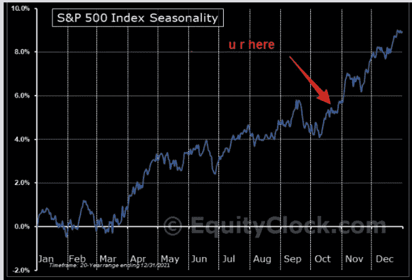
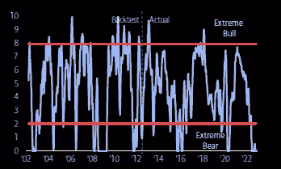
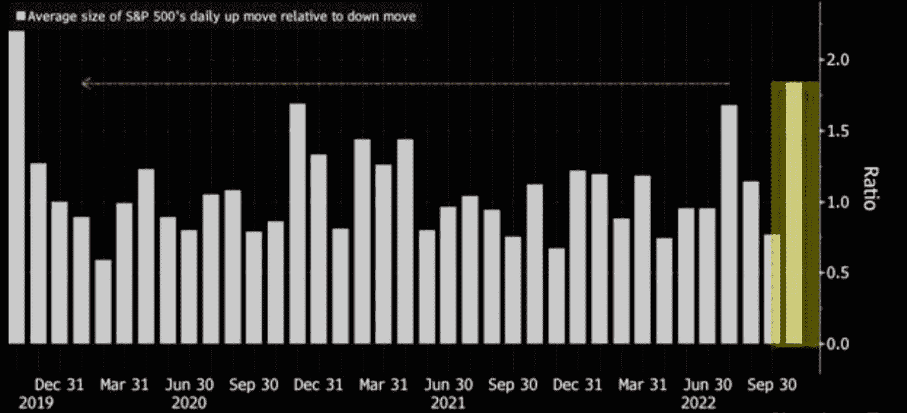
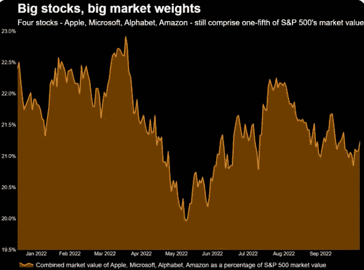
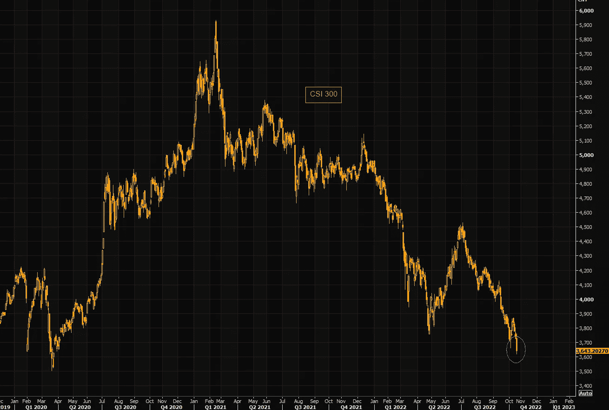
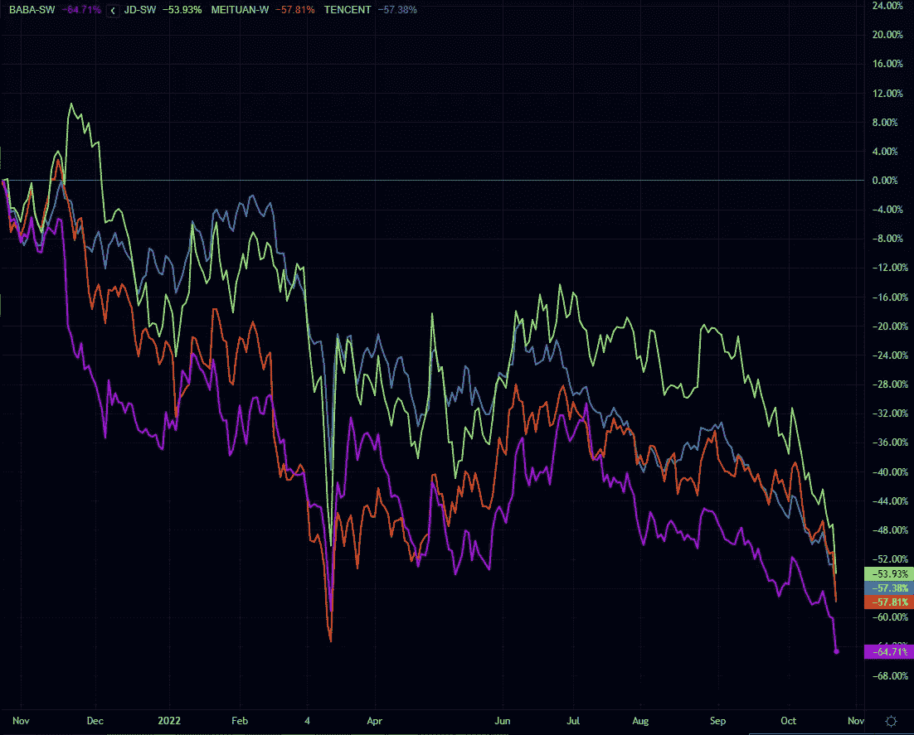
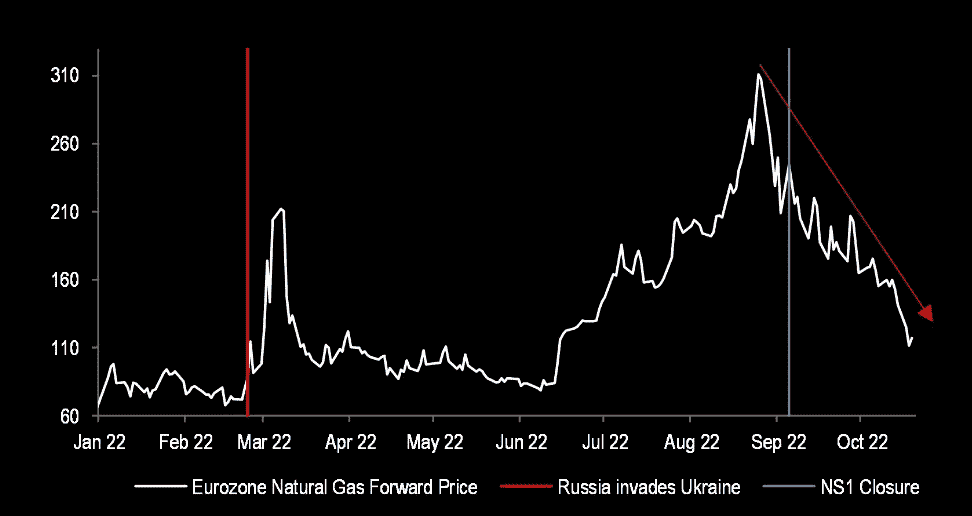

# 标准普尔 500 季节性突破，美国科技对中国科技，天然气价格…下跌？

> 原文：<https://medium.com/coinmonks/s-p-500-seasonality-breakout-us-tech-v-china-tech-nat-gas-prices-are-falling-9a3b46ec526c?source=collection_archive---------45----------------------->

嘿，我是基兰！市场又将迎来新的一周，以下是需要注意的关键事件，以及来自投资银行的最有趣的宏观研究。我希望能在本周的[贸易挑战](http://www.traderseed.io/)中与你交谈，并且一如既往，如果你有任何问题，请在下面给我留言。

# 每周观察列表

本周收益季节继续，美国市值最大的四家公司，微软、Alphabet、亚马逊和苹果，都将发布报告。这 4 家公司构成了美国股票指数的很大一部分，主要是 S&P500 和纳斯达克 100 指数，所以如果我们看到任何意外的收益损失，预计指数将面临压力。

此外，本周美国将于周四公布第三季度 GDP 数据。预计这些数据将显示美国在连续两个季度收缩后已经恢复增长。这里的任何意外都可能导致美元和利率的快速重新定价，这将导致更多的市场混乱和高度波动。我们不想要任何其他方式:)

# 宏观视角

**季节性突围。上周，我们以标准普尔 500 指数周五的大反弹结束。这可能是年末反弹的开始吗？季节性图表(过去 20 年)告诉我们，通常在每年的这个时候，底部就在这里，一切都从这里开始。**

**感情糟透了。美银牛市熊市情绪依然为零。没有人想在这里买股票。然而，这通常是一个反向指标，可能导致像我们今年看到的暴力做空反弹。也就是说，在 2008/09 赛季，我们有一年都是零增长，所以没有什么是必然的。**

**强起来的日子。彭博表明，标普 500 指数上涨的时候比下跌的时候更有力量。这是新一轮牛市开始的第一个迹象吗？或者交易者只是 FOMO 到他们看到的任何上涨趋势？**

**四大科技股集中。如前所述，本周四大公司 AAPL、MSFT、谷歌和 AMZN 都将公布财报。它们加在一起约占标准普尔 500 指数的 21%。尽管今年科技股大幅下跌，但这一比例仍然非常高，因此，该指数仍然高度集中在这四家公司的命运上。如果这些科技巨头中有一家没有盈利，请不要掉帽子。**

**中国崩溃。**中国刚刚“报告”了 3.9%的 GDP 增长，因此，在经历了春季艰难的停滞期后，中国经济似乎出现了反弹。然而，在实地，它继续受到紧缩的 Covid 政策和房地产行业的重大挑战的影响。今天，沪深 300 指数跌破大支撑位，目前交易在 2020 年 3 月以来的最低水平。

**中国科技巨头。**当我们等待美国科技巨头本周的命运时，让我们关注一下中国的科技巨头。巴巴、京东、腾讯、美团 1 年图表。哎呀…

**大决战推迟了？**图表显示欧盟天然气价格。冬天就要到了，欧盟天然气价格正在暴跌？？只是说明，不要交易媒体报道，唯一重要的是价格行动。准备好迎接又一个疯狂的一周吧！

我希望你觉得这很有趣，很有用。我每周一写这篇时事通讯，所以**一定要关注我**！像往常一样，把风险管理放在第一位，安全交易，保持敏捷。

祝你一周愉快！
基兰
**www.traderseed.io**

**想交易本周的市场吗？** 100k 节目起 **$75** ！！点击这里查看新节目 [**！**](http://www.traderseed.io/)

[**查看节目**](http://www.traderseed.io/)

> 交易新手？尝试[加密交易机器人](/coinmonks/crypto-trading-bot-c2ffce8acb2a)或[复制交易](/coinmonks/top-10-crypto-copy-trading-platforms-for-beginners-d0c37c7d698c)