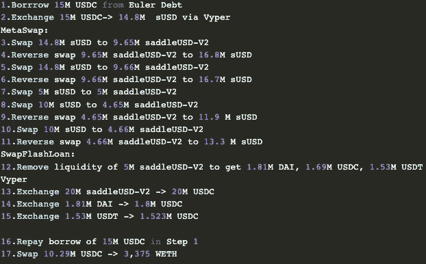

# 马鞍财经，2022 年 4 月，黑客分析

> 原文：<https://medium.com/coinmonks/saddle-finance-was-unable-to-protect-users-from-the-arbitrageurs-8087e8ea11a6?source=collection_archive---------23----------------------->

## 实时代码经常包含缺陷，这些缺陷可以被利用来在不强行操作任何东西的情况下获取金钱

黑客最终会发现一个弱点，因为软件经常漏洞百出。尤其是如果你自己开发了这个平台，你不会很快发现错误。谢天谢地，不是每个黑客都是邪恶的。例如，与“黑帽黑客”相比，“白帽黑客”被企业雇佣来故意破坏平台因此，企业可以更好地保护他们的产品。

2022 年 4 月 30 日，一系列利用激活的智能合约的交易使以太坊上的自动化做市商(AMM)马鞍金融(Saddle Finance)受害。

通过元池中一系列 flash loan 辅助的 sUSD/saddleUSD-V2 互换，黑客能够操纵 LP 令牌的价格，然后可以将其交换为进一步的 sUSD。

在三次攻击交易中，大约 1100 万美元的加密货币被没收。白帽攻击，这三个中的一个，节省了这个数量的大约 25%不被黑帽夺取。该漏洞基于之前报告的一个尚未完全解决的问题。

## 背景

专注于固定价值加密资产，如包装 BTC 和 stablecoins，Saddle 是以太坊区块链的一家分散式自动化做市商。

绝大多数流动性池的设计初衷都不是为了创造挂钩资产，比如打包 BTC。他们使用常数乘积模型来处理更不稳定的令牌对。使用为波动性更大的资产设计的资金池会导致 wBTC 交易员和流动性提供者面临更多的滑点和不必要的、非永久性的损失。为了解决这个问题，Saddle Finance 为打包的 BTC 交易员和流动性提供者创建了一个引人注目的 AMM 指数。

重要的是，Saddle 的代码使用了 Curve 的许多关键思想和原则，尽管其中许多已经被修改以适应 Saddle 的需求。

标准和元交换池是 Curve 作为 AMM 的两个独立功能。标准池的功能类似于典型的 AMM 池，只接受也可以通过该池作为流动性进行交易的代币。《curve》中的三曲池是最受欢迎的池之一，戴、、可以在这里对调。

## 根本原因

我们将讨论此交易中针对 sUSD —萨德尔戴/USDC/USDT 元池的攻击的根本原因。

资金来自协议的 sUSDv2 元库，该元库将 saddleUSD-V2 LP 令牌(来自戴、USDC 和 USDT 库)与 Synthetix 的 sUSD 配对。

如前所述，Saddle Finance 将 Curve 的元素集成到其协议中。Saddle Finance 团队没有派生最初的 Vyper 代码，而是在 Solidity 中重新实现了 Curve 的元池。在此过程中引入了错误！

MetaSwapUtils 库的旧版本有一个缺陷，使其无法在元池交换期间使用 VirturalPrice 来确定 LP 标记的值，从而使黑客攻击变得可行。

资产池内资产定价的不一致是不准确的主要原因。特别是，元池中的 LP 令牌在与池的基础价值相比时被错误定价。因此，一美元的令牌可以检索到或多或少的 LP 令牌。

缺乏基于 LP 代币的虚拟基础价格来确定所提供代币的价值的数学是导致这种错误定价的原因。随着费用的收取，LP 令牌的价值会随着时间的推移而增加。

然而，交换函数不适当地考虑了虚拟价格。有趣的是，合约的数学对于涉及基础代币的存款、取款和互换是准确的；仅当令牌交换为 LP 令牌时，问题才会出现。

价格问题是在名为 MetaSwapUtils 的库中发现的，该库用于计算互换、存款和取款。第 [424 行](https://github.com/saddle-finance/saddle-contract/blob/141a00e7ba0c5e8d51d8018d3c4a170e63c6c7c4/contracts/meta/MetaSwapUtils.sol#L424)的计算中没有计算 LP 令牌的基本虚拟价格，这与第 [277 行](https://github.com/saddle-finance/saddle-contract/blob/141a00e7ba0c5e8d51d8018d3c4a170e63c6c7c4/contracts/meta/MetaSwapUtils.sol#L277)的计算相矛盾，在第[277 行适当地执行了该计算检查。](https://github.com/saddle-finance/saddle-contract/blob/141a00e7ba0c5e8d51d8018d3c4a170e63c6c7c4/contracts/meta/MetaSwapUtils.sol#L277)

易受攻击的 MetaSwapUtils 的一部分:

`dy = xp[tokenIndexTo].sub(y).sub(1);
dyFee = dy.mul(self.swapFee).div(FEE_DENOMINATOR);
dy = dy.sub(dyFee).div(self.tokenPrecisionMultipliers[tokenIndexTo]);`

在早期的鞍叉漏洞中，如 Nerve 和 Synapse，攻击者利用这种定价异常来窃取资金。然而，Saddle 从未直接遭受这一缺陷，因为它反应迅速，并在切换到可能已修复的 MetaSwapUtils 之前停止了元池交换。

缺失的 LP 虚拟价格调整现在出现在固定库中。这些改动来自打补丁文件的第[447–451](https://github.com/saddle-finance/saddle-contract/blob/7b7060e45be2ec3c9bcdf16240acf13394204571/contracts/meta/MetaSwapUtils.sol#L447-L451)行。我们可以在下面的代码摘录中看到弥补漏洞的扩展。

`dy = xp[tokenIndexTo].sub(y).sub(1); if (tokenIndexTo == baseLPTokenIndex) { // When swapping to a base Swap token, scale down dy by its virtual price dy = dy.mul(BASE_VIRTUAL_PRICE_PRECISION).div(baseVirtualPrice);} dyFee = dy.mul(self.swapFee).div(FEE_DENOMINATOR);dy = dy.sub(dyFee); dy = dy.div(self.tokenPrecisionMultipliers[tokenIndexTo]);`

尽管进行了这种迁移，但活池似乎仍在使用以前代码中有缺陷的交换计算。如被滥用的苏塞德-萨德尔戴/USDC/USDT 梅塔池。

此攻击中使用的攻击媒介可能存在于我们正在处理的代码中，因此作为 smart contract 安全研究人员，我们需要了解过去或已知的针对代码库或类似代码的攻击。

> 交易新手？试试[加密交易机器人](/coinmonks/crypto-trading-bot-c2ffce8acb2a)或者[复制交易](/coinmonks/top-10-crypto-copy-trading-platforms-for-beginners-d0c37c7d698c)