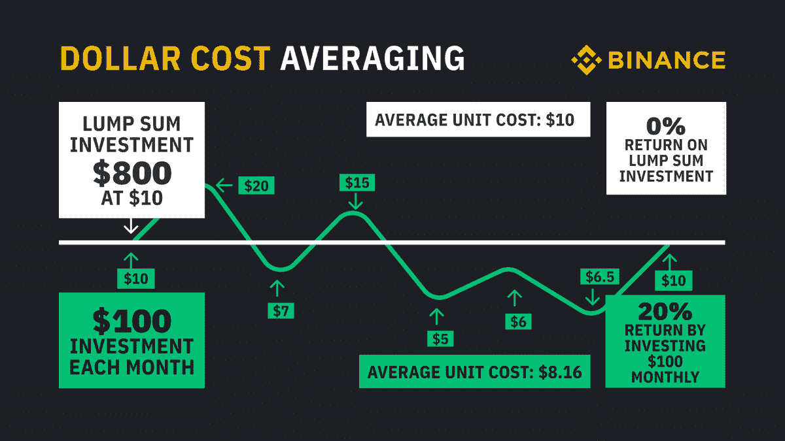

# 加密| DCA 机器人中最安全的被动收入

> 原文：<https://medium.com/coinmonks/safest-passive-income-in-crypto-dca-bots-ad07dc1af1b0?source=collection_archive---------11----------------------->

被动收入是这些天的流行语。人们把它放在文章上只是为了获得点击量和浏览量。我也做到了，所以你才在这里。

被动收入很难，尤其是如果你不是来自秘密世界。De-Fi 中有一些项目让被动收入看起来像小孩子的游戏，你下注或创建一个节点，然后 tada…它自己产生收入，直到他们崩溃或直到他们耗尽现金。

# **充满庞氏骗局的⚠️**

这些新投资者的钱流入老投资者的收入中的项目被称为庞氏骗局，这种现金流方法被称为“庞氏经济学”。

你一定听说过这些，特别是如果你来自密码世界。我去过很多这样的地方寻找被动收入。结果我赔钱了，什么也得不到。

是节点吗，道斯..等等。我经历过其中的大部分，被骗了(也就是被骗了)，或者再也没有看到我最初的投资。我已经在大多数地毯拉，是环节点，武士刀，和最新的一个，屈服节点。我丢了很多钱。这些项目都没有收入来源，只是简单的旧庞氏经济学。

我在寻找一个真正被动的收入来源。什么构成了真正的被动收入流？

1.  很少或没有人工干预应该赚钱，而你睡觉🛌
2.  产生实际收入，没有任何庞氏经济学💵
3.  它应该是安全可靠的，你应该 24 x 7 全天候控制资金🔒

经过长时间的搜索，我发现了 DCA 机器人。它们很简单；他们使用绿色的平均成本技术，并根据输入输出参数自动运行。

Dollar-cost averaging in a nutshell (source: Binance)

# **什么是 DCA(美元成本平均法)？🌈**

1.  美元成本平均法是一种在固定的时间间隔内系统地投资大量资金的做法，不考虑证券的价格⏱
2.  美元成本平均法可以减少价格波动的总体影响，降低每股平均成本💵
3.  它消除了市场时机的陷阱，比如只在价格已经上涨时买入📈
4.  它让你的投资不带感情色彩，防止你潜在地损害你的投资组合的回报🥹

DCA 已经存在了几十年，无数传统投资者使用这种技术，尤其是在熊市期间。这是一种简单而古老的东西，但却非常有效。

# **什么是 DCA 机器人？🤖**

DCA 机器人的引入为传统技术提供了一个新的维度。像 [3commas](https://3commas.io/?c=alphaBots) 这样的平台正在改变平均成本的动态变化。

他们引入了几个功能，不仅可以自动化 DCA 流程，还可以根据个人的风险偏好调整每个机器人的攻击级别。

这些特征中的一些是:

1.  交易开始条件🎬
2.  安全订单量标准⚖️
3.  每个 DCA ➕的价格偏差
4.  安全订单步骤规模🚧
5.  获利💰

以上特性共同帮助我们建立一个自动化的机器人。我将在即将发布的 DCA 机器人初学者指南中介绍这些特性。

# **我们的 DCA 机器人的性能📊**

在学习 DCA 机器人时，在陡峭的学习曲线中可能会犯几个错误。更糟糕的是，你可能甚至没有时间去了解它们，不要担心；我们掩护你。

我们还没有 DCA 的 A 到 Z 课程；这是我们对未来的想法。

我们在阿尔法机器人公司花了无数时间掌握运行 DCA 机器人的艺术。我们一直在测试新的机器人，不断调整它们以达到最佳性能。要记住的最重要的事情是风险/回报的权衡。

就数字而言，我们的一个 DCA 机器人上个月达到了 74%的投资回报率，平均而言，我们达到了 25%以上。这个月，我们准备做得比这多一点，同时比业内任何 Defi 项目都相对安全。

我们可以帮助您设置机器人，并让他们随时了解市场趋势，只需您的一小部分资金。

可以点击这个 [**链接**](https://discord.gg/s387BqAD9w) 联系我们；你也可以在我们的 [**网站**](https://alphabotscrypto.com/bot-results/) 上查看我们机器人的性能。

> 交易新手？尝试[加密交易机器人](/coinmonks/crypto-trading-bot-c2ffce8acb2a)或[复制交易](/coinmonks/top-10-crypto-copy-trading-platforms-for-beginners-d0c37c7d698c)