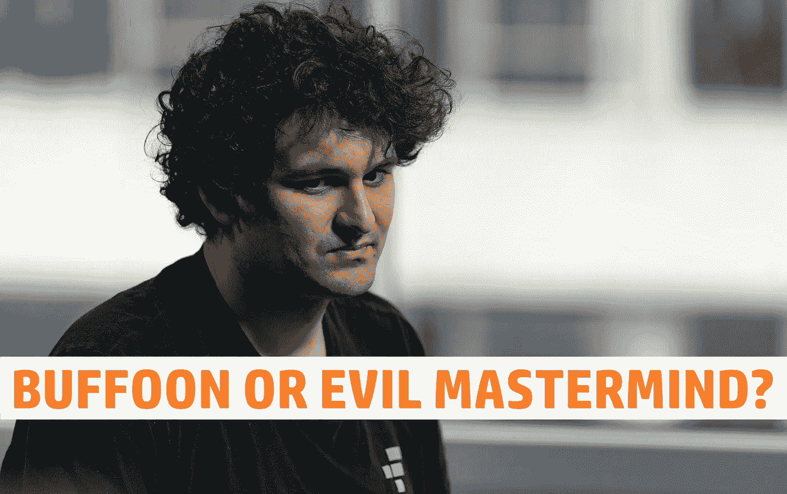
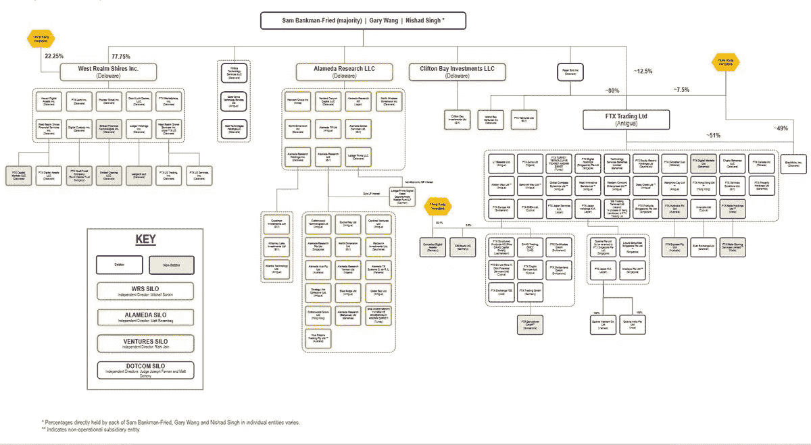
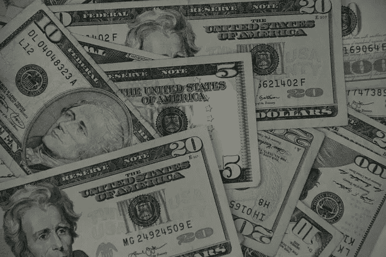
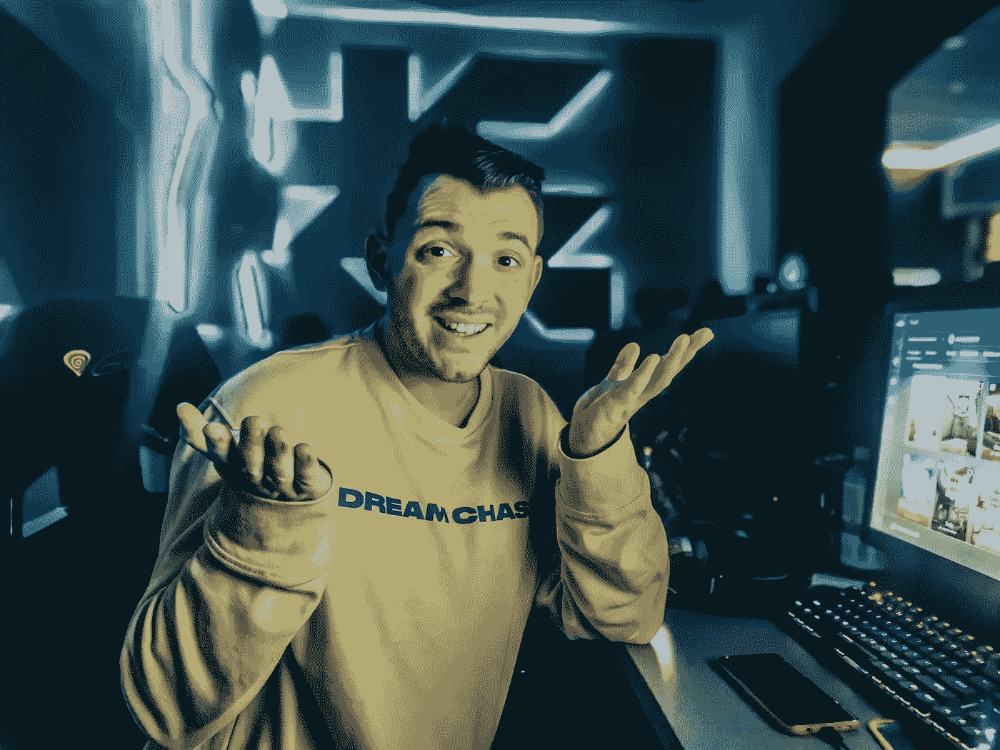
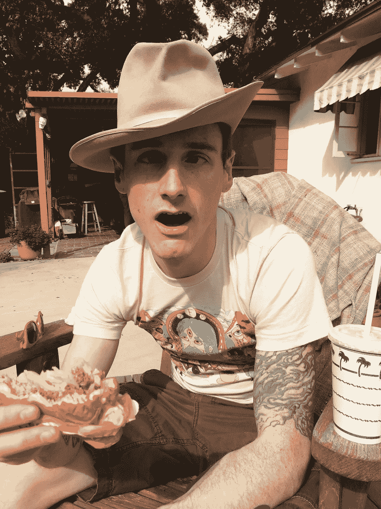

# 山姆·班克曼-弗里德，小丑还是邪恶的策划者？

> 原文：<https://medium.com/coinmonks/sam-bankman-fried-buffoon-or-evil-mastermind-2fcad82b4ce6?source=collection_archive---------5----------------------->

我想是时候写一篇文章，深入了解一下臭名昭著的 SBF 了。他真的只是一个小丑还是有什么阴险的东西潜伏着？这是一个同样邪恶的策划者的邪恶计划吗？

# 山姆·班克曼·弗里德

或者简称 SBF。麻省理工的毕业生，两个律师的儿子，一个来自耶鲁，一个来自哈佛。2017 年阿拉米达研究创始人之一。这家公司是一家交易公司，既使用量化交易，也使用自营交易。2019 年，他成为加密交易所 FTX 的创始人之一。

> 如果你把你的公司命名为像我们做加密货币比特币套利那样的跨国公司，没人会给你一个银行账户。[……]但是每个人都想要一个研究所。-山姆·班克曼-弗里德

我不得不承认他在这一点上非常正确。只是为了展示它的范围。今年早些时候，我参加了为期几周的“自主创业”课程。在此期间，我研究了获得贷款创办一家加密投资公司的可能性。没什么特别的，只是一些能帮助人们投资加密的东西。我想我会联系瑞典的不同银行，试着了解一下如果我贷款开办一家公司会发生什么。

我遇到的不是利息数字和抵押贷款时间表。但是冷淡。一提到加密，就说“我们不处理这个”，以及“我们不向加密业务提供贷款”。我的朋友试图用他的借记卡在币安购买密码，但是被拒绝了。当他联系他的银行时，他们告诉他这是因为它是加密的。这就是指控被驳回的原因。因此，说银行不看好加密技术可能是本世纪最保守的说法。

但话说回来，你会如何看待在某种意义上让你的整个商业模式过时的竞争对手？我想我也不会从好的方面来看待这件事。

# 成长中的帝国

正当阿拉米达研究开始时，FTX 加入了进来。此后不久，越来越多的实体被添加到一个看似不断增长的公司结构中。直到申请破产保护后，才真正开始绘制图表，并掌握整个情况。当时，有 100 多个实体以这样或那样的方式参与了公司结构。

*Source:* [*https://twitter.com/BLynch_23/status/1598711357867696128*](https://twitter.com/BLynch_23/status/1598711357867696128)

如果你认为这个清理过的版本很难理解。想想看，要跟踪和了解所有这些都在做什么，需要做多少工作。更不用说它们是如何连接和互联的了。这几乎就像是他们想要完成某件事的默认动作是启动一个单独的实体来完成那一项任务。

然而，2018 年 4 月，阿拉米达研究中心出现了大量人员外流。在 FTX 建国前一年多一点。领导这一大迁徙的不是别人，正是 SBF 阿拉梅达研究公司的联合创始人塔拉·麦克·奥雷。

她最近给出的理由是对风险管理和商业道德的担忧。其他消息来源也证实了这一点。“没有人最终能确保我们的交易和会计是正常的。SBF 在 2018 年的文件中写道:“我们做了很多草率的交易，其中许多交易当时都有人担心。”。这似乎印证了塔拉的推文。

人们似乎很沮丧，即使回到 2018 年。资金的混合导致记录和余额数据保存不良，由于代币没有及时到达，导致数百万美元的 XRP 交易损失。

*Your money, my money, their money. It is all just money in the end, right? Right?*

我想很多人会觉得这种草率且无组织的方法与阿拉米达之前的 SBF 形成了鲜明的对比。Jane Street Capital LLC 是一家量化交易巨头，拥有广泛的风险管理。我假设没有混合资金。但根据同一份文件，SBF 声称这一问题在 2018 年 3 月得到了解决，“阿拉米达建立了更好地计算公司利润、损失和转移的系统，从而产生了更有利可图的交易系统”。

但是我非常怀疑这些声称的改变。那些关心他们的人在他们被所谓的“解决”后的第二个月就离开了，他们能有多有效呢？

> 在我的职业生涯中，我从未见过如此彻底的公司控制失败，如此完全缺乏可信的财务信息，从国外系统完整性受损和监管监督失误，到控制权集中在一小群缺乏经验、不成熟和可能受损的个人手中，这种情况是前所未有的

从法院指定的约翰·j·雷对这些公司的评论来看。这似乎是他在实施修复后的看法。在那之前情况有多糟？我只能假设那会是噩梦。至少对会计来说是这样。=)

# FTX SBF 邮报

虽然在这个十亿美元的帝国崩溃后，大多数人会选择保持沉默。我想所有的律师都会给他们的客户同样的建议。SBF 反其道而行之。他现在已经开始了各种媒体之旅。到处接受采访。这很奇怪，尤其是考虑到他的父母都是律师。

那么 SBF 在这些采访中说了些什么呢？他一直在告诉所有人和所有事，他基本上没有做错什么，或者我应该说没有犯罪。他承认自己有些力不从心，没有做好自己应该做的事情。一错再错。不幸的是，所有这些都导致了我们现在面临的混乱局面。

*A billion here, a billion there. That can happen to anyone…*

80 亿美元的赤字。很多人想知道他们的钱去了哪里。SBF 对事情变得如此糟糕有什么解释吗？是的，他有。他的意思是，这是一个没有得到控制的会计问题。他给出的原因之一是在 FTX 开始的时候。他们没有银行，所以当客户想把钱投到 FTX 时，他们向阿拉米达研究公司付费。然后他们在 FTX 得到了这笔钱。

尽我所能，我把它理解为 thins。因为钱在一个地方，在阿拉米达，但资金也记入 FTX。阿拉米达认为他们的钱是属于他们的。但事实上，那是 FTX 顾客的钱。这就是他想让我们相信造成 80 亿美元赤字的原因。

当受到压力时，SBF 也说他的误差幅度在 100 亿美元左右。这个数字看起来很荒谬。我不知道 SBF 认为谁会相信这个借口，沃伦·布弗尔还是杰夫·贝索斯？

*Just like the magic words “open sesame” opens the door to the treasure for Alibaba. The word “fraud” seems to turn SBF into this guy.*

但是，他现在试图强加给人们的“我真笨”又是怎么回事呢？在我看来，他似乎是这个房间里最聪明的人，直到有人发现他们所做的是一个骗局。然后魔杖一挥，SBF 从房间里最聪明的人变成了最笨的人。

如果我们回顾这篇文章的开头，我会发现这是多么荒谬的一个例子。SBF 引用了阿拉米达研究所这个名字背后的想法。这不是房间里最笨的人会考虑的事情。

另一个与此形成鲜明对比的事实是，SBF 在他做的第一次采访中说，他实际上对共和党和民主党都进行了同等程度的捐赠。但他一直对自己向共和党人捐款的事实保密，因为这不太符合媒体和公众的看法。

这又一次不要描绘无知的“我一错再错，事情失控”的人。在一系列泄露的关于他与监管者互动的信息中，SBF 忽略了一件类似的事情。据他说，这一切都是为了公关。

在我看来，这两个例子至少不符合 SBF 在采访中试图推动的叙述。我想当所有的事情都闹上法庭的时候，这件事最终会反咬他一口。因为 SBF 现在所做的是大声宣扬和推动某种负面或事件的起因。这使得他的法律辩护几乎没有选择其他策略的余地。但我想总有丘巴卡的辩护可以依靠。

对我来说，这只是 SBF 绝望的一面。更不用说，在采访中，人们会问他，用户协议明确声明不会将资金混合在一起，也不会用客户的资金做任何事情。他听起来像是在即兴创作。但这些是他预计会被问到的问题。因为如果他们能证明存在违约，就意味着欺诈。

但是可以肯定的是，他可能会在第一时间被这个问题弄得措手不及。但是怎么听起来他的回答越来越差了呢？如果你真的像 SBF 所说的那样关心顾客。为什么他不准备并且能够对重要的问题给出一个看似连贯的答案呢？会不会是那个喋喋不休的小丑更适合这个新的小丑故事，而他正试图把所有的一切都押在这个故事上？就我个人而言，我认为这是 SBF·普罗文利过去所做的事情，并且取得了巨大的成功。那么，他为什么会认为它不会再次工作呢？

听听 SBF 接受的采访。尤其是 Coffezilla 上传的那些，他设法问了 SBF 一些问题。我一直在想《T2》中终结者说的话:“我是一个控制论的有机体，是金属内骨骼上的活组织”。只是在这里，活体组织覆盖在一条黏滑的鳗鱼上，而不是金属内骨骼。

我希望你喜欢这次 SBF 之旅。以防现在还不明显，我绝对倾向于邪恶的幕后策划者。但希望我已经能够以一种不偏不倚的方式提出我的理由。但是我想听听你对 SBF 的看法。你是赞同更多，还是觉得我遗漏了一些需要考虑的东西？请在评论区告诉我你的想法。如果你想支持我和我制作的内容，请考虑关注我，阅读我的其他帖子，或者为什么不两者都做。

网络上见！

图片提供:[https://pixabay.com/](https://pixabay.com/,)，[https://www.pexels.com/](https://www.pexels.com/)

> 交易新手？试试[密码交易机器人](/coinmonks/crypto-trading-bot-c2ffce8acb2a)或[复制交易](/coinmonks/top-10-crypto-copy-trading-platforms-for-beginners-d0c37c7d698c)