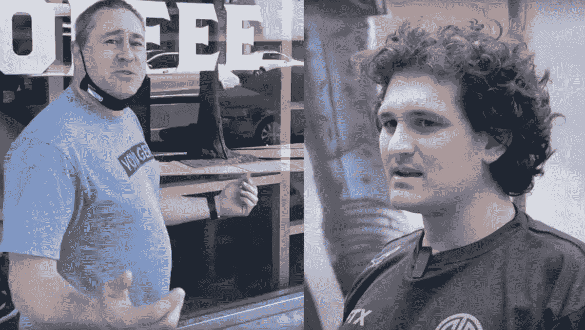

# 萨姆·班克曼-弗里德声称航海家数码公司的客户可能会被“干掉”

> 原文：<https://medium.com/coinmonks/sam-bankman-fried-claims-voyager-digital-customers-likely-to-get-f-ked-2a5dd9caf4e2?source=collection_archive---------14----------------------->

FTX 交易所创始人兼首席执行官山姆·班克曼-弗里德周日回击了航海家数码公司拒绝他“低调”的拯救公司的提议，声称航海家的客户可能会因此被“干掉”。

“旅行者失去了客户资产，但它仍然拥有大部分剩余资产，”班克曼-弗里德 [**在周日的推特帖子**](https://web.archive.org/web/20220725050439/https://twitter.com/SBF_FTX/status/1551364656085602305) 中写道。“为什么那些还没有退还给顾客？假设航海家号剩余 75%的资产(我不知道确切的数字)。似乎首先应该发生的是，客户拿回 75 %,然后如果从 3AC 中恢复了任何东西，再拿回剩余的部分。但这还没有发生。为什么？

[***相关:Voyager Digital 以“调查”威胁用户，阻止公司“冻结”他的账户***](https://goblincrypto.com/voyager-digital-threatened-user-with-investigation-for-preventing-company-from-freezing-his-account/)

“嗯，传统的过程是，在客户拿回他们的资产之前，他们被骗了，”他补充道。“首先，有一个漫长的过程，在此期间资金被冻结。这可能需要几年时间。还记得 Mt. Gox 吗？这个过程仍在继续。与此同时，在整个过程中，各种破产代理人正通过咨询费慢慢榨干客户被冻结的资产。这可能会让客户损失数亿美元。”

***你可以阅读这个故事的其余部分——以及航海家数码对班克曼-弗里德的全部回应——关于***[***GoblinCrypto***](https://goblincrypto.com/sam-bankman-fried-fires-back-at-voyager-digitals-lowball-claim-claims-voyager-customers-likely-to-get-f-ked/)***。***

*原载于 2022 年 7 月 24 日 https://goblincrypto.com**[*。*](https://goblincrypto.com/sam-bankman-fried-fires-back-at-voyager-digitals-lowball-claim-claims-voyager-customers-likely-to-get-f-ked/)*

> 交易新手？尝试[加密交易机器人](/coinmonks/crypto-trading-bot-c2ffce8acb2a)或[复制交易](/coinmonks/top-10-crypto-copy-trading-platforms-for-beginners-d0c37c7d698c)