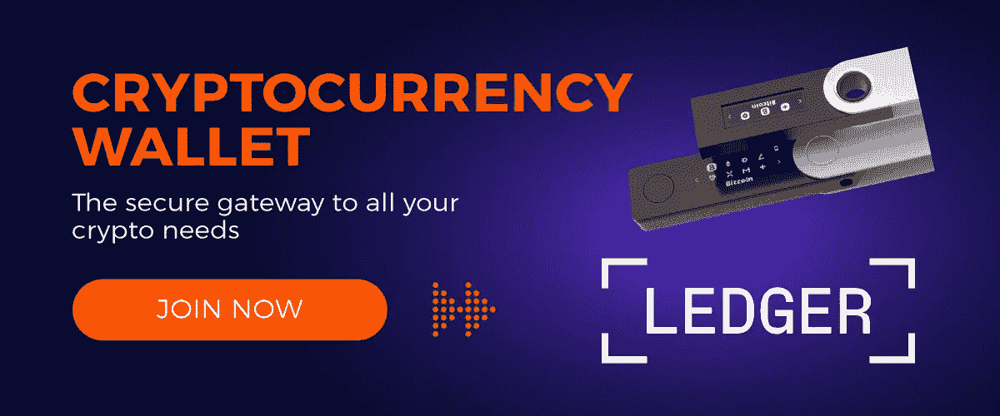

# 山姆·班克曼·弗里德被捕了。现在怎么办？

> 原文：<https://medium.com/coinmonks/sam-bankman-fried-has-been-arrested-what-now-6118f2772a79?source=collection_archive---------18----------------------->

## 数十万 FTX 客户仍有资金被困在 FTX，拿回它们的希望渺茫。

Source: [Getty Images](https://www.gettyimages.ae/)

因此，崩溃仍在继续。12 月 12 日，在美国提出刑事指控后，FTX 前首席执行官萨姆·班克曼-弗里德(Sam Bankman-Fried)在巴哈马被捕，为引渡创造了条件。《纽约时报》**报道称，指控将包括电汇欺诈、电汇欺诈共谋、证券欺诈、证券欺诈共谋和洗钱，指出数十万客户仍有资金被困在 FTX。**

**SBF 的突然失宠给加密行业带来了冲击波，导致许多人将 FTX 的崩溃称为黑天鹅事件，即通常会带来灾难性后果的意外市场事件。**

**黑天鹅是传统股票交易的一个特征，但加密货币市场是*而不是*一个集中的、受监管的股票交易所，只要我们把它当成一个交易所，我们就会让自己失败。加密货币市场是一个全新的实体，它以新的和意想不到的方式表现，所以我们必须以不同的方式对冲它。**

> **我们从 FTX 身上学到的第一课是:永远要为意想不到的事情做好准备。**

**任何密切关注 FTX 运作的投资者都会知道，该交易所的业务建立在高风险交易期权的基础上，而这在美国还不合法。此外，对市场趋势和事件的密切观察，如 Terra 区块链的崩溃和对冲基金 Three Arrows 的破产，应该为那些在保管钱包中持有大笔资金的人(如 FTX)敲响了警钟。**

## **这给我们带来了第二个也是最重要的教训，那就是避免在保管钱包里放大笔钱。**

# **我们对未来加密投资者的建议**

**虽然一家行业巨头的倒闭令人清醒地意识到加密货币这样一个新生市场的波动性，但即使不能预测，也有办法为不可预测的事情做好准备。**

**我们建议所有加密持有者将他们的令牌从保管型 cex(如比特币基地和库币)转移到非保管型钱包，这是一件紧急的事情。当你将资金存放在 CEX 保管钱包中时，该交易所将成为你代币的保管人，这意味着它对你的资金拥有完全的控制权。**如果平台垮了，你的资金也可能垮。****

**使用非托管冷钱包(即不连接互联网的硬件钱包)，如 Ledger，是存储加密货币的最安全方式。Ledger 是一个出色的硬件钱包，附带一个应用程序 Ledger Live，目前全球有超过 400 万人使用。使用硬件钱包是确保您的资产和私钥掌握在自己手中的唯一方法。**

****

**软件钱包是加密交易者和投资者的重要工具，对于那些想在线存储资产的人来说，有许多安全的选择。在动荡的市场条件下，像 MetaMask 或 Coinomi 这样的非托管热钱包是比 CEXs 安全得多的选择，因为它们可以让你最大限度地控制你的资金。与 FTX 不同，非托管钱包不会在你不使用代币时将其借给其他公司，也不会控制你的私钥。**

**当使用任何非保管钱包时——无论是 Ledger 还是 meta mask——你必须**保管好你的私人钥匙**,因为没有第三方来帮助你恢复任何丢失的细节。**

**不管 SBF 被捕的结果如何，我们的关键是意外事件总是会发生，重要的是当**我们无法预测时，我们要做好准备。****

****

# **[网站](https://zero-gravity.io/) | [电报](https://t.me/+gH4vbv4vk14xYTg0) | [推特](https://twitter.com/zerogravitycryp)**