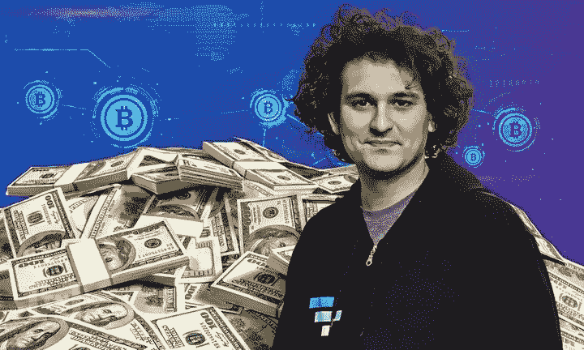
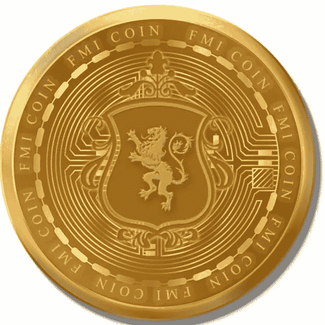

# 报道称，萨姆·班克曼-弗里德说，FTX 没有“狂野派对”,大多数人甚至不喝酒

> 原文：<https://medium.com/coinmonks/sam-bankman-fried-says-ftx-had-no-wild-parties-and-most-people-didn-t-even-drink-alcohol-report-2e0e3e792f32?source=collection_archive---------25----------------------->

萨姆·班克曼-弗里德驳斥了关于 FTX 吸毒和酗酒的指控，称公司“没有疯狂聚会”。

在辞去 FTX 首席执行官后的第一次现场采访中，班克曼-弗里德在纽约时报的 Dealbook 峰会上对安德鲁·罗斯·索尔金说，他的“第一口酒”是在他 21 岁生日后，此后他“一年只喝半杯酒”。

“这里没有疯狂的聚会，”班克曼-弗里德说。“当我们举行聚会时，我们玩棋盘游戏，你知道，20%的人每人会喝四分之三的啤酒或类似的东西。你知道，我们其余的人不会喝任何东西。”

他澄清说，他在办公室“没有看到任何非法使用药物的行为”，他的派对只是“请人过来吃饭”。

虽然否认任何非法药物使用，但班克曼-弗里德承认他服用了处方药，称他“在不同时间被开了各种各样的东西来帮助集中注意力”，但这些都是“完全按照标签使用的药物”。

“我认为这些在边缘上帮助我集中了一点注意力。我希望去年我能更加专注。”

[班克曼-弗里德此前曾在推特上谈论过使用处方药](https://twitter.com/SBF_FTX/status/1173351344159117312)，他在 2019 年的一条推特上说，他使用:“醒来时服用兴奋剂，睡觉时需要时服用安眠药。”

当索尔金说所有关于 FTX 的故事让它看起来像“一群吃了安眠药的孩子在开通宵派对”时，班克曼-弗里德承认，“我搞砸了。”

他说他“最终有责任做正确的事情”，但“我们搞砸了。”

本月早些时候，班克曼-弗里德的加密货币公司 FTX 和阿拉米达研究公司[根据破产法第 11 章](https://markets.businessinsider.com/news/currencies/ftx-bankruptcy-sam-bankman-fried-ceo-crypto-binance-alameda-markets-2022-11?utm_medium=referral&utm_source=yahoo.com)宣布破产。30 岁的[一夜之间失去了他 160 亿美元财产](https://www.businessinsider.com/ftx-ceo-crypto-binance-sam-bankman-fried-wealth-wiped-out-2022-11?IR=T&r=US&utm_medium=referral&utm_source=yahoo.com)的 94%，并在周一告诉 Axios，他的账户中还剩[10 万美元](https://www.businessinsider.com/sam-bankman-fried-ftx-crypto-bank-account-axios-2022-11?IR=T&inline-endstory-related-recommendations=&r=US&utm_medium=referral&utm_source=yahoo.com)。

比特币基地报道称，FTX“被巴哈马的一帮孩子经营”，他们都是室友，并相互约会。前雇员告诉比特币基地，班克曼-弗里德和他的 10 个核心圈子住在一个顶层公寓里，他们都在某个时候与对方有浪漫的关系。

阅读[商业内幕](https://www.businessinsider.com/sam-bankman-fried-shuts-down-claims-wild-parties-ftx-report-2022-12)原文

也了解一下新硬币: [*FMI 硬币*](http://www.fmicoins.com/)

[FMI](http://www.fmicoins.com/) 是建立在币安智能链上的数字货币。FMI 是为公司 FMI 网络而构建的。更具体地说，它包括自己的产品，如投资不同类型的项目，创造新的项目等。FMI COIN (FMI)是一种加密货币，部署在币安智能链(BSC BEP-20)上

合同:[0x9d 427 e 2 Fe 3a D2 CB 93 f 83118d 472 a 6068 b4a 778d 6](https://bscscan.com/token/0x9d427E2fe3ad2Cb93F83118d472A6068B4a778D6)

可以在 [Pancakeswap](https://pancakeswap.finance/) 或者 [Bitkeep App](https://bitkeep.com/download) 上购买 FMI 币。
你可以通过这个来了解详细情况👇

[https://FMI coins . medium . com/how-to-create-FMI-wallet-on-bit keep-app-e 44 a2 a 998 e6a](https://fmicoins.medium.com/how-to-create-fmi-wallet-on-bitkeep-app-e44a2a998e6a)

看看我们的[网站](http://www.fmicoins.com/):【https://fmicoins.com/ 

给我们接通[电报](https://t.me/fmicommunityofficial):[https://t.me/fmicommunityofficial](https://t.me/fmicommunityofficial)

> 交易新手？尝试[加密交易机器人](/coinmonks/crypto-trading-bot-c2ffce8acb2a)或[复制交易](/coinmonks/top-10-crypto-copy-trading-platforms-for-beginners-d0c37c7d698c)